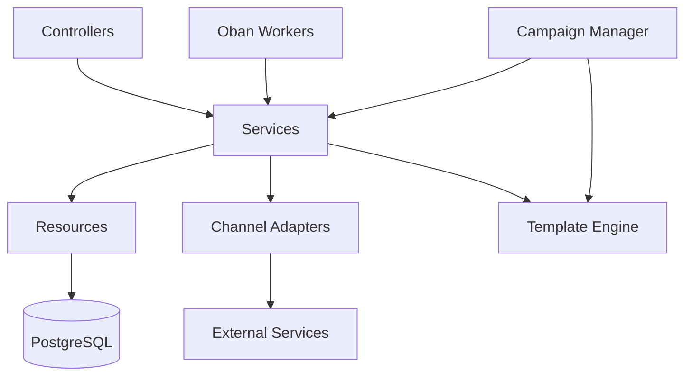

# [GUIDE-002] 프로젝트 구조

| 버전 | 날짜       | 변경 내용      |
| ---- | ---------- | -------------- |
| 1.0  | 2025-04-02 | 최초 문서 작성 |

## 요약

본 문서는 Automata-Signal 프로젝트의 전체 디렉토리 구조와 주요 구성 요소에 대한 설명을 제공합니다. 개발자가 프로젝트 구조를 이해하고 필요한 파일을 빠르게 찾을 수 있도록 도움을 줍니다.

## 대상 독자

- 신규 개발자
- 개발팀

## 1. 전체 프로젝트 구조

Automata-Signal 프로젝트는 Elixir Umbrella 구조를 사용하여 여러 관련 애플리케이션을 하나의 프로젝트로 관리합니다. 전체 프로젝트 구조는 다음과 같습니다:

```
automata/                             # Elixir Umbrella 프로젝트 루트
├── .git/                             # Git 저장소
├── .github/                          # GitHub Actions 워크플로우
├── .gitignore                        # Git 무시 파일 목록
├── README.md                         # 프로젝트 루트 README
├── apps/                             # Umbrella 하위 애플리케이션
│   ├── automata_signal/              # 통합 메시징 서비스 앱
│   ├── automata_admin/               # 관리자 인터페이스 앱
│   └── automata_analytics/           # 데이터 분석 앱
├── config/                           # Umbrella 공통 설정
├── docs/                             # 프로젝트 문서
│   └── automata-signal/
│       ├── README.md                 # 프로젝트 개요
│       ├── 1-guides/                 # 개발자 가이드
│       ├── 2-designs/                # 시스템 설계
│       ├── 3-components/             # 컴포넌트
│       ├── 4-sequences/              # 시퀀스
│       ├── 5-references/             # 참조 자료
│       ├── 6-planning/               # 프로젝트 계획
│       └── 7-progress/               # 프로젝트 진행
└── mix.exs                           # Umbrella 프로젝트 설정 파일
```

## 2. 주요 애플리케이션

### 2.1 automata_signal (통합 메시징 서비스 앱)

메시지 전송, 구독 관리, 템플릿 처리 등 핵심 메시징 기능을 담당하는 앱입니다.

```
automata_signal/
├── lib/                      # 소스 코드
│   ├── automata_signal/      # 비즈니스 로직
│   │   ├── resources/        # Ash 리소스 정의
│   │   ├── services/         # 서비스 로직 모듈
│   │   ├── workers/          # ash_oban 비동기 작업자
│   │   ├── adapters/         # 채널별 어댑터 모듈
│   │   ├── templates/        # 메시지 템플릿 시스템
│   │   └── campaigns/        # 캠페인 관리 모듈
│   └── automata_signal_web/  # 웹 인터페이스
│       ├── controllers/      # API 엔드포인트 처리
│       └── views/            # 응답 데이터 포맷팅
├── priv/                     # 정적 파일 및 마이그레이션
│   ├── repo/                 # 데이터베이스 마이그레이션
│   └── static/               # 정적 파일
├── test/                     # 단위 및 통합 테스트
│   ├── automata_signal/      # 비즈니스 로직 테스트
│   └── automata_signal_web/  # 웹 인터페이스 테스트
└── client/                   # Flutter 모바일 클라이언트
    ├── lib/                  # Flutter 앱 소스 코드
    └── test/                 # Flutter 앱 테스트
```

### 2.2 automata_admin (관리자 인터페이스 앱)

시스템 관리, 모니터링 및 보고서 생성을 위한 관리자 인터페이스를 제공하는 앱입니다.

```
automata_admin/
├── lib/
│   ├── automata_admin/       # 관리자 비즈니스 로직
│   └── automata_admin_web/   # 관리자 웹 인터페이스
├── priv/
│   └── static/               # 관리자 UI 정적 파일
└── test/                     # 관리자 앱 테스트
```

### 2.3 automata_analytics (데이터 분석 앱)

메시지 성과 분석, 사용자 참여 지표, 캠페인 성공률 등을 분석하고 시각화하는 앱입니다.

```
automata_analytics/
├── lib/
│   ├── automata_analytics/    # 분석 비즈니스 로직
│   └── automata_analytics_web/ # 분석 웹 인터페이스
├── priv/
└── test/                     # 분석 앱 테스트
```

## 3. 주요 디렉토리 및 파일 설명

### 3.1 메시징 서비스 핵심 구성 요소

#### resources/

Ash Framework 리소스 정의가 포함된 디렉토리입니다. 주요 리소스에는 다음이 포함됩니다:

- `message.ex`: 메시지 리소스 정의
- `subscription.ex`: 구독 리소스 정의
- `user.ex`: 사용자 리소스 정의
- `application.ex`: 애플리케이션 리소스 정의
- `message_template.ex`: 메시지 템플릿 리소스 정의
- `message_campaign.ex`: 캠페인 리소스 정의

#### services/

비즈니스 로직을 담당하는 서비스 모듈이 포함된 디렉토리입니다:

- `message_service.ex`: 메시지 생성 및 전송 로직
- `subscription_service.ex`: 구독 관리 로직
- `template_service.ex`: 템플릿 렌더링 및 변수 치환
- `campaign_service.ex`: 캠페인 처리 및 타겟팅 로직

#### workers/

비동기 작업을 처리하는 Oban 워커가 포함된 디렉토리입니다:

- `message_worker.ex`: 메시지 전송 작업자
- `campaign_worker.ex`: 캠페인 메시지 처리 작업자
- `scheduled_message_worker.ex`: 예약된 메시지 처리 작업자

#### adapters/

다양한 메시징 채널을 위한 어댑터 모듈이 포함된 디렉토리입니다:

- `push_adapter.ex`: 푸시 알림 채널 (iOS/Android)
- `email_adapter.ex`: 이메일 채널 (지원 예정)
- `sms_adapter.ex`: SMS 채널 (지원 예정)
- `kakao_adapter.ex`: 카카오 알림톡 채널 (지원 예정)
- `in_app_adapter.ex`: 인앱 메시지 채널 (지원 예정)

#### templates/

메시지 템플릿 처리를 위한 모듈이 포함된 디렉토리입니다:

- `template_engine.ex`: 템플릿 렌더링 엔진
- `variable_processor.ex`: 변수 처리 및 치환 로직

#### campaigns/

대량 메시지 캠페인 관리를 위한 모듈이 포함된 디렉토리입니다:

- `campaign_manager.ex`: 캠페인 생성 및 관리
- `targeting_engine.ex`: 타겟팅 및 세그먼트 로직
- `scheduling_manager.ex`: 캠페인 예약 및 일정 관리

### 3.2 웹 인터페이스 구성 요소

#### controllers/

API 엔드포인트 처리를 위한 컨트롤러가 포함된 디렉토리입니다:

- `message_controller.ex`: 메시지 관련 API 엔드포인트
- `subscription_controller.ex`: 구독 관련 API 엔드포인트
- `campaign_controller.ex`: 캠페인 관련 API 엔드포인트
- `template_controller.ex`: 템플릿 관련 API 엔드포인트

#### views/

API 응답 포맷팅을 담당하는 뷰 모듈이 포함된 디렉토리입니다:

- `message_view.ex`: 메시지 응답 포맷팅
- `subscription_view.ex`: 구독 응답 포맷팅
- `error_view.ex`: 오류 응답 포맷팅

### 3.3 설정 파일

#### config/

Umbrella 프로젝트 및 각 앱의 설정 파일이 포함된 디렉토리입니다:

- `config.exs`: 공통 설정
- `dev.exs`: 개발 환경 설정
- `test.exs`: 테스트 환경 설정
- `prod.exs`: 프로덕션 환경 설정
- `runtime.exs`: 런타임 설정

### 3.4 문서

#### docs/automata-signal/

프로젝트 문서가 포함된 디렉토리입니다:

- `README.md`: 프로젝트 개요
- `1-guides/`: 개발자 가이드 (설정, 워크플로우, 코딩 표준 등)
- `2-designs/`: 시스템 설계 문서 (아키텍처, 데이터 모델 등)
- `3-components/`: 컴포넌트 설명 (템플릿 엔진, 어댑터 등)
- `4-sequences/`: 시퀀스 문서 (메시지 처리 흐름, 초기화 등)
- `5-references/`: 참조 자료 (API 명세, 상태 코드 등)
- `6-planning/`: 프로젝트 계획 (요구사항, 로드맵 등)
- `7-progress/`: 프로젝트 진행 상황

## 4. 중요 파일 설명

### 4.1 mix.exs

Umbrella 프로젝트의 Elixir 의존성 및 설정을 정의하는 파일입니다. 이 파일은 프로젝트의 모든 앱에 공통으로 적용되는 의존성을 포함합니다.

```elixir
defmodule Automata.MixProject do
  use Mix.Project

  def project do
    [
      apps_path: "apps",
      version: "0.1.0",
      start_permanent: Mix.env() == :prod,
      deps: deps(),
      aliases: aliases()
    ]
  end

  defp deps do
    [
      # 모든 앱에 공통으로 적용되는 의존성
    ]
  end

  defp aliases do
    [
      # 유용한 에일리어스 정의
      setup: ["deps.get", "cmd mix setup --no-archives-check"],
      test: ["ecto.create --quiet", "ecto.migrate --quiet", "test"]
    ]
  end
end
```

### 4.2 apps/automata_signal/mix.exs

automata_signal 앱의 의존성 및 설정을 정의하는 파일입니다. 이 앱에 필요한 Ash Framework 및 기타 의존성을 포함합니다.

```elixir
defmodule AutomataSignal.MixProject do
  use Mix.Project

  def project do
    [
      app: :automata_signal,
      version: "0.1.0",
      build_path: "../../_build",
      config_path: "../../config/config.exs",
      deps_path: "../../deps",
      lockfile: "../../mix.lock",
      elixir: "~> 1.18",
      elixirc_paths: elixirc_paths(Mix.env()),
      start_permanent: Mix.env() == :prod,
      aliases: aliases(),
      deps: deps()
    ]
  end

  defp deps do
    [
      # automata_signal 앱에 필요한 의존성
      {:ash, "~> 2.15"},
      {:ash_phoenix, "~> 1.3"},
      {:ash_postgres, "~> 1.3"},
      {:ash_json_api, "~> 0.33.1"},
      {:ash_state_machine, "~> 0.2.0"},
      {:ash_oban, "~> 0.1.4"},
      {:ash_paper_trail, "~> 0.1.4"},
      {:ash_archival, "~> 0.2.0"},
      {:ash_cloak, "~> 0.1.1"},
      {:ash_money, "~> 0.1.2"},
      {:ash_double_entry, "~> 0.1.2"},
      {:ash_csv, "~> 0.1.4"},
      {:pigeon, "~> 2.0.0"}
    ]
  end

  defp aliases do
    [
      setup: ["deps.get", "ecto.setup"],
      "ecto.setup": ["ecto.create", "ecto.migrate", "run priv/repo/seeds.exs"],
      "ecto.reset": ["ecto.drop", "ecto.setup"],
      test: ["ecto.create --quiet", "ecto.migrate --quiet", "test"]
    ]
  end
end
```

### 4.3 .github/workflows/ci.yml

GitHub Actions CI 파이프라인을 정의하는 파일입니다.

### 4.4 .github/workflows/deploy.yml

GitHub Actions를 통한 fly.io 배포 파이프라인을 정의하는 파일입니다.

## 5. 모듈 간 의존성 관계

Automata-Signal 프로젝트의 주요 모듈 간 의존성 관계는 다음과 같습니다:



- **Controllers**: API 요청을 처리하고 적절한 서비스를 호출합니다.
- **Services**: 비즈니스 로직을 구현하고 리소스, 어댑터, 템플릿 엔진을 활용합니다.
- **Resources**: 데이터 모델과 데이터베이스 상호작용을 정의합니다.
- **Adapters**: 다양한 메시징 채널과의 통신을 담당합니다.
- **Workers**: 비동기 작업을 처리하고 서비스를 호출합니다.
- **Templates**: 메시지 템플릿을 렌더링하고 변수를 처리합니다.
- **Campaigns**: 대량 메시지 캠페인을 관리하고 서비스와 템플릿 엔진을 활용합니다.

## 6. 확장 및 수정 가이드

### 6.1 새로운 채널 추가

새로운 메시징 채널을 추가하려면 다음 파일을 생성하거나 수정해야 합니다:

1. `adapters/new_channel_adapter.ex`: 새 채널에 대한 어댑터 구현
2. `resources/subscription.ex`: 새 채널 유형 추가
3. `services/message_service.ex`: 새 채널 지원 추가

### 6.2 새로운 앱 추가

Umbrella 프로젝트에 새 앱을 추가하려면:

```bash
cd apps
mix new my_new_app --sup
```

그런 다음 새 앱의 `mix.exs` 파일을 수정하여 Umbrella 프로젝트와 통합합니다.

## 7. 유용한 팁

- **루트 디렉토리에서 작업하기**: 대부분의 mix 명령은 루트 디렉토리에서 실행하는 것이 좋습니다. 이렇게 하면 모든 앱에 명령이 적용됩니다.
- **앱별 작업**: 특정 앱에서만 작업하려면 해당 앱 디렉토리로 이동한 후 명령을 실행합니다.
