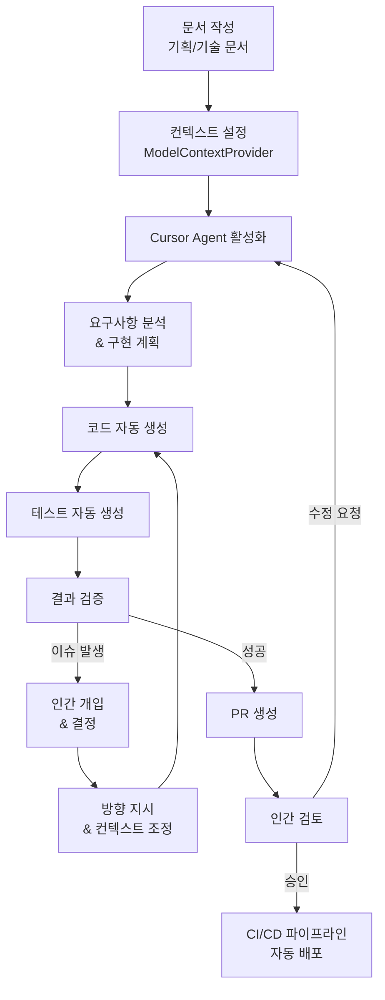
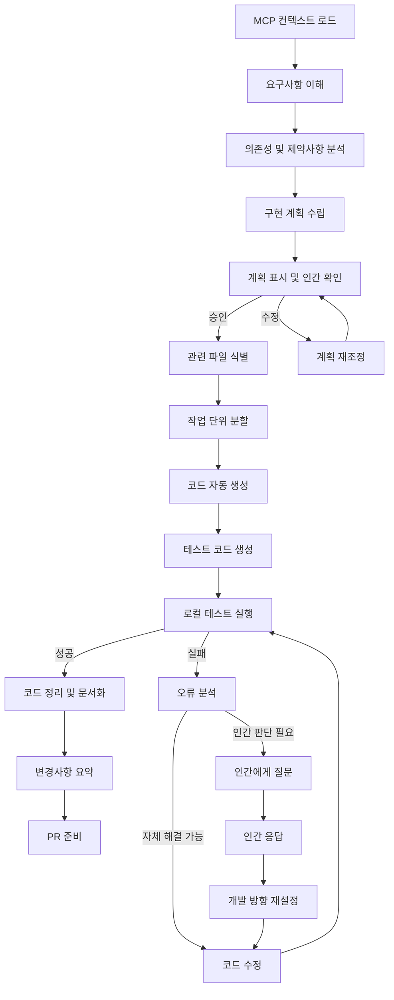
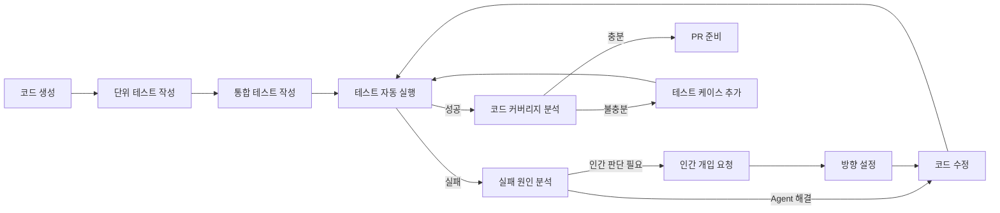
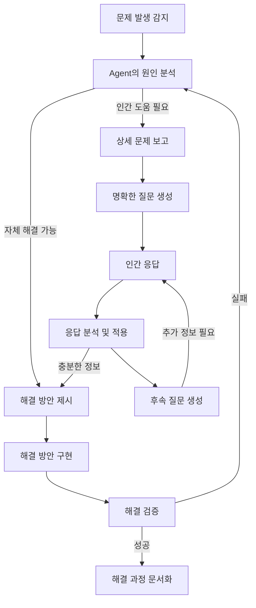

# [GUIDE-003] AI 주도 개발 워크플로우

| 버전 | 날짜       | 변경 내용       |
| ---- | ---------- | --------------- |
| 1.1  | 2023-04-09 | 워크플로우 개선 |
| 1.0  | 2023-04-02 | 최초 문서 작성  |

## 관련 문서

- [[GUIDE-001] 시작하기](../1-guides/GUIDE-001-getting-started.md)
- [[GUIDE-002] 프로젝트 구조](../1-guides/GUIDE-002-project-structure.md)
- [[GUIDE-004] 코딩 표준](../1-guides/GUIDE-004-coding-standards.md)
- [[GUIDE-005] CI/CD 파이프라인](../1-guides/GUIDE-005-cicd-pipeline.md)

## 요약

본 문서는 AI 주도 개발 워크플로우를 설명합니다. 기획/기술 문서를 바탕으로 AI가 자율적으로 계획 수립부터 코드 생성, 테스트, 배포까지 주도하는 프로세스와 인간 개발자의 검토 및 조정 방식을 다룹니다.

## 대상 독자

- 신규 개발자
- 개발팀

## 1. AI 주도 개발 워크플로우 개요

AI 주도 개발 워크플로우는 개발 생산성과 일관성을 극대화합니다:



### 1.1 주요 단계 설명

1. **문서 작성**: 기획/기술 문서 작성 (설계, 요구사항, 데이터 모델 등)
2. **컨텍스트 설정**: 작성된 문서를 Github MCP(ModelContextProvider)에 연결
3. **Cursor Agent 활성화**: Cursor의 AI 에이전트 기능을 통해 자동 개발 시작
4. **요구사항 분석 & 구현 계획**: AI가 문서를 분석하고 구현 계획 수립
5. **코드 자동 생성**: 계획에 따라 코드 자동 생성
6. **테스트 자동 생성**: 구현 코드에 대한 테스트 코드 자동 생성
7. **결과 검증**: 생성된 코드와 테스트 결과 검증
8. **인간 개입 & 결정**: 문제 발생 시 인간 개발자의 결정 요청
9. **PR 생성**: 검증된 코드에 대한 PR 자동 생성
10. **인간 검토**: 최종 코드 검토 및 승인
11. **자동 배포**: CI/CD 파이프라인을 통한 자동 배포

### 1.2 AI와 인간 역할 분담

| 단계          | AI 역할                                 | 인간 역할                              |
| ------------- | --------------------------------------- | -------------------------------------- |
| 문서 작성     | 문서 초안 제안, 형식 검증               | 핵심 요구사항 및 설계 결정 정의        |
| 컨텍스트 설정 | 필요한 컨텍스트 제안                    | Github MCP 연결 및 구성                |
| 요구사항 분석 | 문서 분석, 아키텍처 결정, 작업 분할     | 모호한 부분 명확화, 우선순위 지정      |
| 코드 생성     | 전체 코드 작성, 문서화, 모범 사례 적용  | 병목 지점 해결, 접근법 조정            |
| 테스트 생성   | 테스트 케이스 생성, 테스트 실행 및 분석 | 엣지 케이스 추가, 테스트 범위 확인     |
| 결과 검증     | 코드 품질 분석, 오류 감지, 개선점 제안  | 비즈니스 로직 검증, 도메인 지식 제공   |
| PR 검토       | 자동 코드 리뷰, 개선 제안               | 최종 승인, 비즈니스 요구사항 충족 확인 |
| 배포          | 배포 스크립트 생성, 환경 설정           | 배포 승인, 결과 모니터링               |

## 2. 문서 기반 개발 프로세스

### 2.1 문서 구조와 개발 자동화 연계

AI 주도 개발은 문서 중심 개발 방식을 채택하여 문서가 코드 생성의 기반이 됩니다:

```
docs/
├── 1-guides/         # 개발 가이드 (개발 방식, 규칙)
├── 2-designs/        # 시스템 설계 (아키텍처, 데이터 모델)
├── 3-components/     # 컴포넌트 설계 (주요 모듈 상세 설계)
├── 4-sequences/      # 프로세스 시퀀스 (흐름 및 동작 방식)
├── 5-references/     # 참조 자료 (API 명세, 상태 코드 등)
├── 6-planning/       # 프로젝트 계획 (로드맵, 마일스톤)
└── 7-progress/       # 진행 상황 (작업 상태, 이슈 추적)
```

각 문서 유형이 개발 자동화에 미치는 영향:

| 문서 유형     | AI 개발 영향          | 기여 방식                      |
| ------------- | --------------------- | ------------------------------ |
| 설계 문서     | 아키텍처 및 구조 결정 | 클래스/모듈 구조, 패턴 적용    |
| 데이터 모델   | 스키마 및 관계 정의   | 모델 클래스, 마이그레이션 생성 |
| 컴포넌트 설계 | 구체적 구현 방식      | 세부 로직 및 알고리즘 구현     |
| 시퀀스 문서   | 프로세스 흐름         | 상태 관리 및 트랜지션 구현     |
| API 명세      | 인터페이스 정의       | 컨트롤러 및 라우트 구현        |

### 2.2 ModelContextProvider를 통한 문서 컨텍스트화

Github MCP(ModelContextProvider)를 통해 문서를 AI 개발 컨텍스트로 변환하는 과정:

1. **문서 저장소 연결**: 문서 저장소를 Github MCP에 연결
2. **컨텍스트 구성**: 프로젝트 관련 문서들을 개발 컨텍스트로 자동 구성
3. **우선순위 설정**: 중요 문서(아키텍처, 데이터 모델)에 높은 우선순위 부여
4. **문서 간 관계 매핑**: 문서 간 참조와 의존성 자동 분석
5. **최신성 유지**: 문서 변경 시 컨텍스트 자동 업데이트

Github MCP 설정 예시:

```yaml
# .mcp-config.yml
repository: docs
priority_paths:
  - 2-designs/*.md # 최우선 컨텍스트
  - 3-components/*.md # 구현 세부사항
  - 4-sequences/*.md # 프로세스 흐름
  - 1-guides/GUIDE-004.md # 코딩 표준
exclude_paths:
  - 7-progress/ # 진행 상황은 컨텍스트에서 제외
special_handling:
  - path: rules/*.md # 별도 rules로 처리
    type: rules
```

## 3. Cursor Agent를 활용한 자동 개발 프로세스

### 3.1 Cursor Agent 초기화 및 작업 지시

Cursor에서 AI 주도 개발을 시작하는 기본 명령:

```
Github MCP 컨텍스트를 기반으로 [기능명]을 구현해주세요.
docs의 설계 문서에 따라 구현하되, rules의 코딩 규칙을 준수해주세요.
```

이 명령을 내리면 Cursor Agent는 다음 단계로 진행합니다:

1. Github MCP를 통해 관련 문서 컨텍스트 로드
2. 코딩 규칙 적용
3. 구현 계획 자동 수립 및 표시
4. 개발자 확인 후 구현 시작
5. 코드 생성 및 테스트 진행
6. 결과 공유 및 다음 단계 제안

### 3.2 Agent의 자율적 계획 및 구현 프로세스

Cursor Agent는 다음과 같은 자율적 개발 프로세스를 수행합니다:



1. **요구사항 이해**: MCP 컨텍스트에서 요구사항 추출 및 분석
2. **구현 계획 수립**: 단계별 구현 계획과 예상 결과물 정의
3. **관련 파일 식별**: 수정이 필요한 기존 파일 및 새로 생성할 파일 식별
4. **작업 단위 분할**: 모듈/클래스/함수 단위로 작업 분할
5. **코드 자동 생성**: 각 작업 단위별 코드 생성
6. **테스트 코드 생성**: 생성된 코드에 대한 테스트 코드 작성
7. **로컬 테스트**: 생성된 코드의 로컬 테스트 실행
8. **오류 분석 및 해결**: 발생한 오류의 자동 분석 및 해결
9. **코드 정리 및 문서화**: 최종 코드 정리 및 인라인 문서 추가
10. **변경사항 요약**: 구현 내용과 변경사항 종합적 요약
11. **PR 준비**: 코드 리뷰를 위한 PR 준비

### 3.3 인간 개입 지점 및 협업 방식

Cursor Agent와 인간 개발자 간의 효과적인 협업을 위한 주요 개입 지점:

| 개입 지점       | 상황                        | 인간 역할          | Agent 역할                  |
| --------------- | --------------------------- | ------------------ | --------------------------- |
| 계획 확인       | 구현 시작 전                | 계획 검토 및 조정  | 계획 수립 및 설명           |
| 아키텍처 결정   | 설계 문서에 없는 결정 필요  | 아키텍처 결정 제공 | 결정에 따른 구현            |
| 모호한 요구사항 | 문서 상 불명확한 사항       | 명확한 방향 제시   | 질문 및 대안 제시           |
| 기술적 병목     | 복잡한 알고리즘/최적화 필요 | 접근법 제안        | 구현 방향 조정              |
| 테스트 실패     | 예상치 못한 테스트 실패     | 원인 분석 지원     | 실패 원인 설명 및 대안 제시 |
| 코드 검토       | 구현 완료 후                | 비즈니스 로직 검증 | 설계 준수 확인              |

개입 신호 체계:

```
# Agent가 인간에게 결정 요청
[결정 필요] 메시지 템플릿 엔진의 변수 처리 방식에 대한 결정이 필요합니다:
1. 옵션A: Handlebars 스타일 (`{{var}}`)
2. 옵션B: EEx 스타일 (`<%= var %>`)

# 인간이 Agent에게 방향 제시
[방향 제시] 옵션A를 선택합니다. 기존 문서에 명시된 예제와 일관성을 유지하기 위함입니다.
```

## 4. 개발 산출물 관리 및 통합

### 4.1 코드 생성 및 테스트 자동화

Cursor Agent가 자동으로 생성하는 주요 산출물:

1. **구현 코드**: 설계 문서를 기반으로 한 실제 구현 코드
2. **테스트 코드**: 단위 테스트, 통합 테스트, 기능 테스트
3. **문서화**: 인라인 코드 문서, README, API 문서
4. **마이그레이션 스크립트**: 데이터베이스 스키마 변경 스크립트
5. **구현 보고서**: 결정 사항, 접근 방식, 알고리즘 설명 등

자동 테스트 프로세스:



### 4.2 PR 생성 및 코드 리뷰 프로세스

자동 생성된 코드의 PR 및 리뷰 프로세스:

1. **변경사항 요약**: 구현된 기능과 접근 방식 요약
2. **자동 PR 생성**: 구현 코드, 테스트, 문서 변경사항 포함
3. **AI 자체 리뷰**: 생성된 코드의 품질, 일관성, 표준 준수 여부 검토
4. **인간 리뷰 요청**: 핵심 검토 포인트 강조 및 리뷰 요청
5. **피드백 수집**: 인간 리뷰어의 피드백 수집
6. **피드백 반영**: 수집된 피드백에 따른 코드 개선
7. **최종 승인**: 인간 리뷰어의 최종 승인 후 병합

PR 템플릿 예시:

```markdown
# 자동 생성된 PR: [기능명]

## 구현 내용

- [주요 구현 기능 요약]
- [접근 방식 및 알고리즘 설명]
- [구현 결정사항 및 이유]

## 변경 파일

- [생성/수정된 파일 목록]

## 테스트 커버리지

- 단위 테스트: [커버리지 %]
- 통합 테스트: [커버리지 %]

## 리뷰 포인트

- [중점적으로 검토할 부분]
- [비즈니스 로직 검증 필요 부분]
- [성능 고려사항]

## 자동 생성 정보

- 생성 기반: [참조 문서 목록]
- Agent 버전: [Agent 버전]
```

### 4.3 CI/CD 통합 및 배포 자동화

AI 생성 코드의 CI/CD 통합 방식:

1. **PR 생성 시 자동 CI**: GitHub Actions를 통한 자동 테스트 및 검증
2. **품질 게이트**: 코드 품질, 테스트 커버리지, 보안 검사 자동화
3. **승인 후 자동 배포**: 승인된 PR의 자동 배포 파이프라인 연동
4. **롤백 준비**: 자동 배포 실패 시 롤백 메커니즘 준비
5. **배포 보고**: 배포 결과 및 성능 지표 자동 수집 및 보고

자동 배포 워크플로우:

```yaml
# .github/workflows/ai_deploy.yml 예시
name: AI Generated Code Pipeline

on:
  pull_request:
    types: [opened, synchronize]
    paths:
      - 'src/**'

  pull_request_review:
    types: [submitted]

jobs:
  validate:
    name: Validate AI Generated Code
    runs-on: ubuntu-latest
    steps:
      - uses: actions/checkout@v3
      - name: Run Special AI Code Validation
        run: scripts/validate_ai_code.sh
      # ... 기타 검증 단계

  deploy:
    name: Deploy AI Generated Code
    if: github.event.review.state == 'approved' && contains(github.event.pull_request.labels.*.name, 'ai-generated')
    needs: validate
    runs-on: ubuntu-latest
    steps:
      - uses: actions/checkout@v3
      # ... 배포 단계
```

## 5. 작업 유형별 AI 주도 개발 가이드

### 5.1 새로운 기능 개발

```
Github MCP 컨텍스트를 기반으로 [기능명]을 구현해주세요.

참조 문서:
- 아키텍처: 2-designs/[관련아키텍처].md
- 데이터 모델: 2-designs/[관련데이터모델].md
- 컴포넌트 설계: 3-components/[관련컴포넌트].md

요구사항:
1. [주요 요구사항 1]
2. [주요 요구사항 2]
...

개발 범위:
- 구현 범위: [범위 명시]
- 제외 범위: [제외 범위 명시]
```

Agent는 문서 분석 후 구현 계획을 수립하고, 필요한 코드를 생성합니다.

### 5.2 기존 코드 리팩토링

```
Github MCP 컨텍스트를 기반으로 [모듈/파일명]을 리팩토링해주세요.

리팩토링 목적:
- [리팩토링 목적 설명]

유지해야 할 동작:
- [유지 필요 동작 목록]

개선 방향:
- [개선 방향 목록]

관련 파일:
- [파일 경로 목록]
```

Agent는 기존 코드를 분석하고, 동작을 유지하면서 코드 품질을 향상시키는 리팩토링을 수행합니다.

### 5.3 버그 수정

```
Github MCP 컨텍스트를 기반으로 다음 버그를 수정해주세요:

버그 설명:
- [버그 증상 및 발생 조건]

재현 단계:
1. [재현 단계 1]
2. [재현 단계 2]
...

예상 동작:
- [정상 동작 설명]

현재 동작:
- [현재 버그 동작 설명]

관련 파일:
- [파일 경로 목록]
```

Agent는 버그를 분석하고, 원인을 파악하여 수정 방안을 제시합니다.

### 5.4 성능 최적화

```
Github MCP 컨텍스트를 기반으로 [모듈/기능]의 성능을 최적화해주세요.

현재 성능:
- [현재 성능 지표]

목표 성능:
- [목표 성능 지표]

병목 지점:
- [예상 병목 지점]

제약 사항:
- [고려해야 할 제약사항]
```

Agent는 성능 병목 지점을 분석하고, 최적화 방안을 구현합니다.

### 5.5 테스트 보강

```
Github MCP 컨텍스트를 기반으로 [모듈/기능]의 테스트를 보강해주세요.

현재 커버리지:
- [현재 테스트 커버리지]

목표 커버리지:
- [목표 테스트 커버리지]

중점 테스트 영역:
- [중점적으로 테스트할 영역]

테스트 시나리오:
1. [시나리오 1]
2. [시나리오 2]
...
```

Agent는 기존 테스트를 분석하고, 부족한 테스트 케이스를 추가합니다.

## 6. 문제 해결 및 장애물 극복 전략

### 6.1 AI 개발 한계 상황 및 대응

AI 주도 개발 과정에서 발생할 수 있는 한계 상황과 대응 전략:

| 한계 상황            | 감지 방법                | 대응 전략                                 |
| -------------------- | ------------------------ | ----------------------------------------- |
| 불충분한 컨텍스트    | Agent가 필요 정보 요청   | 관련 문서 추가 또는 인간이 직접 설명      |
| 복잡한 비즈니스 로직 | Agent가 로직 명확화 요청 | 단계별 논리 흐름 설명 또는 의사 코드 제공 |
| 기술적 한계          | Agent가 접근법 요청      | 인간이 고수준 방향 제시                   |
| 외부 시스템 통합     | Agent가 API 명세 요청    | API 문서 참조 추가 또는 모킹 전략 제시    |
| 모호한 설계 결정     | Agent가 결정 요청        | 인간이 명확한 설계 결정 제공              |

### 6.2 효과적인 프롬프트 작성 가이드

AI 주도 개발을 위한 효과적인 프롬프트 작성 방법:

1. **명확한 목표 설정**: 무엇을 구현해야 하는지 명확히 정의
2. **관련 문서 참조**: 참조해야 할 문서를 명시적으로 지정
3. **제약 조건 명시**: 고려해야 할 제약 조건을 명확히 설명
4. **우선순위 지정**: 핵심 요구사항과 선택적 요구사항 구분
5. **예상 결과물 설명**: 기대하는 결과물의 형태와 품질 기준 제시

효과적인 프롬프트 템플릿:

```
Github MCP 컨텍스트를 기반으로 [작업]을 수행해주세요.

목표:
- [작업의 명확한 목표]

참조 문서:
- [핵심 문서 목록]

요구사항:
- 필수: [필수 요구사항 목록]
- 선택: [선택적 요구사항 목록]

제약 조건:
- [고려해야 할 제약 조건]

예상 결과물:
- [기대하는 결과물 설명]

작업 범위:
- [작업 범위 정의]
```

### 6.3 디버깅 및 문제 해결 프로세스

AI 주도 개발 중 발생하는 문제 해결 프로세스:



1. **문제 정확히 정의**: 발생한 문제와 예상 동작의 차이점 명확화
2. **관련 컨텍스트 분석**: 문제와 관련된 코드 및 설계 문서 분석
3. **가설 수립**: 가능한 원인에 대한 여러 가설 수립
4. **가설 검증**: 각 가설을 검증할 수 있는 테스트 수행
5. **해결 방안 구현**: 검증된 원인에 대한 해결 방안 구현
6. **해결 검증**: 구현된 해결 방안의 효과 검증
7. **인간 개입 요청**: 필요 시 명확한 질문과 함께 인간 개입 요청

## 7. 지속적 개선 및 평가

### 7.1 AI 주도 개발 성과 측정

AI 주도 개발의 효과를 측정하기 위한 핵심 지표:

| 지표            | 측정 방법                      | 목표               |
| --------------- | ------------------------------ | ------------------ |
| 개발 속도       | 기능 구현 소요 시간            | 인간 대비 80% 감소 |
| 코드 품질       | 정적 분석 도구 점수            | 90점 이상 유지     |
| 테스트 커버리지 | 단위/통합 테스트 커버리지      | 85% 이상 유지      |
| 버그 발생률     | 프로덕션 배포 후 버그 수       | 인간 대비 50% 감소 |
| 유지보수성      | 코드 복잡도 및 결합도          | 낮은 복잡도 유지   |
| 인간 개입 비율  | AI 개발 과정 중 인간 개입 비율 | 20% 이하 유지      |

### 7.2 피드백 루프 및 개선 프로세스

AI 주도 개발 워크플로우의 지속적 개선을 위한 피드백 루프:


1. **정기 회고**: 개발 사이클 완료 후 AI-인간 공동 회고 진행
2. **병목 지점 식별**: 워크플로우의 병목 지점 및 비효율적 과정 파악
3. **개선 아이디어 수집**: AI와 인간 개발자의 개선 아이디어 수집
4. **워크플로우 최적화**: 수집된 피드백을 바탕으로 워크플로우 조정
5. **문서 개선**: 설계 문서 및 가이드라인 지속적 개선
6. **조직 학습**: 성공 사례와 실패 사례를 통한 조직적 학습

### 7.3 학습 및 지식 공유

AI 주도 개발 경험의 축적 및 공유 방법:

1. **성공 패턴 카탈로그**: 효과적인 AI 주도 개발 패턴 문서화
2. **프롬프트 라이브러리**: 효과적인 프롬프트 템플릿 수집 및 공유
3. **장애물 해결 가이드**: 일반적인 문제 및 해결 방법 문서화
4. **워크샵 및 교육**: 팀원 간 AI 주도 개발 기법 공유
5. **지식 베이스**: 프로젝트별 AI 주도 개발 경험 축적
6. **AI 활용 모범 사례**: 효과적인 AI 활용 사례 및 방법 공유

## 8. 보안 및 품질 관리

### 8.1 AI 생성 코드의 보안 검증

AI 생성 코드의 보안성 확보를 위한 프로세스:

1. **자동 보안 검사**: 생성된 코드에 대한 자동 보안 취약점 스캔
2. **비밀 정보 처리 검증**: 민감 정보 처리에 대한 엄격한 검증
3. **권한 관리 검토**: 적절한 권한 부여 및 검증 메커니즘 확인
4. **입력 검증 확인**: 모든 외부 입력에 대한 검증 로직 점검
5. **보안 코드 리뷰**: 보안 관점에서의 추가 코드 리뷰
6. **취약점 DB 검증**: 알려진 취약점 패턴과의 비교 검증

### 8.2 품질 보증 프로세스

AI 생성 코드의 품질 보증을 위한 프로세스:

1. **자동화된 코드 품질 검사**: 정적 분석 도구를 통한 품질 검증
2. **테스트 케이스 충분성 검증**: 테스트 시나리오 및 커버리지 분석
3. **성능 벤치마크**: 주요 기능에 대한 성능 측정 및 기준 충족 확인
4. **코드 스타일 일관성**: 코딩 표준 준수 여부 검증
5. **문서화 품질**: 인라인 문서 및 API 문서 품질 검증
6. **복잡도 분석**: 코드 복잡도 및 유지보수성 분석

### 8.3 법적/윤리적 고려사항

AI 주도 개발에서의 법적/윤리적 고려사항:

1. **라이선스 준수**: 생성 코드의 라이선스 준수 확인
2. **데이터 보호**: 개인정보 및 민감 데이터 처리 관련 규정 준수
3. **공정성 및 편향**: 알고리즘 및 데이터 처리의 공정성 검증
4. **투명성**: 주요 결정 과정 및 근거의 투명한 문서화
5. **책임 소재**: AI 생성 코드에 대한 책임 소재 명확화
6. **법적 요구사항**: 관련 산업 및 지역의 법적 요구사항 준수
