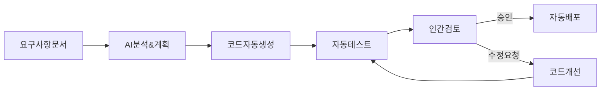

# [GUIDE-003] 개발 워크플로우

| 버전 | 날짜       | 변경 내용                 |
| ---- | ---------- | ------------------------- |
| 1.0  | 2025-04-02 | 최초 문서 작성            |
| 2.0  | 2025-04-08 | AI 주도 워크플로우로 개선 |

## 관련 문서

- [[GUIDE-001] 시작하기](../1-guides/GUIDE-001-getting-started.md)
- [[GUIDE-002] 프로젝트 구조](../1-guides/GUIDE-002-project-structure.md)
- [[GUIDE-004] 코딩 표준](../1-guides/GUIDE-004-coding-standards.md)

## 요약

본 문서는 Automata-Signal 프로젝트의 AI 주도 개발 워크플로우를 설명합니다. 기획/기술 문서를 바탕으로 AI가 자율적으로 계획 수립부터 코드 생성, 테스트, 배포까지 주도하는 프로세스와 인간 개발자의 검토 및 조정 방식을 다룹니다.

## 대상 독자

- 신규 개발자
- 기존 개발팀
- 프로젝트 기여자
- AI 도구 관리자

## 1. AI 주도 개발 워크플로우 개요

Automata-Signal 프로젝트는 AI가 주도하는 개발 워크플로우를 채택하여 개발 생산성과 일관성을 극대화합니다:



### 1.1 주요 단계 설명

1. **요구사항 문서화**: 기획/기술 문서를 통해 개발 대상 정의
2. **AI 분석 및 계획**: AI가 요구사항을 분석하고 구현 계획 자동 수립
3. **코드 자동 생성**: AI가 계획에 따라 코드 자동 생성
4. **자동 테스트**: 테스트 코드 생성 및 실행
5. **인간 검토**: 개발자가 결과물 검토 및 피드백 제공
6. **코드 개선**: 피드백에 따른 자동 코드 개선
7. **자동 배포**: 승인 후 CI/CD 파이프라인을 통한 자동 배포

### 1.2 AI와 인간 역할 분담

| 단계      | AI 역할                                 | 인간 역할                        |
| --------- | --------------------------------------- | -------------------------------- |
| 계획 수립 | 요구사항 분석, 아키텍처 결정, 작업 분할 | 필요시 추가 맥락 제공, 계획 승인 |
| 코드 생성 | 전체 코드 작성, 문서화, 모범 사례 적용  | 필요시 특정 접근법 지정          |
| 테스트    | 테스트 케이스 생성, 테스트 실행 및 분석 | 추가 테스트 케이스 제안          |
| 검토      | 자체 코드 리뷰, 개선 제안               | 최종 검토, 비즈니스 로직 확인    |
| 배포      | 배포 스크립트 생성, 환경 설정           | 배포 승인, 결과 모니터링         |

## 2. AI 개발 시작 프로세스

### 2.1 개발 지시 방법

Cursor에서 AI 주도 개발을 시작하는 기본 명령:

```
기술 문서를 바탕으로 [기능명]을 구현해주세요.
계획 수립부터 코드 작성, 테스트까지 자동으로 진행해주세요.
```

이 명령을 내리면 AI는 컨텍스트로 제공된 문서를 분석하고 다음 순서로 진행합니다:

1. 요구사항 요약 및 확인
2. 구현 계획 자동 수립
3. 필요한 파일 및 변경사항 정의
4. 순차적 코드 구현
5. 테스트 코드 생성 및 실행
6. 결과 보고

### 2.2 상세 구현 계획 자동 생성

AI는 다음 형식으로 계획을 자동 생성합니다:

```markdown
# [기능명] 구현 계획

## 1. 요구사항 분석

- 핵심 기능 요약
- 기술적 제약사항
- 기존 코드와의 통합 포인트

## 2. 아키텍처 설계

- 사용할 모듈 및 컴포넌트
- 데이터 흐름 다이어그램
- 주요 인터페이스 정의

## 3. 구현 단계

1. [파일1] 작성: 주요 기능 X 구현
2. [파일2] 수정: 기존 기능과 통합
3. [파일3] 작성: 테스트 코드 구현
   ...

## 4. 테스트 전략

- 단위 테스트 범위
- 통합 테스트 시나리오
- 예상 엣지 케이스

## 5. 배포 계획

- 필요한 환경 변수
- 마이그레이션 단계
- 롤백 전략
```

### 2.3 개발 범위 조정 명령

AI의 개발 범위를 조정하기 위한 명령 예시:

```
# 특정 모듈에 집중
"adapters/push_adapter.ex 모듈만 우선 구현해주세요."

# 특정 기능 제외
"데이터베이스 마이그레이션은 제외하고 구현해주세요."

# 복잡도 제한
"최소 기능(MVP)으로만 우선 구현해주세요."

# 단계 제한
"계획 수립과 인터페이스 정의까지만 진행해주세요."
```

## 3. 자동 코드 구현 프로세스

### 3.1 파일 순차 구현

AI는 의존성을 고려하여 다음 순서로 파일을 자동 구현합니다:

1. **인터페이스/프로토콜**: 먼저 모듈 간 계약 정의
2. **핵심 모델/리소스**: Ash 리소스 등 데이터 모델 정의
3. **유틸리티 함수**: 공통으로 사용되는 헬퍼 기능
4. **비즈니스 로직**: 주요 서비스 및 비즈니스 규칙
5. **어댑터/통합**: 외부 시스템 연동 코드
6. **테스트 코드**: 각 구현에 대한 테스트 슈트

각 파일은 Cursor에서 자동으로 생성되며, 이전 구현을 참조하여 일관성을 유지합니다.

### 3.2 Ash Framework 리소스 자동 생성

AI는 Ash Framework 리소스를 다음 패턴으로 자동 생성합니다:

```elixir
defmodule AutomataSignal.Resources.NewResource do
  use Ash.Resource,
    data_layer: Ash.DataLayer.Postgres,
    extensions: [필요한_확장_모듈]

  # 메타데이터 주석
  @moduledoc """
  [리소스 설명]

  자동 생성: [timestamp]
  """

  # 속성 정의
  attributes do
    uuid_primary_key :id

    # 주요 속성
    attribute :name, :string
    attribute :status, :atom do
      constraints [one_of: [:active, :inactive]]
      default :active
    end

    # 관계 식별자
    attribute :parent_id, :uuid

    # 타임스탬프
    timestamps()
  end

  # 관계 정의
  relationships do
    belongs_to :parent, Parent
    has_many :children, Child
  end

  # 확장 모듈 설정
  [확장_모듈_설정]

  # 액션 정의
  actions do
    defaults [:create, :read, :update, :destroy]

    [커스텀_액션]
  end

  # 계산 속성
  calculations do
    [계산_속성]
  end
end
```

### 3.3 자동 테스트 코드 생성

각 구현에 대한 테스트 코드가 자동으로 생성됩니다:

```elixir
defmodule AutomataSignal.NewResourceTest do
  use AutomataSignal.DataCase

  alias AutomataSignal.Resources.NewResource

  describe "기본 CRUD 작업" do
    test "리소스 생성" do
      # 설정
      attrs = %{name: "테스트 이름", status: :active}

      # 실행
      assert {:ok, resource} = NewResource.create(attrs)

      # 검증
      assert resource.name == "테스트 이름"
      assert resource.status == :active
    end

    # 추가 테스트 케이스...
  end

  describe "비즈니스 규칙" do
    # 비즈니스 규칙 검증 테스트...
  end

  describe "엣지 케이스" do
    # 엣지 케이스 테스트...
  end
end
```

### 3.4 주석 및 문서화

AI가 자동으로 추가하는 문서화 요소:

1. **모듈 문서**: 모듈의 목적, 주요 함수, 사용 예시
2. **함수 문서**: 매개변수, 반환값, 예외, 사용 예시
3. **구현 주석**: 복잡한 알고리즘이나 비즈니스 로직 설명
4. **테스트 설명**: 각 테스트 케이스의 목적과 검증 대상
5. **TODO 주석**: 향후 개선 필요 사항 표시

## 4. 인간 검토 및 피드백 프로세스

### 4.1 자동 생성 코드 검토 방법

인간 개발자는 다음 측면에 집중하여 AI 생성 코드를 검토합니다:

1. **비즈니스 요구사항 충족**: 모든 요구사항이 올바르게 구현되었는지 확인
2. **아키텍처 일관성**: 프로젝트 아키텍처와 일치하는지 검토
3. **성능 고려사항**: 성능 영향이 큰 부분 최적화 여부 확인
4. **보안 고려사항**: 잠재적 보안 이슈 확인
5. **테스트 커버리지**: 핵심 기능 및 엣지 케이스 테스트 여부

### 4.2 피드백 제공 방법

AI에게 효과적인 피드백을 제공하는 방법:

```
# 코드 개선 요청
"[파일명]의 [함수명] 함수에서 [문제점]을 개선해주세요. [개선 방향]"

# 대안 요청
"[접근 방식]에 대한 대안을 제시해주세요. [우려 사항]"

# 추가 구현 요청
"[기능]에 대한 추가 기능으로 [세부 기능]을 구현해주세요."

# 테스트 보강 요청
"[시나리오]에 대한 테스트 케이스를 추가해주세요."
```

### 4.3 반복 개발 사이클

피드백 후 AI는 다음 과정으로 개선을 진행합니다:

1. 피드백 이해 및 확인
2. 관련 코드 부분 식별
3. 요청된 변경사항 구현
4. 영향받는 테스트 업데이트
5. 변경사항 요약 보고

## 5. CI/CD 및 자동 배포

### 5.1 GitHub Actions 자동화

AI가 구현한 코드는 다음 GitHub Actions 워크플로우를 통해 자동으로 검증 및 배포됩니다:

```yaml
name: CI/CD Pipeline

on:
  push:
    branches: [main, develop]
  pull_request:
    branches: [main, develop]
  workflow_dispatch:

jobs:
  validate:
    name: Validate AI Code
    runs-on: ubuntu-latest
    steps:
      - uses: actions/checkout@v3
      - name: AI Code Quality Check
        uses: acme/ai-code-validator@v1
        with:
          openai_api_key: ${{ secrets.OPENAI_API_KEY }}
          quality_threshold: 85

  test:
    name: Build and Test
    needs: validate
    runs-on: ubuntu-latest
    services:
      postgres:
        image: postgres:17
        # ... 설정 ...
    steps:
      - uses: actions/checkout@v3
      - uses: erlef/setup-beam@v1
        # ... 설정 ...
      - name: Install dependencies
        run: mix deps.get
      - name: Run tests with coverage
        run: mix coveralls

  deploy:
    name: Deploy to fly.io
    needs: [validate, test]
    if: github.event_name == 'push' && (github.ref == 'refs/heads/main' || github.ref == 'refs/heads/develop')
    runs-on: ubuntu-latest
    steps:
      - uses: actions/checkout@v3
      - uses: superfly/flyctl-actions/setup-flyctl@master
      # ... 배포 설정 ...
```

### 5.2 자동 배포 환경

AI 생성 코드는 승인 후 다음 환경으로 자동 배포됩니다:

1. **개발(development)**: `develop` 브랜치 병합 시

   - URL: `https://dev.automata-signal.fly.dev`
   - 목적: 개발자 테스트 및 통합 검증

2. **스테이징(staging)**: 수동 승인 후

   - URL: `https://staging.automata-signal.fly.dev`
   - 목적: QA 및 사용자 인수 테스트

3. **프로덕션(production)**: `main` 브랜치 병합 시
   - URL: `https://automata-signal.fly.dev`
   - 목적: 실제 사용자 서비스

### 5.3 배포 후 검증

AI는 배포 후 다음 검증을 자동으로 수행합니다:

1. **스모크 테스트**: 핵심 API 및 기능 가용성 확인
2. **성능 모니터링**: 응답 시간 및 리소스 사용량 추적
3. **오류 모니터링**: 예외 및 오류 로그 분석
4. **롤백 기준**: 자동 롤백 트리거 조건 모니터링

## 6. AI 주도 개발의 작업 유형별 가이드

### 6.1 새로운 기능 개발

```
새로운 기능 [기능명]을 개발해주세요.

요구사항:
1. [요구사항1]
2. [요구사항2]
...

참고 문서:
- [문서1 링크]
- [문서2 링크]
```

AI는 요구사항 분석부터 테스트까지 전체 개발 사이클을 자동 수행합니다.

### 6.2 버그 수정

```
다음 버그를 수정해주세요:

버그 설명: [버그 설명]
재현 단계: [재현 단계]
예상 동작: [예상 동작]
현재 동작: [현재 동작]

관련 파일:
- [파일1 경로]
- [파일2 경로]
```

AI는 버그를 분석하고, 문제 해결 방안을 제시한 후 코드를 수정합니다.

### 6.3 성능 최적화

```
[모듈/기능]의 성능을 최적화해주세요.

현재 성능: [현재 성능 지표]
목표 성능: [목표 성능 지표]
병목 포인트: [예상 병목 지점]
```

AI는 성능 최적화 계획을 수립하고, 코드를 최적화한 후 성능 테스트를 진행합니다.

### 6.4 코드 리팩토링

```
[모듈/파일]을 리팩토링해주세요.

리팩토링 목적: [리팩토링 이유]
유지할 동작: [변경하지 않아야 할 동작]
개선 방향: [코드 품질 개선 방향]
```

AI는 기존 동작을 유지하면서 코드 구조와 가독성을 개선합니다.

### 6.5 테스트 보강

```
[모듈/기능]의 테스트 커버리지를 개선해주세요.

현재 커버리지: [현재 커버리지]
목표 커버리지: [목표 커버리지]
테스트 시나리오:
1. [시나리오1]
2. [시나리오2]
...
```

AI는 필요한 테스트 케이스를 추가하고, 기존 테스트를 개선합니다.

## 7. AI 주도 개발 모범 사례

### 7.1 효과적인 지시 작성법

AI에게 효과적인 지시를 내리는 방법:

1. **명확한 기능 정의**: 구현할 기능을 명확히 설명
2. **맥락 정보 제공**: 관련 기존 코드와 문서 참조
3. **제약사항 명시**: 기술적 제약이나 아키텍처 요구사항 설명
4. **우선순위 지정**: 핵심 기능과 부가 기능 구분
5. **예상 결과 설명**: 최종 결과물의 기대 동작 설명

### 7.2 AI 코드 품질 보장

AI 생성 코드의 품질을 보장하는 방법:

1. **점진적 개발**: 한 번에 모든 것을 요청하지 않고 단계적으로 접근
2. **테스트 중심**: 테스트 코드 작성을 필수로 요청
3. **명시적 검증**: 주요 로직의 검증 방법 지정
4. **코드 리뷰 포인트**: 인간 검토 시 중점적으로 볼 부분 지정
5. **문서화 요구**: 코드 문서화 및 주석 요청

### 7.3 AI 개발 진행 상황 추적

AI 개발 상황을 추적하는 방법:

1. **진행 상황 보고서**: AI에게 정기적인 진행 상황 보고 요청
2. **체크포인트 설정**: 중간 검토 시점 지정
3. **문제 조기 식별**: "현재 어려움을 겪고 있는 부분이 있나요?" 질문
4. **문서 업데이트**: README 또는 설계 문서 업데이트 요청
5. **지표 추적**: 코드 생성량, 테스트 커버리지 등 정량적 지표 요청

## 8. 문제 해결 및 제한사항

### 8.1 AI 개발 한계 상황

AI가 효과적으로 처리하기 어려울 수 있는 상황:

1. **복잡한 분산 시스템 설계**: 다중 노드 간 상호작용이 복잡한 경우
2. **하드웨어 특화 최적화**: 특정 하드웨어에 최적화된 로직
3. **보안 중심 암호화 구현**: 고급 암호화 알고리즘 설계
4. **매우 특화된 도메인 지식**: 프로젝트에 특화된 비공개 지식 의존
5. **대규모 레거시 코드 마이그레이션**: 문서화되지 않은 복잡한 레거시 시스템

### 8.2 대체 접근법

한계 상황에서의 대체 접근법:

1. **하이브리드 접근**: AI는 기본 구조, 인간은 복잡한 로직
2. **점진적 개발**: 복잡한 시스템을 작은 모듈로 분할
3. **설계 중심**: AI에게 설계 문서만 생성 요청, 구현은 인간
4. **페어 프로그래밍**: 인간과 AI가 함께 실시간 개발
5. **검토 중심**: 인간이 구현, AI가 코드 리뷰 및 개선 제안

### 8.3 문제 해결 워크플로우

AI 개발 중 문제 발생 시 해결 방법:

1. **문제 진단 요청**: "현재 직면한 문제를 분석해주세요."
2. **컨텍스트 확장**: 추가 문서나 코드 참조 제공
3. **단순화된 접근**: 복잡한 부분 분리하여 단계적 접근
4. **대안 요청**: "다른 접근 방식을 제안해주세요."
5. **인간 개입**: 복잡한 부분을 인간이 구현하고 AI에 통합 요청

## 9. AI 개발 팀 협업 가이드라인

### 9.1 AI 개발 문화

효과적인 AI 주도 개발 문화 조성:

1. **지식 공유**: AI 프롬프트와 결과 공유
2. **실험 장려**: 다양한 AI 접근법 시도 및 결과 공유
3. **지속적 학습**: AI 도구 활용 방법 정기 교육
4. **성과 측정**: AI 활용 효과 추적 및 공유
5. **책임 분담**: AI와 인간 개발자 간 명확한 책임 정의

### 9.2 팀 내 의사소통

AI 주도 개발 환경에서의 효과적인 의사소통:

1. **AI 생성 코드 표시**: AI 생성 코드임을 PR에 명시
2. **설계 논의**: 설계 단계에서 AI 제안에 대한 팀 논의
3. **지식 베이스 구축**: 프로젝트 특화 프롬프트 및 패턴 공유
4. **리뷰 가이드라인**: AI 코드 리뷰 중점 사항 합의
5. **실패 사례 공유**: AI 한계 상황 및 해결 방법 공유
