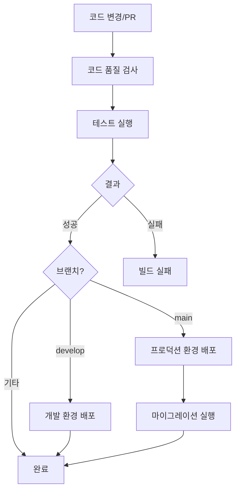

# [GUIDE-005] CI/CD 파이프라인

| 버전 | 날짜       | 변경 내용      |
| ---- | ---------- | -------------- |
| 1.0  | 2025-04-10 | 최초 문서 작성 |

## 관련 문서

- [[GUIDE-001] 시작하기](../1-guides/GUIDE-001-getting-started.md)
- [[GUIDE-002] 프로젝트 구조](../1-guides/GUIDE-002-project-structure.md)
- [[GUIDE-003] AI 주도 개발 워크플로우](../1-guides/GUIDE-003-ai-driven-development-workflow.md)
- [[GUIDE-004] 코딩 표준](../1-guides/GUIDE-004-coding-standards.md)

## 요약

본 문서는 Automata-Signal 프로젝트의 CI/CD(지속적 통합 및 배포) 파이프라인을 설명합니다. GitHub Actions를 활용한 코드 품질 검증, 테스트 자동화, 그리고 다중 환경 배포 프로세스에 대한 상세 내용을 제공합니다.

## 대상 독자

- 개발자
- DevOps 엔지니어
- 시스템 운영자

## 1. CI/CD 파이프라인 개요

Automata-Signal 프로젝트는 GitHub Actions를 통해 완전 자동화된 CI/CD 파이프라인을 구현합니다. 이 파이프라인은 코드 품질 검증부터 다중 환경 자동 배포까지의 전체 과정을 자동화합니다.

### 1.1 파이프라인 흐름



### 1.2 주요 구성 요소

1. **코드 품질 검증**: 코드 형식, 스타일, 보안 취약점 등 검사
2. **자동화된 테스트**: 단위 테스트, 통합 테스트 실행 및 커버리지 측정
3. **환경별 배포**: 특정 브랜치 변경에 따른 자동 배포
   - 개발(Development): develop 브랜치 변경 시
   - 스테이징(Staging): 수동 워크플로우 트리거 시
   - 프로덕션(Production): main 브랜치 변경 시 (다중 리전 배포)

## 2. GitHub Actions 워크플로우

### 2.1 워크플로우 파일 구성

CI/CD 파이프라인은 `.github/workflows/ci_cd.yml` 파일에 정의되어 있습니다:

```yaml
# .github/workflows/ci_cd.yml
name: CI/CD Pipeline

on:
  push:
    branches: [main, develop]
  pull_request:
    branches: [main, develop]
  workflow_dispatch:

jobs:
  verify:
    name: Code Quality & Tests
    runs-on: ubuntu-latest
    services:
      postgres:
        image: postgres:17
        env:
          POSTGRES_USER: postgres
          POSTGRES_PASSWORD: postgres
          POSTGRES_DB: automata_test
        ports:
          - 5432:5432
        options: >-
          --health-cmd pg_isready
          --health-interval 10s
          --health-timeout 5s
          --health-retries 5

    steps:
      - uses: actions/checkout@v3
      - uses: erlef/setup-beam@v1
        with:
          otp-version: '27'
          elixir-version: '1.18'

      - name: Cache deps
        uses: actions/cache@v3
        with:
          path: deps
          key: ${{ runner.os }}-mix-${{ hashFiles(format('{0}{1}', github.workspace, '/mix.lock')) }}
          restore-keys: |
            ${{ runner.os }}-mix-

      - name: Cache _build
        uses: actions/cache@v3
        with:
          path: _build
          key: ${{ runner.os }}-build-${{ hashFiles(format('{0}{1}', github.workspace, '/mix.lock')) }}
          restore-keys: |
            ${{ runner.os }}-build-

      - name: Install Dependencies
        run: mix deps.get

      - name: Check Formatting
        run: mix format --check-formatted

      - name: Run Credo
        run: mix credo --strict

      - name: Run Dialyxir
        run: mix dialyxir

      - name: Run Sobelow
        run: mix sobelow --config

      - name: Run Tests with Coverage
        run: mix coveralls.github
        env:
          GITHUB_TOKEN: ${{ secrets.GITHUB_TOKEN }}

  deploy_dev:
    name: Deploy to Development
    needs: verify
    if: github.event_name == 'push' && github.ref == 'refs/heads/develop'
    runs-on: ubuntu-latest

    steps:
      - uses: actions/checkout@v3
      - uses: superfly/flyctl-actions/setup-flyctl@master
      - name: Deploy to Development
        env:
          FLY_API_TOKEN: ${{ secrets.FLY_API_TOKEN }}
        run: |
          flyctl deploy --app automata-signal-dev --config fly.dev.toml

  deploy_staging:
    name: Deploy to Staging
    needs: verify
    if: github.event_name == 'workflow_dispatch'
    runs-on: ubuntu-latest
    environment: staging

    steps:
      - uses: actions/checkout@v3
      - uses: superfly/flyctl-actions/setup-flyctl@master
      - name: Deploy to Staging
        env:
          FLY_API_TOKEN: ${{ secrets.FLY_API_TOKEN }}
        run: |
          flyctl deploy --app automata-signal-staging --config fly.staging.toml

  deploy_production:
    name: Deploy to Production
    needs: verify
    if: github.event_name == 'push' && github.ref == 'refs/heads/main'
    runs-on: ubuntu-latest
    environment: production

    steps:
      - uses: actions/checkout@v3
      - uses: superfly/flyctl-actions/setup-flyctl@master
      - name: Deploy to Production
        env:
          FLY_API_TOKEN: ${{ secrets.FLY_API_TOKEN }}
        run: |
          for region in nrt fra syd; do
            flyctl deploy --app automata-signal-$region --config fly.prod.$region.toml
          done

      - name: Run Migrations
        env:
          FLY_API_TOKEN: ${{ secrets.FLY_API_TOKEN }}
        run: |
          flyctl ssh console --app automata-signal-nrt --command "/app/bin/automata eval 'Automata.Release.migrate'"
```

### 2.2 트리거 이벤트

워크플로우는 다음 이벤트에 의해 트리거됩니다:

1. **push**: main 또는 develop 브랜치에 코드가 푸시될 때
2. **pull_request**: main 또는 develop 브랜치로 PR이 생성될 때
3. **workflow_dispatch**: 수동으로 워크플로우를 실행할 때

### 2.3 작업(Jobs) 구성

워크플로우는 다음 작업들로 구성됩니다:

1. **verify**: 코드 품질 검사 및 테스트 실행
2. **deploy_dev**: 개발 환경 배포 (develop 브랜치에 변경 사항이 있을 때)
3. **deploy_staging**: 스테이징 환경 배포 (수동 트리거 시)
4. **deploy_production**: 프로덕션 환경 배포 (main 브랜치에 변경 사항이 있을 때)

## 3. 코드 품질 및 테스트 검증

### 3.1 사용되는 도구

`verify` 작업에서는 다음 코드 품질 도구가 사용됩니다:

| 도구        | 명령                           | 목적                         |
| ----------- | ------------------------------ | ---------------------------- |
| Formatter   | `mix format --check-formatted` | 코드 형식 일관성 검사        |
| Credo       | `mix credo --strict`           | 코드 스타일 및 일관성 검사   |
| Dialyxir    | `mix dialyxir`                 | 타입 검사                    |
| Sobelow     | `mix sobelow --config`         | 보안 취약점 분석             |
| ExCoveralls | `mix coveralls.github`         | 테스트 커버리지 측정 및 보고 |

### 3.2 데이터베이스 서비스

테스트 실행 시 다음과 같이 PostgreSQL 서비스가 제공됩니다:

```yaml
services:
  postgres:
    image: postgres:17
    env:
      POSTGRES_USER: postgres
      POSTGRES_PASSWORD: postgres
      POSTGRES_DB: automata_test
    ports:
      - 5432:5432
    options: >-
      --health-cmd pg_isready
      --health-interval 10s
      --health-timeout 5s
      --health-retries 5
```

### 3.3 캐싱 최적화

빌드 시간을 단축하기 위해 다음 항목을 캐싱합니다:

1. **deps 디렉토리**: 의존성 라이브러리 캐싱
2. **\_build 디렉토리**: 컴파일된 결과물 캐싱

```yaml
- name: Cache deps
  uses: actions/cache@v3
  with:
    path: deps
    key: ${{ runner.os }}-mix-${{ hashFiles(format('{0}{1}', github.workspace, '/mix.lock')) }}
    restore-keys: |
      ${{ runner.os }}-mix-

- name: Cache _build
  uses: actions/cache@v3
  with:
    path: _build
    key: ${{ runner.os }}-build-${{ hashFiles(format('{0}{1}', github.workspace, '/mix.lock')) }}
    restore-keys: |
      ${{ runner.os }}-build-
```

## 4. 환경별 배포 구성

### 4.1 배포 프로세스

각 환경에 대한 배포 작업은 다음과 같은 조건과 단계로 구성됩니다:

#### 개발 환경 배포

```yaml
deploy_dev:
  name: Deploy to Development
  needs: verify
  if: github.event_name == 'push' && github.ref == 'refs/heads/develop'
  runs-on: ubuntu-latest

  steps:
    - uses: actions/checkout@v3
    - uses: superfly/flyctl-actions/setup-flyctl@master
    - name: Deploy to Development
      env:
        FLY_API_TOKEN: ${{ secrets.FLY_API_TOKEN }}
      run: |
        flyctl deploy --app automata-signal-dev --config fly.dev.toml
```

#### 스테이징 환경 배포

```yaml
deploy_staging:
  name: Deploy to Staging
  needs: verify
  if: github.event_name == 'workflow_dispatch'
  runs-on: ubuntu-latest
  environment: staging

  steps:
    - uses: actions/checkout@v3
    - uses: superfly/flyctl-actions/setup-flyctl@master
    - name: Deploy to Staging
      env:
        FLY_API_TOKEN: ${{ secrets.FLY_API_TOKEN }}
      run: |
        flyctl deploy --app automata-signal-staging --config fly.staging.toml
```

#### 프로덕션 환경 배포

```yaml
deploy_production:
  name: Deploy to Production
  needs: verify
  if: github.event_name == 'push' && github.ref == 'refs/heads/main'
  runs-on: ubuntu-latest
  environment: production

  steps:
    - uses: actions/checkout@v3
    - uses: superfly/flyctl-actions/setup-flyctl@master
    - name: Deploy to Production
      env:
        FLY_API_TOKEN: ${{ secrets.FLY_API_TOKEN }}
      run: |
        for region in nrt fra syd; do
          flyctl deploy --app automata-signal-$region --config fly.prod.$region.toml
        done

    - name: Run Migrations
      env:
        FLY_API_TOKEN: ${{ secrets.FLY_API_TOKEN }}
      run: |
        flyctl ssh console --app automata-signal-nrt --command "/app/bin/automata eval 'Automata.Release.migrate'"
```

### 4.2 환경별 구성 파일

각 환경은 별도의 구성 파일을 사용합니다:

| 환경     | 구성 파일              | 애플리케이션 이름        |
| -------- | ---------------------- | ------------------------ |
| 개발     | fly.dev.toml           | automata-signal-dev      |
| 스테이징 | fly.staging.toml       | automata-signal-staging  |
| 프로덕션 | fly.prod.{region}.toml | automata-signal-{region} |

### 4.3 환경 승인 프로세스

스테이징 및 프로덕션 환경은 GitHub Environments를 통한 승인 프로세스를 적용할 수 있습니다:

```yaml
environment: staging
```

```yaml
environment: production
```

이를 통해 배포 전 지정된 리뷰어의 승인을 요구할 수 있습니다.

## 5. 비밀 관리

### 5.1 GitHub Secrets

워크플로우에서 사용되는 비밀은 GitHub Secrets를 통해 관리됩니다:

- **GITHUB_TOKEN**: GitHub API 접근을 위한 토큰 (GitHub에서 자동 제공)
- **FLY_API_TOKEN**: fly.io API 접근을 위한 토큰

비밀은 다음과 같이 환경 변수로 접근합니다:

```yaml
env:
  FLY_API_TOKEN: ${{ secrets.FLY_API_TOKEN }}
```

### 5.2 환경별 비밀 관리

환경별로 다른 비밀을 사용해야 하는 경우, GitHub Environments 기능을 활용하여 환경별 비밀을 구성할 수 있습니다.

## 6. 모니터링 및 피드백

### 6.1 워크플로우 실행 모니터링

GitHub Actions 대시보드에서 워크플로우 실행 상태를 모니터링할 수 있습니다:

- GitHub 저장소 → Actions 탭 → CI/CD Pipeline 워크플로우

### 6.2 빌드 상태 배지

README.md 파일에 다음과 같은 빌드 상태 배지를 추가하여 최신 빌드 상태를 표시할 수 있습니다:

```markdown

```

### 6.3 테스트 커버리지 보고서

ExCoveralls를 통해 생성된 테스트 커버리지 보고서는 GitHub Actions의 실행 결과에서 확인할 수 있습니다.

## 7. 문제 해결

### 7.1 일반적인 문제

| 문제                | 해결 방법                                                  |
| ------------------- | ---------------------------------------------------------- |
| 의존성 설치 실패    | `mix.lock` 파일이 저장소에 포함되어 있는지 확인            |
| 테스트 실패         | 로컬에서 `mix test`를 실행하여 문제 확인                   |
| 포맷팅 검사 실패    | `mix format`을 실행한 후 변경사항 커밋                     |
| 코드 품질 검사 실패 | `mix credo --strict`를 로컬에서 실행하여 문제 확인 및 수정 |
| 배포 실패           | fly.io 구성 파일이 올바른지 확인                           |

### 7.2 디버깅 방법

GitHub Actions의 실행 로그를 확인하여 오류의 원인을 파악할 수 있습니다:

1. GitHub 저장소 → Actions 탭 → 해당 워크플로우 실행 → 실패한 작업 클릭
2. 오류가 발생한 단계의 로그 확인

### 7.3 수동 워크플로우 실행

문제 해결을 위해 워크플로우를 수동으로 실행할 수 있습니다:

1. GitHub 저장소 → Actions 탭 → CI/CD Pipeline 워크플로우 → Run workflow 버튼
2. 필요한 경우 브랜치 선택 후 실행

## 8. 파이프라인 확장 및 커스터마이징

### 8.1 새 작업 추가

새로운 작업을 추가하려면 `jobs` 섹션에 다음과 같이 정의합니다:

```yaml
jobs:
  # 기존 작업들...

  new_job_name:
    name: New Job Description
    runs-on: ubuntu-latest
    needs: [verify] # 의존하는 작업 지정

    steps:
      - uses: actions/checkout@v3
      # 필요한 단계 추가
```

### 8.2 환경 추가

새로운 환경(예: QA)을 추가하려면 다음과 같이 설정합니다:

```yaml
deploy_qa:
  name: Deploy to QA
  needs: verify
  if: github.event_name == 'push' && github.ref == 'refs/heads/qa'
  runs-on: ubuntu-latest
  environment: qa

  steps:
    - uses: actions/checkout@v3
    - uses: superfly/flyctl-actions/setup-flyctl@master
    - name: Deploy to QA
      env:
        FLY_API_TOKEN: ${{ secrets.FLY_API_TOKEN }}
      run: |
        flyctl deploy --app automata-signal-qa --config fly.qa.toml
```

### 8.3 통합 추가

알림 시스템(Slack, Teams 등)과의 통합은 다음과 같이 추가할 수 있습니다:

```yaml
- name: Slack Notification
  uses: 8398a7/action-slack@v3
  with:
    status: ${{ job.status }}
    fields: repo,message,commit,author,action,workflow
  env:
    SLACK_WEBHOOK_URL: ${{ secrets.SLACK_WEBHOOK_URL }}
  if: always() # 성공/실패 상관없이 항상 알림 전송
```

## 9. 모범 사례

### 9.1 워크플로우 최적화

1. **캐싱 활용**: 의존성과 빌드 결과물을 캐싱하여 실행 시간 단축
2. **매트릭스 빌드**: 여러 버전의 Elixir/OTP로 테스트해야 하는 경우 매트릭스 전략 사용
3. **필요한 작업만 실행**: 조건부 실행을 통해 필요한 작업만 수행

### 9.2 보안 강화

1. **비밀 관리**: 모든 민감한 정보는 GitHub Secrets로 관리
2. **최소 권한**: 각 작업에 필요한 최소한의 권한만 부여
3. **의존성 검사**: `mix hex.audit`를 통한 의존성 취약점 검사 추가

### 9.3 배포 안전성

1. **점진적 롤아웃**: 중요 변경사항은 단계적으로 배포
2. **Canary 배포**: 일부 사용자에게만 새 버전 배포 후 모니터링
3. **자동 롤백**: 중요 지표 이상 시 자동 롤백 메커니즘 구현

## 10. 참고 자료

- [GitHub Actions 공식 문서](https://docs.github.com/en/actions)
- [fly.io 배포 가이드](https://fly.io/docs/languages-and-frameworks/elixir/)
- [ExCoveralls 문서](https://github.com/parroty/excoveralls)
- [Credo 문서](https://github.com/rrrene/credo)
- [Dialyxir 문서](https://github.com/jeremyjh/dialyxir)
- [Sobelow 문서](https://github.com/nccgroup/sobelow)
