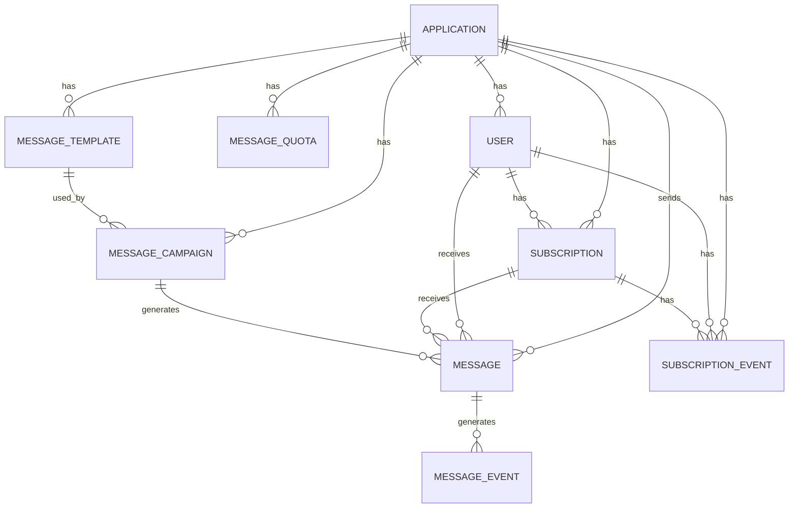

# [DESIGN-003] 데이터 모델

| 버전 | 날짜       | 변경 내용      |
| ---- | ---------- | -------------- |
| 1.0  | 2025-04-02 | 최초 문서 작성 |

## 관련 문서

- [DESIGN-001] 아키텍처 개요
- [DESIGN-002] 시스템 아키텍처
- [REF-002] 상태 코드
- [COMP-002] 어댑터 시스템

## 요약

본 문서는 Automata-Signal 시스템의 데이터 모델을 상세히 설명합니다. Ash Framework를 사용하여 구현된 핵심 리소스, 그들의 속성, 관계 및 비즈니스 규칙을 포함합니다.

## 대상 독자

- 백엔드 개발자
- 데이터베이스 관리자
- 시스템 아키텍트
- API 개발자

## 1. 개념적 데이터 모델

Automata-Signal 시스템의 핵심 데이터 모델을 개체-관계 다이어그램으로 표현합니다:



## 2. 핵심 리소스 정의

Automata-Signal 시스템은 다음과 같은 핵심 리소스로 구성됩니다.

### 2.1 Application

메시징 서비스를 사용하는, 시스템에 등록된 애플리케이션을 나타냅니다.

```elixir
defmodule AutomataSignal.Resources.Application do
  use Ash.Resource,
    data_layer: Ash.DataLayer.Postgres

  attributes do
    uuid_primary_key :id

    attribute :name, :string do
      constraints [
        required: true,
        min_length: 1,
        max_length: 100
      ]
    end

    attribute :api_key, :string do
      constraints [required: true]
      sensitive? true
    end

    attribute :settings, :map, default: %{}

    timestamps()

    attribute :is_active, :boolean, default: true
  end

  relationships do
    has_many :users, AutomataSignal.Resources.User
    has_many :subscriptions, AutomataSignal.Resources.Subscription
    has_many :messages, AutomataSignal.Resources.Message
    has_many :templates, AutomataSignal.Resources.MessageTemplate
    has_many :campaigns, AutomataSignal.Resources.MessageCampaign
    has_one :quota, AutomataSignal.Resources.MessageQuota
  end

  actions do
    defaults [:create, :read, :update, :destroy]
  end

  # ... 추가 액션 및 정책 ...
end
```

**핵심 속성**:

- `id`: 애플리케이션의 고유 식별자 (UUID)
- `name`: 애플리케이션 이름
- `api_key`: API 호출 인증에 사용되는 키
- `settings`: 애플리케이션별 설정 (JSON/Map)
- `is_active`: 애플리케이션 활성화 상태

### 2.2 User

애플리케이션의 사용자(최종 사용자)를 나타냅니다.

```elixir
defmodule AutomataSignal.Resources.User do
  use Ash.Resource,
    data_layer: Ash.DataLayer.Postgres,
    extensions: [AshArchival.Resource]

  attributes do
    uuid_primary_key :id

    attribute :external_id, :string do
      constraints [required: true]
    end

    attribute :application_id, :uuid do
      constraints [required: true]
    end

    attribute :created_at, :utc_datetime
    attribute :last_active_at, :utc_datetime
  end

  relationships do
    belongs_to :application, AutomataSignal.Resources.Application
    has_many :subscriptions, AutomataSignal.Resources.Subscription
    has_many :messages, AutomataSignal.Resources.Message
  end

  # 아카이빙(논리적 삭제) 설정
  archival do
    archive_attribute :is_archived
    archive_timestamp_attribute :archived_at
  end

  # 복합 유니크 제약조건
  postgres do
    table "users"
    repo AutomataSignal.Repo

    unique_index [:external_id, :application_id]
  end

  actions do
    defaults [:create, :read, :update, :destroy]
  end

  # ... 추가 액션 및 정책 ...
end
```

**핵심 속성**:

- `id`: 내부 사용자 ID (UUID)
- `external_id`: 애플리케이션에서 사용하는 외부 사용자 ID
- `application_id`: 사용자가 속한 애플리케이션
- `created_at`: 사용자 생성 시간
- `last_active_at`: 마지막 활동 시간
- `is_archived`: 아카이빙(논리적 삭제) 상태

**중요 제약조건**:

- `external_id`와 `application_id`의 조합은 유일해야 함 (한 애플리케이션 내에서 사용자 식별자는 고유해야 함)

### 2.3 Subscription

사용자의 메시징 채널 구독 정보를 나타냅니다.

```elixir
defmodule AutomataSignal.Resources.Subscription do
  use Ash.Resource,
    data_layer: Ash.DataLayer.Postgres,
    extensions: [
      AshArchival.Resource,
      AshCloak.Resource
    ]

  attributes do
    uuid_primary_key :id

    attribute :token, :string, sensitive?: true do
      constraints [required: true]
    end

    attribute :type, :atom do
      constraints [
        required: true,
        one_of: [:iOSPush, :AndroidPush, :Email, :SMS, :KakaoTalk, :InAppMessage]
      ]
    end

    attribute :user_id, :uuid
    attribute :application_id, :uuid, allow_nil?: false

    # 디바이스 메타데이터 (푸시 알림 구독인 경우)
    attribute :device_model, :string
    attribute :device_os, :string
    attribute :device_language, :string
    attribute :app_version, :string
    attribute :sdk_version, :string
    attribute :country_code, :string
    attribute :test_type, :integer, default: 0

    # 구독 상태 관련 필드
    attribute :subscription_status, :integer, default: 0
    attribute :subscribed_at, :utc_datetime
    attribute :unsubscribed_at, :utc_datetime

    # 태그 (세그먼테이션 용도)
    attribute :tags, :map, default: %{}

    # 통계 지표
    attribute :last_active_at, :utc_datetime
    attribute :total_messages_received, :integer, default: 0
    attribute :total_messages_converted, :integer, default: 0
  end

  # 민감 데이터 암호화
  encrypted_attributes do
    attribute :token
  end

  relationships do
    belongs_to :user, AutomataSignal.Resources.User
    belongs_to :application, AutomataSignal.Resources.Application
    has_many :messages, AutomataSignal.Resources.Message
    has_many :subscription_events, AutomataSignal.Resources.SubscriptionEvent
  end

  # 아카이빙(논리적 삭제) 설정
  archival do
    archive_attribute :is_archived
    archive_timestamp_attribute :archived_at
  end

  # 계산된 속성
  calculations do
    calculate :is_push_channel, :boolean, expr: expr(type in [:iOSPush, :AndroidPush])
    calculate :is_messaging_channel, :boolean, expr: expr(type in [:Email, :SMS, :KakaoTalk])
    calculate :is_in_app_channel, :boolean, expr: expr(type == :InAppMessage)

    calculate :is_subscribed, :boolean, expr: expr(subscription_status > 0)
    calculate :is_unsubscribed, :boolean, expr: expr(subscription_status == -2 or subscription_status == -31)
    calculate :has_error, :boolean, expr: expr(subscription_status < -2 and subscription_status != -31 and subscription_status != -99)
    calculate :error_code_range, :string, expr: expr(
      cond do
        subscription_status >= -24 and subscription_status <= -3 -> "push_error"
        subscription_status >= -49 and subscription_status <= -40 -> "email_error"
        subscription_status >= -59 and subscription_status <= -50 -> "sms_error"
        subscription_status >= -69 and subscription_status <= -60 -> "kakao_error"
        subscription_status >= -79 and subscription_status <= -70 -> "in_app_error"
        true -> "other"
      end
    )
  end

  actions do
    defaults [:create, :read, :update, :destroy]

    create :register do
      accept [:token, :type, :user_id, :application_id, :device_model, :device_os, :device_language, :app_version, :sdk_version, :country_code, :test_type]
      change set_attribute(:subscription_status, 1)
      change set_attribute(:subscribed_at, &DateTime.utc_now/0)
    end

    update :unsubscribe do
      accept []
      change set_attribute(:subscription_status, -2)
      change set_attribute(:unsubscribed_at, &DateTime.utc_now/0)
    end

    update :add_tags do
      accept [:tags]
      argument :new_tags, :map do
        allow_nil? false
      end

      change fn changeset, _ ->
        current_tags = Ash.Changeset.get_attribute(changeset, :tags) || %{}
        new_tags = Ash.Changeset.get_argument(changeset, :new_tags)

        Ash.Changeset.set_attribute(changeset, :tags, Map.merge(current_tags, new_tags))
      end
    end
  end
end
```

**핵심 속성**:

- `id`: 구독의 고유 식별자 (UUID)
- `token`: 채널 토큰 (푸시 토큰, 이메일 주소, 전화번호 등)
- `type`: 구독 채널 유형 (iOSPush, AndroidPush, Email, SMS, KakaoTalk, InAppMessage)
- `user_id`: 연결된 사용자 ID (익명 사용자의 경우 null 가능)
- `application_id`: 연결된 애플리케이션 ID
- 디바이스 정보 (device_model, device_os 등)
- `subscription_status`: 구독 상태 코드
- `tags`: 세그먼테이션을 위한 키-값 태그

**중요 상태 코드**:

- 양수 값(1 이상): 구독 활성화 상태
- 0, -99: 초기 상태 (구독된 적 없음)
- -2: 사용자에 의한 구독 취소
- -31: API를 통해 비활성화됨
- -3 ~ -24: 푸시 알림 관련 오류
- -40 ~ -49: 이메일 관련 오류
- -50 ~ -59: SMS 관련 오류
- -60 ~ -69: 카카오톡 관련 오류
- -70 ~ -79: 인앱 메시지 관련 오류

### 2.4 Message

사용자에게 전송된 개별 메시지를 나타냅니다.

```elixir
defmodule AutomataSignal.Resources.Message do
  use Ash.Resource,
    data_layer: Ash.DataLayer.Postgres,
    extensions: [AshStateMachine.Resource]

  attributes do
    uuid_primary_key :id

    # 메시지 내용
    attribute :title, :string
    attribute :body, :string
    attribute :data, :map, default: %{}

    # 관계 식별자
    attribute :user_id, :uuid
    attribute :subscription_id, :uuid
    attribute :application_id, :uuid
    attribute :campaign_id, :uuid, allow_nil?: true

    # 상태 추적
    attribute :status, :atom do
      constraints [
        one_of: [:pending, :successful, :failed, :errored, :received, :converted]
      ]
      default :pending
    end

    attribute :channel_type, :atom do
      constraints [
        one_of: [:push, :email, :sms, :kakao_talk, :in_app]
      ]
    end

    # 타임스탬프
    timestamps()
    attribute :sent_at, :utc_datetime
    attribute :received_at, :utc_datetime
    attribute :converted_at, :utc_datetime
    attribute :failed_at, :utc_datetime

    # 오류 정보
    attribute :error_reason, :string
    attribute :error_details, :map, default: %{}

    # 이력 추적
    attribute :version_history, :map, default: %{}
  end

  # 상태 머신 정의
  state_machine do
    field :status

    initial_states [:pending]

    transitions do
      transition :send, from: [:pending], to: :successful
      transition :fail, from: [:pending, :successful], to: :failed
      transition :error, from: [:pending], to: :errored
      transition :retry, from: [:errored], to: :pending
      transition :receive, from: [:successful], to: :received
      transition :convert, from: [:received], to: :converted
    end

    on_transition :send do
      set_attribute :sent_at, &DateTime.utc_now/0
    end

    on_transition :fail do
      set_attribute :failed_at, &DateTime.utc_now/0
    end

    on_transition :receive do
      set_attribute :received_at, &DateTime.utc_now/0
    end

    on_transition :convert do
      set_attribute :converted_at, &DateTime.utc_now/0
    end
  end

  relationships do
    belongs_to :user, AutomataSignal.Resources.User
    belongs_to :subscription, AutomataSignal.Resources.Subscription
    belongs_to :application, AutomataSignal.Resources.Application
    belongs_to :campaign, AutomataSignal.Resources.MessageCampaign, allow_nil?: true
    has_many :events, AutomataSignal.Resources.MessageEvent
  end

  actions do
    defaults [:create, :read, :update]

    create :send_message do
      accept [:title, :body, :data, :user_id, :subscription_id, :application_id, :campaign_id, :channel_type]

      argument :use_template, :boolean, default: false
      argument :template_id, :uuid
      argument :template_variables, :map, default: %{}

      change fn changeset, _ ->
        if Ash.Changeset.get_argument(changeset, :use_template) do
          template_id = Ash.Changeset.get_argument(changeset, :template_id)
          variables = Ash.Changeset.get_argument(changeset, :template_variables)

          # 템플릿 렌더링 로직
          # ...
        else
          changeset
        end
      end
    end

    update :mark_as_sent do
      accept [:error_reason, :error_details]

      change transition_state(:send)
    end

    update :mark_as_failed do
      accept [:error_reason, :error_details]

      change transition_state(:fail)
    end

    update :mark_as_received do
      accept []

      change transition_state(:receive)
      change increment_subscription_counter(:total_messages_received)
    end

    update :mark_as_converted do
      accept []

      change transition_state(:convert)
      change increment_subscription_counter(:total_messages_converted)
    end
  end

  defp increment_subscription_counter(changeset, field) do
    # 구독의 카운터 필드를 증가시키는 로직
    # ...
  end
end
```

**핵심 속성**:

- `id`: 메시지의 고유 식별자 (UUID)
- `title`, `body`: 메시지 제목과 본문
- `data`: 추가 데이터 (JSON/Map)
- `user_id`, `subscription_id`, `application_id`: 관계 식별자
- `campaign_id`: 캠페인에 의해 생성된 경우 캠페인 ID
- `status`: 메시지 상태 (pending, successful, failed, errored, received, converted)
- `channel_type`: 채널 유형 (push, email, sms, kakao_talk, in_app)
- 시간 추적: `sent_at`, `received_at`, `converted_at`, `failed_at`
- `error_reason`, `error_details`: 오류 정보

**메시지 상태**:

- `pending`: 메시지가 생성되고 전송을 기다리는 상태
- `successful`: 외부 서비스에 성공적으로 전송됨
- `failed`: 메시지 전송이 실패함
- `errored`: 일시적인 오류로 재시도 가능한 상태
- `received`: 사용자 기기에 도달하여 수신됨
- `converted`: 사용자가 메시지를 열람하거나 상호작용함

### 2.5 MessageEvent

메시지 상태 변경 이벤트를 추적하는 리소스입니다.

```elixir
defmodule AutomataSignal.Resources.MessageEvent do
  use Ash.Resource,
    data_layer: Ash.DataLayer.Postgres,
    extensions: [AshPaperTrail.Resource]

  attributes do
    uuid_primary_key :id

    attribute :message_id, :uuid, allow_nil?: false

    attribute :event_type, :atom do
      constraints [
        one_of: [:created, :sent, :received, :converted, :failed, :errored, :retried]
      ]
    end

    attribute :occurred_at, :utc_datetime
    attribute :metadata, :map, default: %{}
  end

  relationships do
    belongs_to :message, AutomataSignal.Resources.Message
  end

  # 변경 이력 추적 설정
  paper_trail do
    track_attribute :event_type
    track_attribute :metadata
  end

  actions do
    defaults [:create, :read]
  end
end
```

**핵심 속성**:

- `id`: 이벤트 고유 식별자 (UUID)
- `message_id`: 연결된 메시지 ID
- `event_type`: 이벤트 유형
- `occurred_at`: 이벤트 발생 시간
- `metadata`: 이벤트 관련 추가 정보

### 2.6 SubscriptionEvent

구독 상태 변경 이벤트를 추적하는 리소스입니다.

```elixir
defmodule AutomataSignal.Resources.SubscriptionEvent do
  use Ash.Resource,
    data_layer: Ash.DataLayer.Postgres

  attributes do
    uuid_primary_key :id

    attribute :user_id, :uuid
    attribute :subscription_id, :uuid, allow_nil?: false
    attribute :application_id, :uuid, allow_nil?: false

    attribute :event_type, :atom do
      constraints [
        one_of: [:created, :subscribed, :unsubscribed, :error, :token_updated, :user_linked, :user_unlinked]
      ]
    end

    attribute :channel, :string
    attribute :source, :string
    attribute :reason, :string
    attribute :occurred_at, :utc_datetime
  end

  relationships do
    belongs_to :user, AutomataSignal.Resources.User
    belongs_to :subscription, AutomataSignal.Resources.Subscription
    belongs_to :application, AutomataSignal.Resources.Application
  end

  actions do
    defaults [:create, :read]
  end
end
```

**핵심 속성**:

- `id`: 이벤트 고유 식별자 (UUID)
- `user_id`, `subscription_id`, `application_id`: 관계 식별자
- `event_type`: 이벤트 유형
- `channel`: 채널 정보
- `source`: 이벤트 소스
- `reason`: 이벤트 발생 이유
- `occurred_at`: 이벤트 발생 시간

### 2.7 MessageTemplate

재사용 가능한 메시지 템플릿을 나타냅니다.

```elixir
defmodule AutomataSignal.Resources.MessageTemplate do
  use Ash.Resource,
    data_layer: Ash.DataLayer.Postgres

  attributes do
    uuid_primary_key :id

    attribute :application_id, :uuid, allow_nil?: false

    attribute :name, :string do
      constraints [required: true]
    end

    attribute :title_template, :string
    attribute :body_template, :string
    attribute :data_template, :map, default: %{}

    attribute :description, :string

    timestamps()

    attribute :is_active, :boolean, default: true
    attribute :version, :integer, default: 1
  end

  relationships do
    belongs_to :application, AutomataSignal.Resources.Application
    has_many :campaigns, AutomataSignal.Resources.MessageCampaign
  end

  actions do
    defaults [:create, :read, :update, :destroy]
  end
end
```

**핵심 속성**:

- `id`: 템플릿 고유 식별자 (UUID)
- `application_id`: 연결된 애플리케이션 ID
- `name`: 템플릿 이름
- `title_template`, `body_template`: 제목 및 본문 템플릿 문자열
- `data_template`: 추가 데이터 템플릿 (JSON/Map)
- `version`: 템플릿 버전

### 2.8 MessageCampaign

대량 메시지 발송 캠페인을 나타냅니다.

```elixir
defmodule AutomataSignal.Resources.MessageCampaign do
  use Ash.Resource,
    data_layer: Ash.DataLayer.Postgres

  attributes do
    uuid_primary_key :id

    attribute :application_id, :uuid, allow_nil?: false
    attribute :template_id, :uuid

    attribute :name, :string do
      constraints [required: true]
    end

    attribute :title, :string
    attribute :body, :string
    attribute :data, :map, default: %{}

    attribute :campaign_type, :atom do
      constraints [
        one_of: [:immediate, :scheduled, :triggered]
      ]
      default :immediate
    end

    attribute :scheduled_at, :utc_datetime

    timestamps()

    attribute :sent_at, :utc_datetime
    attribute :created_by, :string

    attribute :targeting_criteria, :map, default: %{}

    attribute :total_recipients, :integer, default: 0
    attribute :successful_count, :integer, default: 0
    attribute :failed_count, :integer, default: 0

    attribute :status, :atom do
      constraints [
        one_of: [:draft, :scheduled, :in_progress, :completed, :cancelled, :failed]
      ]
      default :draft
    end
  end

  relationships do
    belongs_to :application, AutomataSignal.Resources.Application
    belongs_to :template, AutomataSignal.Resources.MessageTemplate
    has_many :messages, AutomataSignal.Resources.Message
  end

  actions do
    defaults [:create, :read, :update]

    update :schedule do
      accept [:scheduled_at]

      change fn changeset, _ ->
        Ash.Changeset.set_attribute(changeset, :status, :scheduled)
      end
    end

    update :execute do
      accept []

      change fn changeset, _ ->
        Ash.Changeset.set_attribute(changeset, :status, :in_progress)
      end
    end

    update :complete do
      accept [:successful_count, :failed_count]

      change fn changeset, _ ->
        Ash.Changeset.set_attribute(changeset, :status, :completed)
        Ash.Changeset.set_attribute(changeset, :sent_at, DateTime.utc_now())
      end
    end

    update :cancel do
      accept []

      change fn changeset, _ ->
        Ash.Changeset.set_attribute(changeset, :status, :cancelled)
      end
    end
  end
end
```

**핵심 속성**:

- `id`: 캠페인 고유 식별자 (UUID)
- `application_id`: 연결된 애플리케이션 ID
- `template_id`: 사용할 템플릿 ID
- `name`: 캠페인 이름
- `campaign_type`: 캠페인 유형 (immediate, scheduled, triggered)
- `scheduled_at`: 예약 전송 시간
- `targeting_criteria`: 대상 사용자 필터링 조건 (JSON/Map)
- `status`: 캠페인 상태
- `successful_count`, `failed_count`: 성공/실패 메시지 수

### 2.9 MessageQuota

애플리케이션별 메시지 할당량 및 사용량을 추적합니다.

```elixir
defmodule AutomataSignal.Resources.MessageQuota do
  use Ash.Resource,
    data_layer: Ash.DataLayer.Postgres,
    extensions: [
      AshMoney.Resource,
      AshDoubleEntry.Resource
    ]

  attributes do
    uuid_primary_key :id

    attribute :application_id, :uuid, allow_nil?: false

    attribute :daily_quota, :integer
    attribute :monthly_quota, :integer

    attribute :daily_used, :integer, default: 0
    attribute :monthly_used, :integer, default: 0

    attribute :reset_date, :utc_datetime

    # 과금 관련 필드
    attribute :unit_price, :money
    attribute :credit_balance, :money, default: 0
    attribute :billing_currency, :string, default: "KRW"
  end

  relationships do
    belongs_to :application, AutomataSignal.Resources.Application
  end

  # 이중 원장 설정
  double_entry do
    account :daily_usage do
      change_attribute :daily_used
      credit_type :increase
      debit_type :decrease
    end

    account :monthly_usage do
      change_attribute :monthly_used
      credit_type :increase
      debit_type :decrease
    end

    account :credit_balance do
      change_attribute :credit_balance
      credit_type :increase
      debit_type :decrease
    end
  end

  actions do
    defaults [:read, :update]

    update :add_usage do
      argument :count, :integer do
        allow_nil? false
      end

      change fn changeset, _ ->
        count = Ash.Changeset.get_argument(changeset, :count)

        changeset
        |> Ash.Changeset.double_entry_credit(:daily_usage, count)
        |> Ash.Changeset.double_entry_credit(:monthly_usage, count)
      end
    end

    update :reset_daily do
      change fn changeset, _ ->
        Ash.Changeset.set_attribute(changeset, :daily_used, 0)
      end
    end

    update :reset_monthly do
      change fn changeset, _ ->
        Ash.Changeset.set_attribute(changeset, :monthly_used, 0)
      end
    end

    update :add_credits do
      argument :amount, :decimal do
        allow_nil? false
      end

      change fn changeset, _ ->
        amount = Ash.Changeset.get_argument(changeset, :amount)

        Ash.Changeset.double_entry_credit(changeset, :credit_balance, amount)
      end
    end

    update :use_credits do
      argument :amount, :decimal do
        allow_nil? false
      end

      change fn changeset, _ ->
        amount = Ash.Changeset.get_argument(changeset, :amount)

        Ash.Changeset.double_entry_debit(changeset, :credit_balance, amount)
      end
    end
  end
end
```

**핵심 속성**:

- `id`: 할당량 고유 식별자 (UUID)
- `application_id`: 연결된 애플리케이션 ID
- `daily_quota`, `monthly_quota`: 일일/월간 할당량
- `daily_used`, `monthly_used`: 사용량
- `reset_date`: 다음 리셋 일자
- `unit_price`: 메시지당 단가
- `credit_balance`: 남은 크레딧 잔액

## 3. 데이터베이스 스키마

### 3.1 테이블 구조

PostgreSQL 데이터베이스에 다음과 같은 테이블 구조가 생성됩니다:

```sql
-- 애플리케이션 테이블
CREATE TABLE applications (
  id UUID PRIMARY KEY,
  name VARCHAR(100) NOT NULL,
  api_key VARCHAR(255) NOT NULL,
  settings JSONB DEFAULT '{}',
  created_at TIMESTAMP WITH TIME ZONE,
  updated_at TIMESTAMP WITH TIME ZONE,
  is_active BOOLEAN DEFAULT TRUE
);

-- 사용자 테이블
CREATE TABLE users (
  id UUID PRIMARY KEY,
  external_id VARCHAR(255) NOT NULL,
  application_id UUID NOT NULL REFERENCES applications(id),
  created_at TIMESTAMP WITH TIME ZONE,
  last_active_at TIMESTAMP WITH TIME ZONE,
  is_archived BOOLEAN DEFAULT FALSE,
  archived_at TIMESTAMP WITH TIME ZONE,
  UNIQUE(external_id, application_id)
);

-- 구독 테이블
CREATE TABLE subscriptions (
  id UUID PRIMARY KEY,
  token TEXT NOT NULL,
  type VARCHAR(20) NOT NULL,
  user_id UUID REFERENCES users(id),
  application_id UUID NOT NULL REFERENCES applications(id),
  device_model VARCHAR(255),
  device_os VARCHAR(255),
  device_language VARCHAR(10),
  app_version VARCHAR(20),
  sdk_version VARCHAR(20),
  country_code VARCHAR(10),
  test_type INTEGER DEFAULT 0,
  subscription_status INTEGER DEFAULT 0,
  subscribed_at TIMESTAMP WITH TIME ZONE,
  unsubscribed_at TIMESTAMP WITH TIME ZONE,
  tags JSONB DEFAULT '{}',
  last_active_at TIMESTAMP WITH TIME ZONE,
  total_messages_received INTEGER DEFAULT 0,
  total_messages_converted INTEGER DEFAULT 0,
  is_archived BOOLEAN DEFAULT FALSE,
  archived_at TIMESTAMP WITH TIME ZONE
);

-- 메시지 테이블
CREATE TABLE messages (
  id UUID PRIMARY KEY,
  title TEXT,
  body TEXT,
  data JSONB DEFAULT '{}',
  user_id UUID REFERENCES users(id),
  subscription_id UUID REFERENCES subscriptions(id),
  application_id UUID NOT NULL REFERENCES applications(id),
  campaign_id UUID REFERENCES message_campaigns(id),
  status VARCHAR(20) NOT NULL DEFAULT 'pending',
  channel_type VARCHAR(20) NOT NULL,
  created_at TIMESTAMP WITH TIME ZONE,
  updated_at TIMESTAMP WITH TIME ZONE,
  sent_at TIMESTAMP WITH TIME ZONE,
  received_at TIMESTAMP WITH TIME ZONE,
  converted_at TIMESTAMP WITH TIME ZONE,
  failed_at TIMESTAMP WITH TIME ZONE,
  error_reason VARCHAR(255),
  error_details JSONB DEFAULT '{}',
  version_history JSONB DEFAULT '{}'
);

-- 메시지 이벤트 테이블
CREATE TABLE message_events (
  id UUID PRIMARY KEY,
  message_id UUID NOT NULL REFERENCES messages(id),
  event_type VARCHAR(20) NOT NULL,
  occurred_at TIMESTAMP WITH TIME ZONE NOT NULL,
  metadata JSONB DEFAULT '{}'
);

-- 구독 이벤트 테이블
CREATE TABLE subscription_events (
  id UUID PRIMARY KEY,
  user_id UUID REFERENCES users(id),
  subscription_id UUID NOT NULL REFERENCES subscriptions(id),
  application_id UUID NOT NULL REFERENCES applications(id),
  event_type VARCHAR(20) NOT NULL,
  channel VARCHAR(20),
  source VARCHAR(50),
  reason VARCHAR(255),
  occurred_at TIMESTAMP WITH TIME ZONE NOT NULL
);

-- 메시지 템플릿 테이블
CREATE TABLE message_templates (
  id UUID PRIMARY KEY,
  application_id UUID NOT NULL REFERENCES applications(id),
  name VARCHAR(100) NOT NULL,
  title_template TEXT,
  body_template TEXT,
  data_template JSONB DEFAULT '{}',
  description TEXT,
  created_at TIMESTAMP WITH TIME ZONE,
  updated_at TIMESTAMP WITH TIME ZONE,
  is_active BOOLEAN DEFAULT TRUE,
  version INTEGER DEFAULT 1
);

-- 메시지 캠페인 테이블
CREATE TABLE message_campaigns (
  id UUID PRIMARY KEY,
  application_id UUID NOT NULL REFERENCES applications(id),
  template_id UUID REFERENCES message_templates(id),
  name VARCHAR(100) NOT NULL,
  title TEXT,
  body TEXT,
  data JSONB DEFAULT '{}',
  campaign_type VARCHAR(20) DEFAULT 'immediate',
  scheduled_at TIMESTAMP WITH TIME ZONE,
  created_at TIMESTAMP WITH TIME ZONE,
  updated_at TIMESTAMP WITH TIME ZONE,
  sent_at TIMESTAMP WITH TIME ZONE,
  created_by VARCHAR(100),
  targeting_criteria JSONB DEFAULT '{}',
  total_recipients INTEGER DEFAULT 0,
  successful_count INTEGER DEFAULT 0,
  failed_count INTEGER DEFAULT 0,
  status VARCHAR(20) DEFAULT 'draft'
);

-- 메시지 할당량 테이블
CREATE TABLE message_quotas (
  id UUID PRIMARY KEY,
  application_id UUID NOT NULL REFERENCES applications(id) UNIQUE,
  daily_quota INTEGER,
  monthly_quota INTEGER,
  daily_used INTEGER DEFAULT 0,
  monthly_used INTEGER DEFAULT 0,
  reset_date TIMESTAMP WITH TIME ZONE,
  unit_price DECIMAL(10, 2),
  credit_balance DECIMAL(10, 2) DEFAULT 0,
  billing_currency VARCHAR(3) DEFAULT 'KRW'
);

-- Oban 작업 큐 테이블
CREATE TABLE oban_jobs (
  id BIGSERIAL PRIMARY KEY,
  state TEXT NOT NULL DEFAULT 'available',
  queue TEXT NOT NULL DEFAULT 'default',
  worker TEXT NOT NULL,
  args JSONB NOT NULL DEFAULT '{}',
  errors JSONB[] DEFAULT '{}',
  attempt INTEGER NOT NULL DEFAULT 0,
  max_attempts INTEGER NOT NULL DEFAULT 20,
  inserted_at TIMESTAMP WITH TIME ZONE NOT NULL,
  scheduled_at TIMESTAMP WITH TIME ZONE NOT NULL,
  completed_at TIMESTAMP WITH TIME ZONE,
  attempted_at TIMESTAMP WITH TIME ZONE,
  cancelled_at TIMESTAMP WITH TIME ZONE,
  discarded_at TIMESTAMP WITH TIME ZONE,
  priority INTEGER NOT NULL DEFAULT 0,
  tags VARCHAR(255)[] DEFAULT '{}',
  meta JSONB DEFAULT '{}'
);
```

### 3.2 인덱스 전략

성능 최적화를 위한 인덱스 설정:

```sql
-- 사용자 테이블 인덱스
CREATE INDEX users_application_id_idx ON users(application_id);
CREATE INDEX users_external_id_idx ON users(external_id);
CREATE INDEX users_last_active_at_idx ON users(last_active_at);

-- 구독 테이블 인덱스
CREATE INDEX subscriptions_user_id_idx ON subscriptions(user_id);
CREATE INDEX subscriptions_application_id_idx ON subscriptions(application_id);
CREATE INDEX subscriptions_token_idx ON subscriptions(token);
CREATE INDEX subscriptions_type_idx ON subscriptions(type);
CREATE INDEX subscriptions_status_idx ON subscriptions(subscription_status);
CREATE INDEX subscriptions_tags_gin_idx ON subscriptions USING GIN (tags);

-- 메시지 테이블 인덱스
CREATE INDEX messages_user_id_idx ON messages(user_id);
CREATE INDEX messages_subscription_id_idx ON messages(subscription_id);
CREATE INDEX messages_application_id_idx ON messages(application_id);
CREATE INDEX messages_campaign_id_idx ON messages(campaign_id);
CREATE INDEX messages_status_idx ON messages(status);
CREATE INDEX messages_channel_type_idx ON messages(channel_type);
CREATE INDEX messages_created_at_idx ON messages(created_at);

-- 이벤트 테이블 인덱스
CREATE INDEX message_events_message_id_idx ON message_events(message_id);
CREATE INDEX message_events_event_type_idx ON message_events(event_type);
CREATE INDEX message_events_occurred_at_idx ON message_events(occurred_at);

CREATE INDEX subscription_events_subscription_id_idx ON subscription_events(subscription_id);
CREATE INDEX subscription_events_application_id_idx ON subscription_events(application_id);
CREATE INDEX subscription_events_event_type_idx ON subscription_events(event_type);
CREATE INDEX subscription_events_occurred_at_idx ON subscription_events(occurred_at);

-- 캠페인 테이블 인덱스
CREATE INDEX campaigns_application_id_idx ON message_campaigns(application_id);
CREATE INDEX campaigns_template_id_idx ON message_campaigns(template_id);
CREATE INDEX campaigns_status_idx ON message_campaigns(status);
CREATE INDEX campaigns_scheduled_at_idx ON message_campaigns(scheduled_at);

-- Oban 작업 큐 인덱스
CREATE INDEX oban_jobs_state_idx ON oban_jobs(state);
CREATE INDEX oban_jobs_queue_state_idx ON oban_jobs(queue, state);
CREATE INDEX oban_jobs_scheduled_at_idx ON oban_jobs(scheduled_at);
CREATE INDEX oban_jobs_tags_idx ON oban_jobs USING GIN (tags);
```

### 3.3 파티셔닝 전략

메시지 및 이벤트 테이블은 대량의 데이터를 처리하기 위해 파티셔닝을 적용합니다:

```sql
-- 메시지 테이블 파티셔닝 (월별)
CREATE TABLE messages_y2025m04 PARTITION OF messages
  FOR VALUES FROM ('2025-04-01') TO ('2025-05-01');

CREATE TABLE messages_y2025m05 PARTITION OF messages
  FOR VALUES FROM ('2025-05-01') TO ('2025-06-01');

-- 메시지 이벤트 테이블 파티셔닝 (월별)
CREATE TABLE message_events_y2025m04 PARTITION OF message_events
  FOR VALUES FROM ('2025-04-01') TO ('2025-05-01');

CREATE TABLE message_events_y2025m05 PARTITION OF message_events
  FOR VALUES FROM ('2025-05-01') TO ('2025-06-01');

-- 구독 이벤트 테이블 파티셔닝 (월별)
CREATE TABLE subscription_events_y2025m04 PARTITION OF subscription_events
  FOR VALUES FROM ('2025-04-01') TO ('2025-05-01');

CREATE TABLE subscription_events_y2025m05 PARTITION OF subscription_events
  FOR VALUES FROM ('2025-05-01') TO ('2025-06-01');
```

## 4. 데이터 관계 및 제약조건

### 4.1 주요 관계

- **Application-User**: 일대다 관계. 하나의 애플리케이션은 여러 사용자를 가질 수 있음.
- **User-Subscription**: 일대다 관계. 하나의 사용자는 여러 구독을 가질 수 있음.
- **Application-Subscription**: 일대다 관계. 하나의 애플리케이션은 여러 구독을 가질 수 있음.
- **Subscription-Message**: 일대다 관계. 하나의 구독은 여러 메시지를 수신할 수 있음.
- **User-Message**: 일대다 관계. 하나의 사용자는 여러 메시지를 수신할 수 있음.
- **Message-MessageEvent**: 일대다 관계. 하나의 메시지는 여러 이벤트를 생성할 수 있음.
- **Template-Campaign**: 일대다 관계. 하나의 템플릿은 여러 캠페인에서 사용될 수 있음.
- **Campaign-Message**: 일대다 관계. 하나의 캠페인은 여러 메시지를 생성할 수 있음.
- **Application-MessageQuota**: 일대일 관계. 하나의 애플리케이션은 하나의 할당량 설정을 가짐.

### 4.2 중요 제약조건

- **User.external_id + User.application_id**: 복합 유니크 제약조건. 애플리케이션 내에서 사용자 식별자는 고유해야 함.
- **Application-MessageQuota**: 일대일 제약조건. 애플리케이션당 하나의 할당량 설정만 허용.
- **Foreign Key 제약조건**: 모든 관계는 외래 키 제약조건으로 보호됨.
- **NOT NULL 제약조건**: 핵심 필드는 NULL 값을 허용하지 않음 (application_id, token, type 등).
- **Enum 제약조건**: 상태, 유형 등의 필드는 미리 정의된 값만 허용.

## 5. 데이터 마이그레이션 및 진화

### 5.1 스키마 변경 전략

1. **점진적 마이그레이션**: 하위 호환성을 유지하면서 점진적인 스키마 변경
2. **롤백 계획**: 모든 마이그레이션에 롤백 계획 포함
3. **무중단 마이그레이션**: 서비스 중단 없이 스키마 변경 수행

### 5.2 마이그레이션 가이드라인

새로운 필드 추가:

```elixir
# 마이그레이션 예시
defmodule AutomataSignal.Repo.Migrations.AddDeviceLanguageToSubscription do
  use Ecto.Migration

  def change do
    alter table(:subscriptions) do
      add :device_language, :string, size: 10
    end
  end
end
```

필드 유형 변경:

```elixir
# 마이그레이션 예시
defmodule AutomataSignal.Repo.Migrations.ChangeStatusToEnum do
  use Ecto.Migration

  def up do
    # 임시 컬럼 추가
    alter table(:messages) do
      add :status_new, :message_status
    end

    # 데이터 복사
    execute """
    UPDATE messages
    SET status_new = status::message_status
    """

    # 기존 컬럼 삭제 및 이름 변경
    alter table(:messages) do
      remove :status
      rename :status_new, to: :status
    end
  end

  def down do
    # 롤백 로직
    # ...
  end
end
```

테이블 파티셔닝:

```elixir
defmodule AutomataSignal.Repo.Migrations.PartitionMessagesTable do
  use Ecto.Migration

  def up do
    # 임시 테이블 생성
    execute """
    CREATE TABLE messages_new (
      id UUID NOT NULL,
      -- 다른 필드들...
      created_at TIMESTAMP WITH TIME ZONE NOT NULL
    ) PARTITION BY RANGE (created_at);
    """

    # 기존 데이터 복사
    execute "INSERT INTO messages_new SELECT * FROM messages"

    # 파티션 생성
    execute """
    CREATE TABLE messages_y2025m04 PARTITION OF messages_new
      FOR VALUES FROM ('2025-04-01') TO ('2025-05-01');
    """

    # 테이블 교체
    execute "DROP TABLE messages"
    execute "ALTER TABLE messages_new RENAME TO messages"
  end

  def down do
    # 롤백 로직
    # ...
  end
end
```

### 5.3 버전 관리

1. **스키마 버전 추적**: 데이터베이스 스키마 버전 명시적 추적
2. **마이그레이션 릴리스 계획**: 마이그레이션과 코드 릴리스 조정
3. **이전 버전 호환성**: 필요한 경우 이전 버전 스키마와의 호환성 유지

## 6. 성능 최적화

### 6.1 조회 최적화

1. **인덱스 전략**: 자주 조회되는 필드에 인덱스 적용
2. **복합 인덱스**: 함께 조회되는 필드에 복합 인덱스 적용
3. **부분 인덱스**: 특정 조건에 대한 부분 인덱스 활용

```sql
-- 활성 구독만을 위한 부분 인덱스
CREATE INDEX active_subscriptions_idx ON subscriptions(application_id, type)
WHERE subscription_status > 0;

-- 태그 기반 검색을 위한 GIN 인덱스
CREATE INDEX subscriptions_tags_gin_idx ON subscriptions USING GIN (tags);

-- 메시지 상태 및 생성 시간 복합 인덱스
CREATE INDEX messages_status_created_idx ON messages(status, created_at);
```

### 6.2 입력/수정 최적화

1. **배치 삽입**: 대량 데이터 삽입 시 배치 처리
2. **부분 업데이트**: 필요한 필드만 업데이트
3. **낙관적 잠금**: 동시 업데이트 처리를 위한 낙관적 잠금 활용

### 6.3 실행 계획 분석

중요 쿼리의 실행 계획 분석 및 최적화:

```sql
EXPLAIN ANALYZE
SELECT * FROM messages
WHERE application_id = '123e4567-e89b-12d3-a456-426614174000'
AND status = 'pending'
ORDER BY created_at DESC
LIMIT 100;
```

### 6.4 대량 쿼리 전략

대량 데이터 처리를 위한 전략:

1. **커서 기반 페이징**: offset 대신 커서 기반 페이징 사용
2. **스트리밍 처리**: 대량 데이터를 스트림으로 처리
3. **비동기 배치 처리**: 대량 작업을 비동기 배치로 처리

```elixir
# 커서 기반 페이징 예시
def list_messages_after(application_id, cursor, limit) do
  query = from m in Message,
    where: m.application_id == ^application_id,
    where: m.id > ^cursor,
    order_by: [asc: m.id],
    limit: ^limit

  Repo.all(query)
end

# 스트리밍 처리 예시
def stream_all_messages(application_id) do
  Message
  |> where([m], m.application_id == ^application_id)
  |> order_by([m], m.id)
  |> Repo.stream()
end
```

## 7. 보안 고려사항

### 7.1 민감 데이터 처리

민감한 데이터는 ash_cloak을 사용하여 암호화됩니다:

```elixir
defmodule AutomataSignal.Resources.Subscription do
  use Ash.Resource,
    # ...
    extensions: [AshCloak.Resource]

  # ...

  encrypted_attributes do
    attribute :token
  end

  # ...
end
```

암호화 설정:

```elixir
config :ash_cloak, repo: AutomataSignal.Repo

config :ash_cloak, AutomataSignal.AES,
  keys: [
    %{tag: "1", key: :base64.decode("..."), default: true}
  ]
```

### 7.2 접근 제어

데이터 접근 제어:

```elixir
defmodule AutomataSignal.Resources.Application do
  # ...

  actions do
    # ...

    # API 키 인증 정책
    defaults [:create, :read, :update, :destroy], policy: [AutomataSignal.Policies.RequireApiKey]
  end
end
```

인증 정책 구현:

```elixir
defmodule AutomataSignal.Policies.RequireApiKey do
  use Ash.Policy.SimpleCheck

  def check(actor, _resource, _action) do
    case actor do
      %{api_key: key} when is_binary(key) ->
        # API 키 검증 로직
        # ...
        true
      _ ->
        false
    end
  end
end
```

### 7.3 감사 추적

ash_paper_trail을 사용한 변경 이력 추적:

```elixir
defmodule AutomataSignal.Resources.MessageEvent do
  use Ash.Resource,
    # ...
    extensions: [AshPaperTrail.Resource]

  # ...

  paper_trail do
    track_attribute :event_type
    track_attribute :metadata

    track_relationship_updates? true

    monitor_actor? true
    track_actor? true
  end

  # ...
end
```

## 8. 데이터 마이그레이션 스크립트

### 8.1 기본 스키마 생성

```elixir
defmodule AutomataSignal.Repo.Migrations.CreateBaseSchema do
  use Ecto.Migration

  def change do
    # 애플리케이션 테이블
    create table(:applications, primary_key: false) do
      add :id, :uuid, primary_key: true
      add :name, :string, size: 100, null: false
      add :api_key, :string, size: 255, null: false
      add :settings, :jsonb, default: "{}"

      timestamps()

      add :is_active, :boolean, default: true
    end

    create index(:applications, [:name])
    create unique_index(:applications, [:api_key])

    # 사용자 테이블
    create table(:users, primary_key: false) do
      add :id, :uuid, primary_key: true
      add :external_id, :string, size: 255, null: false
      add :application_id, references(:applications, type: :uuid), null: false

      add :created_at, :utc_datetime
      add :last_active_at, :utc_datetime

      add :is_archived, :boolean, default: false
      add :archived_at, :utc_datetime
    end

    create index(:users, [:application_id])
    create index(:users, [:external_id])
    create unique_index(:users, [:external_id, :application_id])

    # 구독 테이블
    create table(:subscriptions, primary_key: false) do
      add :id, :uuid, primary_key: true
      add :token, :text, null: false
      add :type, :string, size: 20, null: false
      add :user_id, references(:users, type: :uuid)
      add :application_id, references(:applications, type: :uuid), null: false

      # 디바이스 정보
      add :device_model, :string, size: 255
      add :device_os, :string, size: 255
      add :device_language, :string, size: 10
      add :app_version, :string, size: 20
      add :sdk_version, :string, size: 20
      add :country_code, :string, size: 10
      add :test_type, :integer, default: 0

      # 구독 상태
      add :subscription_status, :integer, default: 0
      add :subscribed_at, :utc_datetime
      add :unsubscribed_at, :utc_datetime

      # 태그
      add :tags, :jsonb, default: "{}"

      # 통계
      add :last_active_at, :utc_datetime
      add :total_messages_received, :integer, default: 0
      add :total_messages_converted, :integer, default: 0

      add :is_archived, :boolean, default: false
      add :archived_at, :utc_datetime
    end

    # ... 나머지 테이블 생성 ...

    # 인덱스 생성
    create index(:subscriptions, [:user_id])
    create index(:subscriptions, [:application_id])
    create index(:subscriptions, [:type])
    create index(:subscriptions, [:subscription_status])
    create index(:subscriptions, :tags, using: :gin)

    # ... 나머지 인덱스 생성 ...
  end
end
```

### 8.2 테이블 파티셔닝 마이그레이션

```elixir
defmodule AutomataSignal.Repo.Migrations.CreateTablePartitions do
  use Ecto.Migration

  def up do
    # 메시지 테이블 파티셔닝
    execute """
    CREATE TABLE messages_partitioned (
      LIKE messages INCLUDING ALL
    ) PARTITION BY RANGE (created_at);
    """

    # 초기 파티션 생성
    execute """
    CREATE TABLE messages_y2025m04 PARTITION OF messages_partitioned
      FOR VALUES FROM ('2025-04-01') TO ('2025-05-01');
    """

    execute """
    CREATE TABLE messages_y2025m05 PARTITION OF messages_partitioned
      FOR VALUES FROM ('2025-05-01') TO ('2025-06-01');
    """

    # 데이터 마이그레이션
    execute "INSERT INTO messages_partitioned SELECT * FROM messages;"

    # 테이블 교체
    execute "DROP TABLE messages CASCADE;"
    execute "ALTER TABLE messages_partitioned RENAME TO messages;"

    # ... 다른 테이블에 대해서도 동일한 과정 반복 ...
  end

  def down do
    # 롤백 로직
    # ...
  end
end
```

## 9. 데이터 모델 사용 예시

### 9.1 구독 등록

```elixir
defmodule AutomataSignal.Services.SubscriptionService do
  alias AutomataSignal.Resources.Subscription

  def register_subscription(params) do
    Subscription.register(params)
    |> case do
      {:ok, subscription} ->
        # 구독 등록 이벤트 생성
        create_subscription_event(subscription, :created)
        {:ok, subscription}

      {:error, error} ->
        {:error, error}
    end
  end

  def create_subscription_event(subscription, event_type, reason \\ nil) do
    # 구독 이벤트 생성 로직
    # ...
  end
end
```

### 9.2 메시지 전송

```elixir
defmodule AutomataSignal.Services.MessageService do
  alias AutomataSignal.Resources.Message
  alias AutomataSignal.Resources.MessageEvent

  def send_message(params) do
    # 사용량 확인
    with {:ok, _} <- check_quota(params.application_id),
         {:ok, message} <- create_message(params) do

      # 작업 큐에 추가
      schedule_message_delivery(message)

      {:ok, message}
    else
      {:error, reason} -> {:error, reason}
    end
  end

  defp create_message(params) do
    # 템플릿 처리
    params = if params[:use_template] do
      process_template(params)
    else
      params
    end

    # 메시지 생성
    Message.send_message(params)
  end

  defp process_template(%{template_id: template_id, template_variables: variables} = params) do
    # 템플릿 렌더링 로직
    # ...
  end

  defp schedule_message_delivery(message) do
    # 작업 큐에 전송 작업 추가
    # ...
  end

  defp check_quota(application_id) do
    # 할당량 확인 로직
    # ...
  end
end
```

### 9.3 캠페인 생성 및 실행

```elixir
defmodule AutomataSignal.Services.CampaignService do
  alias AutomataSignal.Resources.MessageCampaign
  alias AutomataSignal.Resources.Subscription

  def create_campaign(params) do
    MessageCampaign.create(params)
  end

  def execute_campaign(campaign_id) do
    with {:ok, campaign} <- get_campaign(campaign_id),
         {:ok, updated_campaign} <- MessageCampaign.execute(%{id: campaign_id}),
         {:ok, subscriptions} <- find_target_subscriptions(campaign) do

      # 타겟팅된 구독 수 업데이트
      update_campaign_recipients(campaign.id, length(subscriptions))

      # 배치 처리
      process_campaign_messages(campaign, subscriptions)

      {:ok, updated_campaign}
    else
      {:error, reason} -> {:error, reason}
    end
  end

  defp get_campaign(id) do
    # 캠페인 조회
    # ...
  end

  defp find_target_subscriptions(campaign) do
    # 타겟팅 조건에 맞는 구독 찾기
    criteria = campaign.targeting_criteria

    query = Subscription.query()
      |> Ash.Query.filter(application_id == ^campaign.application_id)
      |> Ash.Query.filter(subscription_status > 0)

    # 태그 필터 적용
    query = if criteria["tags"] do
      apply_tag_filters(query, criteria["tags"])
    else
      query
    end

    # 활동 시간 필터 적용
    query = if criteria["last_active_after"] do
      Ash.Query.filter(query, last_active_at > ^criteria["last_active_after"])
    else
      query
    end

    # 국가 필터 적용
    query = if criteria["countries"] do
      Ash.Query.filter(query, country_code in ^criteria["countries"])
    else
      query
    end

    # 쿼리 실행
    {:ok, Ash.read!(query)}
  end

  defp apply_tag_filters(query, tags) do
    Enum.reduce(tags, query, fn {key, value}, acc ->
      Ash.Query.filter(acc, fragment("(tags->?)::text = ?", ^key, ^value))
    end)
  end

  defp update_campaign_recipients(campaign_id, count) do
    # 캠페인 수신자 수 업데이트
    # ...
  end

  defp process_campaign_messages(campaign, subscriptions) do
    # 배치 처리
    subscriptions
    |> Enum.chunk_every(500)
    |> Enum.each(fn batch ->
      # 배치 단위로 메시지 생성 및 작업 추가
      # ...
    end)
  end
end
```

## 10. 결론

Automata-Signal의 데이터 모델은 확장성, 성능, 보안을 고려하여 설계되었습니다. Ash Framework의 강력한 기능과 PostgreSQL의 안정성을 결합하여 다양한 메시징 채널을 지원하는 통합 시스템을 구현합니다.

주요 특징:

1. **모듈화된 리소스**: 명확한 책임 분리와 관계 정의
2. **확장 가능한 설계**: 새로운 채널 및 기능 추가를 위한 유연한 구조
3. **성능 최적화**: 인덱싱, 파티셔닝, 배치 처리 전략
4. **보안 강화**: 민감 데이터 암호화 및 접근 제어
5. **풍부한 상태 관리**: 메시지 및 구독 상태의 명확한 추적
6. **이력 관리**: 변경 이력 및 이벤트 추적

이러한 데이터 모델 설계는 Automata-Signal이 초당 10만 건의 메시지를 처리하는 고성능 메시징 플랫폼으로 작동할 수 있도록 합니다.
