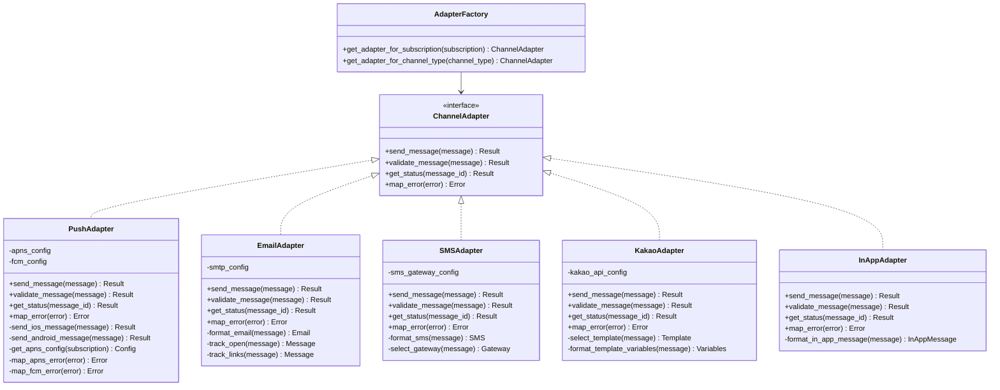

# [COMP-002] 어댑터 시스템

| 버전 | 날짜       | 변경 내용      |
| ---- | ---------- | -------------- |
| 1.0  | 2025-04-02 | 최초 문서 작성 |

## 관련 문서

- [DESIGN-001] 아키텍처 개요
- [REF-002] 상태 코드
- [SEQ-002] 메시지 처리 시퀀스
- [SEQ-003] 라이프사이클 시퀀스

## 요약

본 문서는 Automata-Signal의 채널 어댑터 시스템에 대한 상세 설계와 구현 방법을 설명합니다. 채널 어댑터는 다양한 메시징 채널(푸시 알림, 이메일, SMS 등)과의 통합을 담당하는 모듈화된 컴포넌트입니다. 확장 가능하고 유지보수가 용이한 설계를 통해 새로운 채널을 쉽게 추가할 수 있습니다.

## 대상 독자

- 백엔드 개발자
- 시스템 아키텍트
- 채널 통합 담당자
- QA 엔지니어

## 1. 어댑터 시스템 개요

채널 어댑터 시스템은 다양한 메시징 채널과의 통합을 일관된 인터페이스로 추상화하는 핵심 컴포넌트입니다. 이를 통해 메시지 처리 코어 시스템은 각 채널의 특성과 구현 세부사항을 알 필요 없이 표준화된 방식으로 메시지를 전송할 수 있습니다.

### 1.1 주요 목표

- **일관된 인터페이스**: 모든 채널에 대해 동일한 메시지 전송 인터페이스 제공
- **확장성**: 새로운 채널을 최소한의 코드 변경으로 추가 가능
- **채널 독립성**: 각 채널의 구현이 다른 채널에 영향을 주지 않음
- **오류 처리 통합**: 다양한 채널별 오류를 표준화된 형식으로 변환
- **성능 최적화**: 각 채널별 최적화된 전송 전략 적용

### 1.2 채널 어댑터 아키텍처 다이어그램



## 2. 어댑터 인터페이스

모든 채널 어댑터는 다음과 같은 공통 인터페이스를 구현합니다:

```elixir
defmodule AutomataSignal.Adapters.ChannelAdapter do
  @callback send_message(message :: AutomataSignal.Resources.Message.t()) ::
    {:ok, map()} | {:error, map()}

  @callback validate_message(message :: AutomataSignal.Resources.Message.t()) ::
    :ok | {:error, reason :: atom(), details :: map()}

  @callback get_status(message_id :: String.t()) ::
    {:ok, status :: atom()} | {:error, reason :: atom()}

  @callback map_error(error :: any()) ::
    {:permanent, reason :: atom(), details :: map()} |
    {:temporary, reason :: atom(), details :: map()}
end
```

### 2.1 인터페이스 메서드 설명

#### 2.1.1 send_message/1

메시지를 해당 채널을 통해 전송하는 핵심 메서드입니다.

- **입력**: `Message` 구조체 (제목, 본문, 데이터, 구독 정보 등)
- **출력**: 성공 시 `{:ok, response_data}`, 실패 시 `{:error, error_data}`
- **책임**:
  - 메시지를 채널에 맞는 형식으로 변환
  - 외부 서비스 API 호출
  - 응답 처리 및 결과 반환

#### 2.1.2 validate_message/1

메시지가 해당 채널에 적합한지 검증하는 메서드입니다.

- **입력**: `Message` 구조체
- **출력**: 유효 시 `:ok`, 무효 시 `{:error, reason, details}`
- **책임**:
  - 필수 필드 검증
  - 채널별 제한사항 검사 (길이, 형식 등)
  - 유효하지 않은 경우 상세 오류 정보 제공

#### 2.1.3 get_status/1

특정 메시지의 현재 상태를 조회하는 메서드입니다.

- **입력**: 메시지 ID (채널별 고유 식별자)
- **출력**: 성공 시 `{:ok, status}`, 실패 시 `{:error, reason}`
- **책임**:
  - 외부 서비스 API를 통한 상태 조회
  - 표준화된 상태값으로 변환

#### 2.1.4 map_error/1

채널별 오류를 표준화된 형식으로 변환하는 메서드입니다.

- **입력**: 채널 특정 오류 객체/메시지
- **출력**: `{:permanent, reason, details}` 또는 `{:temporary, reason, details}`
- **책임**:
  - 영구적/일시적 오류 분류
  - 오류 코드 및 메시지 표준화
  - 구독 상태 코드 매핑

## 3. 채널 어댑터 구현

### 3.1 푸시 알림 어댑터

푸시 알림 어댑터는 iOS(APNS)와 Android(FCM) 플랫폼 모두를 지원합니다.

```elixir
defmodule AutomataSignal.Adapters.PushAdapter do
  @behaviour AutomataSignal.Adapters.ChannelAdapter
  alias AutomataSignal.Resources.Message
  alias AutomataSignal.Resources.Subscription

  # APNS 설정
  @apns_config %{
    cert: {:file, "path/to/cert.pem"},
    key: {:file, "path/to/key.pem"},
    mode: :prod  # :dev 또는 :prod
  }

  # FCM 설정
  @fcm_config %{
    key: "your_server_key"
  }

  @impl true
  def send_message(%Message{subscription: subscription} = message) do
    # 메시지 검증
    case validate_message(message) do
      :ok ->
        # 구독 유형에 따라 적절한 전송 방법 선택
        case subscription.type do
          :iOSPush -> send_ios_message(message)
          :AndroidPush -> send_android_message(message)
          _ -> {:error, %{reason: :invalid_subscription_type}}
        end

      error ->
        error
    end
  end

  @impl true
  def validate_message(%Message{} = message) do
    cond do
      is_nil(message.title) and is_nil(message.body) ->
        {:error, :missing_content, %{message: "Both title and body cannot be empty"}}

      byte_size(message.title || "") > 150 ->
        {:error, :title_too_long, %{message: "Title exceeds maximum length (150 bytes)"}}

      byte_size(message.body || "") > 4000 ->
        {:error, :body_too_long, %{message: "Body exceeds maximum length (4000 bytes)"}}

      is_nil(message.subscription) or is_nil(message.subscription.token) ->
        {:error, :missing_token, %{message: "Push token is required"}}

      true ->
        :ok
    end
  end

  @impl true
  def get_status(message_id) do
    # 대부분의 푸시 서비스는 상태 조회 API를 제공하지 않으므로
    # 로컬 상태 저장소에서 조회
    {:error, :not_supported}
  end

  @impl true
  def map_error(error) do
    case error do
      # APNS 오류 매핑
      %{reason: "BadDeviceToken"} ->
        {:permanent, :invalid_token, %{
          code: "BadDeviceToken",
          subscription_status: -10
        }}

      %{reason: "DeviceTokenNotForTopic"} ->
        {:permanent, :token_topic_mismatch, %{
          code: "DeviceTokenNotForTopic",
          subscription_status: -14
        }}

      # FCM 오류 매핑
      %{error: "NotRegistered"} ->
        {:permanent, :unregistered, %{
          code: "NotRegistered",
          subscription_status: -10
        }}

      %{error: "InvalidRegistration"} ->
        {:permanent, :invalid_token, %{
          code: "InvalidRegistration",
          subscription_status: -4
        }}

      # 서비스 일시적 오류
      %{status: code} when code >= 500 ->
        {:temporary, :server_error, %{
          code: "ServerError",
          status: code
        }}

      # 기본 오류 처리
      _ ->
        {:permanent, :unknown_error, %{
          original_error: inspect(error)
        }}
    end
  end

  # 내부 헬퍼 메서드

  defp send_ios_message(%Message{} = message) do
    notification = %{
      token: message.subscription.token,
      topic: get_bundle_id(message.application),
      notification: %{
        title: message.title,
        body: message.body
      },
      custom: message.data
    }

    case Pigeon.APNS.push(notification, get_apns_config(message.subscription)) do
      {:ok, data} ->
        {:ok, %{provider_message_id: data.id}}
      {:error, reason} ->
        {:error, reason}
    end
  end

  defp send_android_message(%Message{} = message) do
    notification = %{
      to: message.subscription.token,
      notification: %{
        title: message.title,
        body: message.body
      },
      data: message.data
    }

    case Pigeon.FCM.push(notification) do
      {:ok, data} ->
        {:ok, %{provider_message_id: data.id}}
      {:error, reason} ->
        {:error, reason}
    end
  end

  # 디바이스의 test_type에 따라 APNS 환경 결정
  defp get_apns_config(%Subscription{test_type: 1}), do: %{@apns_config | mode: :dev}
  defp get_apns_config(%Subscription{test_type: 2}), do: %{@apns_config | mode: :dev}
  defp get_apns_config(_), do: @apns_config

  defp get_bundle_id(application) do
    # 앱 설정에서 번들 ID 조회 로직
    application.settings["ios_bundle_id"] || "com.default.app"
  end
end
```

### 3.2 이메일 어댑터 (지원 예정)

이메일 어댑터는 SMTP 또는 AWS SES와 같은 이메일 서비스와 통합됩니다.

```elixir
defmodule AutomataSignal.Adapters.EmailAdapter do
  @behaviour AutomataSignal.Adapters.ChannelAdapter
  alias AutomataSignal.Resources.Message

  @impl true
  def send_message(%Message{subscription: %{type: :Email, token: email}} = message) do
    # 향후 구현 예정
    {:error, %{reason: :not_implemented_yet}}
  end

  @impl true
  def validate_message(%Message{} = message) do
    cond do
      is_nil(message.title) ->
        {:error, :missing_subject, %{message: "Email subject is required"}}

      is_nil(message.body) ->
        {:error, :missing_body, %{message: "Email body is required"}}

      # 이메일 형식 검증
      not valid_email?(message.subscription.token) ->
        {:error, :invalid_email, %{message: "Invalid email format"}}

      true ->
        :ok
    end
  end

  @impl true
  def get_status(_message_id) do
    # 향후 구현 예정
    {:error, :not_implemented_yet}
  end

  @impl true
  def map_error(_error) do
    # 향후 구현 예정
    {:permanent, :not_implemented_yet, %{}}
  end

  # 내부 헬퍼 메서드

  defp valid_email?(email) do
    # 간단한 이메일 형식 검증 로직
    Regex.match?(~r/^[A-Za-z0-9._%+-]+@[A-Za-z0-9.-]+\.[A-Za-z]{2,}$/, email)
  end
end
```

### 3.3 SMS 어댑터 (지원 예정)

SMS 어댑터는 다양한 SMS 게이트웨이와 통합됩니다.

```elixir
defmodule AutomataSignal.Adapters.SMSAdapter do
  @behaviour AutomataSignal.Adapters.ChannelAdapter
  alias AutomataSignal.Resources.Message

  @impl true
  def send_message(%Message{subscription: %{type: :SMS, token: phone_number}} = message) do
    # 향후 구현 예정
    {:error, %{reason: :not_implemented_yet}}
  end

  @impl true
  def validate_message(%Message{} = message) do
    cond do
      is_nil(message.body) ->
        {:error, :missing_body, %{message: "SMS body is required"}}

      byte_size(message.body) > 160 ->
        {:error, :body_too_long, %{message: "SMS body exceeds 160 characters"}}

      # 전화번호 형식 검증
      not valid_phone_number?(message.subscription.token) ->
        {:error, :invalid_phone_number, %{message: "Invalid phone number format"}}

      true ->
        :ok
    end
  end

  @impl true
  def get_status(_message_id) do
    # 향후 구현 예정
    {:error, :not_implemented_yet}
  end

  @impl true
  def map_error(_error) do
    # 향후 구현 예정
    {:permanent, :not_implemented_yet, %{}}
  end

  # 내부 헬퍼 메서드

  defp valid_phone_number?(phone) do
    # 간단한 전화번호 형식 검증 로직
    Regex.match?(~r/^\+?[0-9]{10,15}$/, phone)
  end
end
```

### 3.4 카카오 알림톡 어댑터 (지원 예정)

카카오 알림톡 어댑터는 카카오 비즈니스 API와 통합됩니다.

```elixir
defmodule AutomataSignal.Adapters.KakaoAdapter do
  @behaviour AutomataSignal.Adapters.ChannelAdapter
  alias AutomataSignal.Resources.Message

  @impl true
  def send_message(%Message{subscription: %{type: :KakaoTalk, token: phone_number}} = message) do
    # 향후 구현 예정
    {:error, %{reason: :not_implemented_yet}}
  end

  @impl true
  def validate_message(%Message{} = message) do
    cond do
      is_nil(message.data) || is_nil(message.data["template_code"]) ->
        {:error, :missing_template, %{message: "Kakao template code is required"}}

      # 템플릿 변수 검증
      not valid_template_variables?(message.data) ->
        {:error, :invalid_template_variables, %{message: "Invalid template variables"}}

      true ->
        :ok
    end
  end

  @impl true
  def get_status(_message_id) do
    # 향후 구현 예정
    {:error, :not_implemented_yet}
  end

  @impl true
  def map_error(_error) do
    # 향후 구현 예정
    {:permanent, :not_implemented_yet, %{}}
  end

  # 내부 헬퍼 메서드

  defp valid_template_variables?(data) do
    # 템플릿 변수 검증 로직
    # 향후 구현 예정
    true
  end
end
```

### 3.5 인앱 메시지 어댑터 (지원 예정)

인앱 메시지 어댑터는 클라이언트 SDK와 통합됩니다.

```elixir
defmodule AutomataSignal.Adapters.InAppAdapter do
  @behaviour AutomataSignal.Adapters.ChannelAdapter
  alias AutomataSignal.Resources.Message

  @impl true
  def send_message(%Message{subscription: %{type: :InAppMessage}} = message) do
    # 향후 구현 예정
    {:error, %{reason: :not_implemented_yet}}
  end

  @impl true
  def validate_message(%Message{} = message) do
    cond do
      is_nil(message.title) and is_nil(message.body) ->
        {:error, :missing_content, %{message: "Both title and body cannot be empty"}}

      is_nil(message.data) || is_nil(message.data["layout_type"]) ->
        {:error, :missing_layout, %{message: "Layout type is required for in-app messages"}}

      true ->
        :ok
    end
  end

  @impl true
  def get_status(_message_id) do
    # 향후 구현 예정
    {:error, :not_implemented_yet}
  end

  @impl true
  def map_error(_error) do
    # 향후 구현 예정
    {:permanent, :not_implemented_yet, %{}}
  end
end
```

## 4. 어댑터 팩토리

어댑터 팩토리는 메시지나 구독 정보를 기반으로 적절한 채널 어댑터를 선택하는 역할을 합니다.

```elixir
defmodule AutomataSignal.Adapters.AdapterFactory do
  alias AutomataSignal.Resources.Subscription
  alias AutomataSignal.Resources.Message

  alias AutomataSignal.Adapters.PushAdapter
  alias AutomataSignal.Adapters.EmailAdapter
  alias AutomataSignal.Adapters.SMSAdapter
  alias AutomataSignal.Adapters.KakaoAdapter
  alias AutomataSignal.Adapters.InAppAdapter

  @doc """
  구독 정보를 기반으로 적절한 채널 어댑터를 반환합니다.
  """
  def get_adapter_for_subscription(%Subscription{type: type}) do
    get_adapter_for_channel_type(type)
  end

  @doc """
  채널 유형을 기반으로 적절한 채널 어댑터를 반환합니다.
  """
  def get_adapter_for_channel_type(channel_type) do
    case channel_type do
      :iOSPush -> PushAdapter
      :AndroidPush -> PushAdapter
      :Email -> EmailAdapter
      :SMS -> SMSAdapter
      :KakaoTalk -> KakaoAdapter
      :InAppMessage -> InAppAdapter
      _ -> raise "Unsupported channel type: #{inspect(channel_type)}"
    end
  end

  @doc """
  메시지 객체를 기반으로 적절한 채널 어댑터를 반환합니다.
  """
  def get_adapter_for_message(%Message{subscription: subscription}) do
    get_adapter_for_subscription(subscription)
  end
end
```

## 5. 메시지 전송 프로세스

어댑터 시스템을 사용한 메시지 전송 프로세스는 다음과 같습니다:

```elixir
defmodule AutomataSignal.Services.MessageService do
  alias AutomataSignal.Resources.Message
  alias AutomataSignal.Adapters.AdapterFactory

  @doc """
  메시지를 적절한 채널을 통해 전송합니다.
  """
  def send_message(%Message{} = message) do
    # 메시지에 맞는 어댑터 선택
    adapter = AdapterFactory.get_adapter_for_message(message)

    # 메시지 검증
    case adapter.validate_message(message) do
      :ok ->
        # 메시지 전송
        case adapter.send_message(message) do
          {:ok, response} ->
            # 성공 처리
            update_message_status(message, :successful, response)

          {:error, error} ->
            # 오류 처리
            handle_send_error(message, adapter, error)
        end

      {:error, reason, details} ->
        # 검증 오류 처리
        update_message_status(message, :failed, %{
          error_reason: reason,
          error_details: details
        })
    end
  end

  # 메시지 상태 업데이트
  defp update_message_status(message, status, details) do
    # ... 메시지 상태 업데이트 로직 ...
  end

  # 전송 오류 처리
  defp handle_send_error(message, adapter, error) do
    # 오류 매핑
    case adapter.map_error(error) do
      {:permanent, reason, details} ->
        # 영구적 오류 - 재시도 없음
        update_message_status(message, :failed, %{
          error_reason: reason,
          error_details: details
        })

      {:temporary, reason, details} ->
        # 일시적 오류 - 재시도 스케줄링
        update_message_status(message, :errored, %{
          error_reason: reason,
          error_details: details
        })
        schedule_retry(message)
    end
  end

  # 메시지 재시도 스케줄링
  defp schedule_retry(message) do
    # ... 재시도 스케줄링 로직 ...
  end
end
```

## 6. 어댑터 확장 가이드

새로운 메시징 채널을 추가하기 위한 어댑터 구현 가이드입니다.

### 6.1 기본 구현 단계

1. `ChannelAdapter` 비헤이비어를 구현하는 새 모듈 생성
2. 필수 콜백 메서드 구현:
   - `send_message/1`
   - `validate_message/1`
   - `get_status/1`
   - `map_error/1`
3. 채널별 특화 로직 구현 (메시지 변환, API 호출 등)
4. `AdapterFactory`에 새 채널 유형 및 어댑터 추가

### 6.2 새 어댑터 구현 예시

```elixir
defmodule AutomataSignal.Adapters.WebPushAdapter do
  @behaviour AutomataSignal.Adapters.ChannelAdapter
  alias AutomataSignal.Resources.Message

  @impl true
  def send_message(%Message{subscription: %{type: :WebPush, token: subscription_info}} = message) do
    # Web Push API 통합 로직
    # ...
  end

  @impl true
  def validate_message(%Message{} = message) do
    # Web Push 메시지 검증 로직
    # ...
  end

  @impl true
  def get_status(message_id) do
    # 상태 조회 로직
    # ...
  end

  @impl true
  def map_error(error) do
    # Web Push 특화 오류 매핑
    # ...
  end
end
```

### 6.3 AdapterFactory 업데이트

```elixir
# AdapterFactory에 새 채널 유형 추가
def get_adapter_for_channel_type(channel_type) do
  case channel_type do
    # ... 기존 채널 ...
    :WebPush -> WebPushAdapter
    _ -> raise "Unsupported channel type: #{inspect(channel_type)}"
  end
end
```

### 6.4 새 구독 유형 추가

데이터베이스 스키마에 새 구독 유형을 추가해야 합니다:

```elixir
# Subscription 리소스 업데이트
attribute :type, :atom do
  constraints [one_of: [
    :iOSPush, :AndroidPush, :Email, :SMS, :KakaoTalk, :InAppMessage, :WebPush
  ]]
end
```

## 7. 성능 및 확장성 고려사항

### 7.1 연결 풀링

외부 서비스와의 연결을 효율적으로 관리하기 위한 연결 풀링:

```elixir
defmodule AutomataSignal.Adapters.ConnectionPool do
  use GenServer

  # 풀 관리 및 연결 재사용 로직
  # ...
end
```

### 7.2 비율 제한 처리

API 비율 제한을 관리하기 위한 전략:

```elixir
defmodule AutomataSignal.Adapters.RateLimiter do
  use GenServer

  # 채널별 비율 제한 처리 로직
  # ...
end
```

### 7.3 배치 처리

대량 메시지 전송을 위한 배치 처리:

```elixir
defmodule AutomataSignal.Adapters.BatchProcessor do
  # 메시지 그룹화 및 배치 전송 로직
  # ...
end
```

## 8. 모니터링 및 지표

어댑터 시스템의 상태 및 성능을 모니터링하기 위한 지표:

### 8.1 성능 지표

- **전송 시간**: 채널별 평균/최대/최소 전송 시간
- **성공률**: 채널별 성공적인 전송 비율
- **오류 비율**: 채널별 오류 유형 분포
- **재시도 비율**: 임시 오류로 인한 재시도 비율

### 8.2 운영 지표

- **채널별 사용량**: 시간별/일별 채널 사용 통계
- **연결 풀 상태**: 활성/유휴/최대 연결 수
- **비율 제한 상태**: 채널별 비율 제한 히트 횟수
- **외부 서비스 가용성**: 채널별 외부 서비스 상태

### 8.3 로깅 전략

각 어댑터는 다음과 같은 이벤트를 로깅합니다:

- 메시지 전송 시도
- 전송 성공/실패
- 외부 서비스 응답 (요약)
- 오류 및 예외 상황
- 비율 제한 히트
- 연결 풀 상태 변경

```elixir
defmodule AutomataSignal.Adapters.Logger do
  def log_message_send(adapter_type, message_id, result) do
    # 메시지 전송 로깅 로직
    # ...
  end

  def log_error(adapter_type, message_id, error) do
    # 오류 로깅 로직
    # ...
  end

  # ... 기타 로깅 함수 ...
end
```

## 9. 테스트 전략

어댑터 시스템을 위한 테스트 전략:

### 9.1 단위 테스트

각 어댑터의 기능을 격리하여 테스트:

```elixir
defmodule AutomataSignal.Adapters.PushAdapterTest do
  use ExUnit.Case
  alias AutomataSignal.Adapters.PushAdapter
  alias AutomataSignal.Resources.Message
  alias AutomataSignal.Resources.Subscription

  # 메시지 검증 테스트
  test "validate_message/1 returns :ok for valid messages" do
    message = %Message{
      title: "Test Title",
      body: "Test Body",
      subscription: %Subscription{type: :iOSPush, token: "valid_token"}
    }

    assert PushAdapter.validate_message(message) == :ok
  end

  # 오류 매핑 테스트
  test "map_error/1 correctly maps APNS errors" do
    error = %{reason: "BadDeviceToken"}

    assert PushAdapter.map_error(error) == {
      :permanent,
      :invalid_token,
      %{code: "BadDeviceToken", subscription_status: -10}
    }
  end

  # ... 기타 테스트 ...
end
```

### 9.2 통합 테스트

어댑터와 실제 외부 서비스의 통합을 테스트:

```elixir
defmodule AutomataSignal.Adapters.PushAdapterIntegrationTest do
  use ExUnit.Case
  alias AutomataSignal.Adapters.PushAdapter

  # 실제 테스트 토큰을 사용한 전송 테스트
  @tag :integration
  test "send_message/1 successfully sends to test device" do
    # ...
  end

  # ... 기타 통합 테스트 ...
end
```

### 9.3 모의 어댑터

테스트 환경을 위한 모의 어댑터 구현:

```elixir
defmodule AutomataSignal.Adapters.MockAdapter do
  @behaviour AutomataSignal.Adapters.ChannelAdapter

  @impl true
  def send_message(message) do
    # 메시지 ID를 기반으로 성공/실패 시뮬레이션
    # ...
  end

  # ... 기타 콜백 구현 ...
end
```
