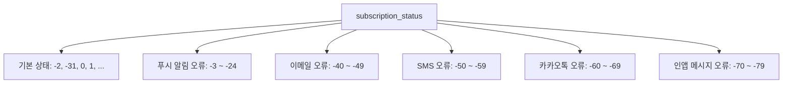

# [REF-002] 상태 코드

| 버전 | 날짜       | 변경 내용      |
| ---- | ---------- | -------------- |
| 1.0  | 2025-04-02 | 최초 문서 작성 |

## 관련 문서

- [SEQ-001] 초기화 시퀀스
- [SEQ-003] 라이프사이클 시퀀스
- [COMP-002] 어댑터 시스템
- [REF-001] API 참조

## 요약

본 문서는 Automata-Signal 시스템에서 사용하는 구독 상태 코드의 정의와 의미를 설명합니다. 각 채널별 구독 상태와 오류 코드를 포함합니다.

## 대상 독자

- 개발팀
- QA 팀
- 운영팀
- 고객 지원팀

## 1. 구독 상태 코드 체계

Automata-Signal은 다음과 같은 구독 상태 코드 체계를 사용합니다:



- 양수 값: 구독 활성화 상태
- 0 또는 -99: 초기 상태
- -2, -31: 기본 구독 취소 상태
- 음수 범위: 채널별 오류 상태

## 2. 기본 구독 상태

| 코드   | 상태명                | 정의                  | 설명                                                                               |
| ------ | --------------------- | --------------------- | ---------------------------------------------------------------------------------- |
| 1 이상 | SUBSCRIBED            | 구독됨                | 해당 채널에서 메시지를 수신할 수 있는 상태. 푸시 알림의 경우 유효한 토큰이 필요함. |
| 0, -99 | NEVER_SUBSCRIBED      | 구독된 적 없음        | 초기 상태. 해당 채널에 아직 구독되지 않음.                                         |
| -2     | UNSUBSCRIBED          | 구독 취소됨           | 사용자가 직접 구독을 취소한 상태. enabled 속성을 false로 설정할 때 권장되는 값.    |
| -31    | DISABLED_BY_API       | API를 통해 비활성화됨 | REST API를 통해 관리자나 시스템에 의해 비활성화된 경우.                            |
| -98    | PENDING_DOUBLE_OPT_IN | 이중 확인 대기 중     | SMS/이메일에서 더블 옵트인을 기다리는 상태.                                        |

## 3. 푸시 알림 관련 오류 코드

### 3.1 Android 관련 오류

| 코드             | 상태명                 | 정의                              | 설명                                                 | 권장 조치                                       |
| ---------------- | ---------------------- | --------------------------------- | ---------------------------------------------------- | ----------------------------------------------- |
| -3, -5           | ANDROID_SUPPORT_ERROR  | Android 지원 라이브러리 오류      | 앱의 Android 지원 라이브러리 추가 또는 업데이트 필요 | 앱 개발자에게 Firebase 라이브러리 업데이트 요청 |
| -4, -8, -11, -12 | PLAY_SERVICES_ERROR    | Android Google Play 서비스 오류   | Google Play 서비스 라이브러리 업그레이드 필요        | 사용자에게 Google Play 서비스 업데이트 안내     |
| -6               | SENDER_ID_MISMATCH     | Android 잘못된 프로젝트 번호      | FCMv1 Sender ID가 토큰 원본과 일치하지 않음          | 서버 설정에서 올바른 Sender ID 확인             |
| -7, -9           | OUTDATED_PLAY_SERVICES | Android 구버전 Google Play 서비스 | 기기의 Google Play 서비스 앱 업데이트 필요           | 사용자에게 Google Play 서비스 업데이트 안내     |

### 3.2 iOS 관련 오류

| 코드          | 상태명                      | 정의                | 설명                          | 권장 조치                                  |
| ------------- | --------------------------- | ------------------- | ----------------------------- | ------------------------------------------ |
| -13           | IOS_PUSH_CAPABILITY_MISSING | iOS 푸시 기능 누락  | 필요한 SDK 설정 단계가 누락됨 | 앱 개발자에게 푸시 알림 기능 구성 요청     |
| -14, -16, -17 | APNS_CONNECTION_ERROR       | iOS APNS 오류       | 기기가 APNS 연결에 문제 있음  | 네트워크 연결 확인 및 기기 재시작 권장     |
| -15           | IOS_SIMULATOR_ERROR         | iOS 시뮬레이터 오류 | iOS 16.4+ 시뮬레이터 필요     | 개발 환경에서만 발생, 실제 기기에서는 무시 |

### 3.3 공통 푸시 오류

| 코드               | 상태명                   | 정의                | 설명                                                   | 권장 조치                               |
| ------------------ | ------------------------ | ------------------- | ------------------------------------------------------ | --------------------------------------- |
| -10                | PUSH_UNSUBSCRIBED        | 구독되지 않음       | 앱 제거 또는 기기 설정에서 구독 취소됨, 웹 푸시 차단됨 | 사용자에게 앱 설정에서 알림 허용 안내   |
| -18                | PERMISSION_NOT_REQUESTED | 권한 요청 안됨      | 구독 권한 요청이 표시된 적 없음                        | 앱 시작 시 권한 요청 대화상자 표시      |
| -19                | PERMISSION_NO_RESPONSE   | 권한 요청 무응답    | 구독 권한 요청이 표시되었으나 응답하지 않음            | 적절한 시점에 권한 요청 재시도          |
| -22                | MANUALLY_UNSUBSCRIBED    | 수동 구독 취소      | 사용자가 권한을 철회함                                 | 푸시 알림 가치 설명 및 재구독 유도      |
| -20, -21, -23, -24 | WEB_PUSH_ERROR           | 웹 레코드 관련 오류 | 웹 푸시 권한 철회 또는 서비스 워커 오류                | 웹 푸시 설정 확인 및 서비스 워커 재등록 |

## 4. 이메일 관련 오류 코드 (지원 예정)

| 코드 | 상태명             | 정의                 | 설명                                       | 권장 조치                       |
| ---- | ------------------ | -------------------- | ------------------------------------------ | ------------------------------- |
| -40  | INVALID_EMAIL      | 유효하지 않은 이메일 | 이메일 형식이 올바르지 않음                | 유효한 이메일 주소 입력 요청    |
| -41  | EMAIL_SEND_FAILED  | 이메일 전송 실패     | 일반적인 이메일 전송 오류                  | 이메일 서비스 상태 확인         |
| -42  | HARD_BOUNCE        | 하드 바운스          | 영구적인 전송 실패 (존재하지 않는 주소 등) | 이메일 주소 확인 요청           |
| -43  | SOFT_BOUNCE        | 소프트 바운스        | 일시적인 전송 실패 (사서함 용량 초과 등)   | 일정 시간 후 재시도             |
| -44  | SPAM_REPORTED      | 스팸으로 신고됨      | 사용자가 스팸으로 신고함                   | 콘텐츠 품질 개선 및 재동의 요청 |
| -45  | EMAIL_UNSUBSCRIBED | 수신 거부            | 이메일 내 수신 거부 링크를 통해 구독 취소  | 재구독 유도 및 콘텐츠 가치 설명 |

## 5. SMS 관련 오류 코드 (지원 예정)

| 코드 | 상태명            | 정의                   | 설명                          | 권장 조치                 |
| ---- | ----------------- | ---------------------- | ----------------------------- | ------------------------- |
| -50  | INVALID_PHONE     | 유효하지 않은 전화번호 | 전화번호 형식이 올바르지 않음 | 유효한 전화번호 입력 요청 |
| -51  | SMS_SEND_FAILED   | SMS 전송 실패          | 일반적인 SMS 전송 오류        | SMS 서비스 상태 확인      |
| -52  | NUMBER_NOT_EXIST  | 번호 없음              | 존재하지 않는 전화번호        | 전화번호 확인 요청        |
| -53  | NETWORK_ERROR     | 네트워크 오류          | 통신사 네트워크 오류          | 나중에 재시도             |
| -54  | SMS_BLOCKED       | 차단됨                 | 사용자가 수신을 차단함        | 다른 채널 사용 고려       |
| -55  | SENDER_RESTRICTED | 발신 번호 제한         | 발신 번호에 대한 제한         | 발신 번호 등록 상태 확인  |

## 6. 카카오 알림톡 관련 오류 코드 (지원 예정)

| 코드 | 상태명                | 정의              | 설명                                | 권장 조치             |
| ---- | --------------------- | ----------------- | ----------------------------------- | --------------------- |
| -60  | KAKAO_NOT_USER        | 카카오톡 미사용자 | 카카오톡을 사용하지 않는 사용자     | 대체 메시지 채널 사용 |
| -61  | KAKAO_BLOCKED         | 알림톡 차단       | 사용자가 알림톡 수신을 차단함       | 다른 채널 사용 고려   |
| -62  | KAKAO_NOT_FRIEND      | 친구 추가 안됨    | 비즈니스 계정 친구 추가가 안된 상태 | 친구 추가 유도        |
| -63  | TEMPLATE_NOT_APPROVED | 템플릿 미승인     | 알림톡 템플릿이 승인되지 않음       | 템플릿 승인 재신청    |
| -64  | SEND_LIMIT_EXCEEDED   | 발송 한도 초과    | 일일 발송 한도 초과                 | 다음날까지 대기       |
| -65  | CHANNEL_ERROR         | 채널 오류         | 카카오 비즈니스 채널 오류           | 채널 설정 확인        |

## 7. 인앱 메시지 관련 오류 코드 (지원 예정)

| 코드 | 상태명               | 정의                 | 설명                                          | 권장 조치             |
| ---- | -------------------- | -------------------- | --------------------------------------------- | --------------------- |
| -70  | APP_VERSION_MISMATCH | 앱 버전 불일치       | 지원되지 않는 앱 버전                         | 앱 업데이트 권장      |
| -71  | INAPP_DISABLED       | 사용자 설정 비활성화 | 사용자가 앱 설정에서 인앱 메시지를 비활성화함 | 인앱 메시지 설정 안내 |
| -72  | TRIGGER_MISMATCH     | 표시 조건 불일치     | 표시 조건(트리거)에 부합하지 않음             | 트리거 조건 재설정    |
| -73  | STORAGE_INSUFFICIENT | 기기 저장공간 부족   | 인앱 메시지 에셋을 저장할 공간 부족           | 저장공간 확보 안내    |
| -74  | SDK_INIT_FAILED      | SDK 초기화 실패      | 인앱 메시지 SDK 초기화 오류                   | 앱 재시작 권장        |

## 8. 구독 상태 확인 및 관리

### 8.1 구독 상태 확인 방법

```elixir
# 활성 구독인지 확인
def is_active_subscription?(subscription) do
  subscription.subscription_status > 0
end

# 오류 상태인지 확인
def has_error?(subscription) do
  subscription.subscription_status < -2 and
  subscription.subscription_status != -31 and
  subscription.subscription_status != -99
end

# 오류 종류 확인
def get_error_category(subscription) do
  cond do
    subscription.subscription_status >= -24 and subscription.subscription_status <= -3 -> :push_error
    subscription.subscription_status >= -49 and subscription.subscription_status <= -40 -> :email_error
    subscription.subscription_status >= -59 and subscription.subscription_status <= -50 -> :sms_error
    subscription.subscription_status >= -69 and subscription.subscription_status <= -60 -> :kakao_error
    subscription.subscription_status >= -79 and subscription.subscription_status <= -70 -> :inapp_error
    true -> :other
  end
end
```

### 8.2 상태 전이 규칙

- 구독 상태는 일반적으로 높은 값에서 낮은 값으로 전이됩니다 (예: 1 → -2).
- 오류 상태(-3 ~ -79)는 오류 해결 시 다시 활성 상태(1 이상)로 복구될 수 있습니다.
- 사용자가 명시적으로 구독 취소한 경우(-2)는 사용자 동의 없이 활성 상태로 변경할 수 없습니다.
- API를 통한 비활성화(-31)는 API를 통해 다시 활성화할 수 있습니다.

## 9. 데이터베이스 스키마에서의 표현

```elixir
defmodule AutomataSignal.Resources.Subscription do
  use Ash.Resource,
    data_layer: Ash.DataLayer.Postgres,
    extensions: [
      AshArchival.Resource,
      AshCloak.Resource
    ]

  attributes do
    # ... 다른 속성들 ...

    # 구독 상태
    attribute :subscription_status, :integer, default: 0
    attribute :subscribed_at, :utc_datetime
    attribute :unsubscribed_at, :utc_datetime
  end

  calculations do
    calculate :is_subscribed, :boolean, expr: expr(subscription_status > 0)
    calculate :is_unsubscribed, :boolean, expr: expr(subscription_status == -2 or subscription_status == -31)
    calculate :has_error, :boolean, expr: expr(subscription_status < -2 and subscription_status != -31 and subscription_status != -99)
    calculate :error_code_range, :string, expr: expr(
      cond do
        subscription_status >= -24 and subscription_status <= -3 -> "push_error"
        subscription_status >= -49 and subscription_status <= -40 -> "email_error"
        subscription_status >= -59 and subscription_status <= -50 -> "sms_error"
        subscription_status >= -69 and subscription_status <= -60 -> "kakao_error"
        subscription_status >= -79 and subscription_status <= -70 -> "in_app_error"
        true -> "other"
      end
    )
  end

  # ... 관계 및 기타 정의 ...
end
```

## 10. 채널별 오류 코드 매핑

다음 테이블은 외부 서비스에서 반환하는 오류 코드를 내부 구독 상태 코드로 매핑하는 방법을 보여줍니다:

### 10.1 FCM 오류 코드 매핑

| FCM 오류             | 내부 코드 | 설명                         |
| -------------------- | --------- | ---------------------------- |
| UNREGISTERED         | -10       | 토큰이 더 이상 유효하지 않음 |
| SENDER_ID_MISMATCH   | -6        | 발신자 ID 불일치             |
| MISSING_REGISTRATION | -3        | 등록 토큰 누락               |
| INVALID_REGISTRATION | -4        | 유효하지 않은 등록 토큰      |
| ...                  | ...       | ...                          |

### 10.2 APNS 오류 코드 매핑

| APNS 오류              | 내부 코드 | 설명                       |
| ---------------------- | --------- | -------------------------- |
| BadDeviceToken         | -10       | 유효하지 않은 기기 토큰    |
| DeviceTokenNotForTopic | -14       | 토픽에 맞지 않는 기기 토큰 |
| Unregistered           | -10       | 등록되지 않은 기기         |
| ...                    | ...       | ...                        |
