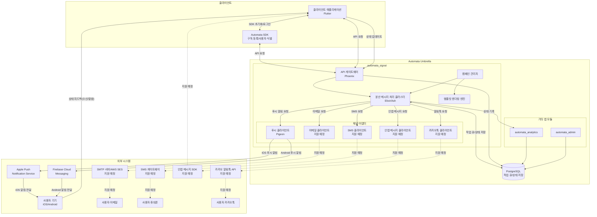

# [ARCH-001] Automata-Signal 아키텍처 개요

- 문서 ID: ARCH-001
- 버전: 1.0
- 작성일: 2025-04-02
- 상태: 초안

## 요약

본 문서는 Automata-Signal 시스템의 전체 아키텍처 개요를 제공합니다. 시스템의 주요 구성 요소, 상호작용, 그리고 설계 원칙을 설명합니다.

## 대상 독자

- 개발팀
- 시스템 엔지니어
- 프로젝트 관리자
- 기술 이해관계자

## 1. 시스템 개요

Automata-Signal은 다양한 메시징 채널을 통합 관리하는 확장 가능한 메시징 플랫폼입니다. 초기에는 푸시 알림에 중점을 두고, 이후 이메일, SMS, 카카오 알림톡, 인앱 메시지 등 다양한 채널로 확장됩니다.

### 1.1 주요 목표

- **채널 통합**: 다양한 메시징 채널을 단일 인터페이스로 통합
- **고성능**: 초당 10만 건(10초당 100만 건)의 메시지 처리 능력
- **확장성**: 사용자, 채널 및 메시지 볼륨 증가에 유연한 대응
- **안정성**: fly.io 기반 글로벌 분산 배포로 99.95% 이상의 가용성
- **보안**: 민감한 사용자 데이터 및 인증 토큰 암호화
- **유지보수성**: Umbrella 구조와 어댑터 패턴을 통한 모듈성 및 확장성

### 1.2 핵심 기능

- 멀티채널 메시징 지원 (푸시, 이메일, SMS, 카카오 알림톡, 인앱 메시지)
- 메시지 상태 추적 (발송→도달→오픈)
- 대량 메시지 배치 처리 및 스케줄링
- 사용자 및 채널별 구독 관리
- 메시지 템플릿 관리와 개인화
- 메시지 캠페인 관리 및 타겟팅
- 통합 SDK 제공
- 멀티채널 통합 분석 및 보고서 생성

## 2. 아키텍처 다이어그램

아래는 Automata-Signal의 전체 시스템 아키텍처를 보여주는 다이어그램입니다:

## 3. 주요 컴포넌트

### 3.1 클라이언트 컴포넌트

- **클라이언트 애플리케이션**: Flutter 기반의 모바일 앱
- **Automata SDK**: 구독 등록, 사용자 식별, 메시지 상태 추적 기능을 제공하는 클라이언트 라이브러리

### 3.2 백엔드 컴포넌트

- **API 게이트웨이**: Phoenix Framework 기반 RESTful API
- **분산 메시지 처리 클러스터**: Elixir/OTP, libcluster, GenServer 기반 고성능 메시지 처리 시스템
- **템플릿 렌더링 엔진**: 메시지 템플릿 관리 및 변수 치환 처리
- **캠페인 관리자**: 대규모 메시지 캠페인 생성, 스케줄링, 타겟팅 처리
- **채널 어댑터**: 각 메시징 채널과의 통합을 담당하는 어댑터 모듈
- **분석 모듈**: 메시지 상태 및 사용자 참여 데이터 분석
- **관리자 모듈**: 시스템 관리 및 모니터링 인터페이스

### 3.3 데이터 저장소

- **PostgreSQL 데이터베이스**: 사용자, 구독, 메시지, 템플릿 등의 데이터 저장
- **Oban 작업 큐**: 메시지 처리 작업 관리 및 스케줄링

### 3.4 외부 시스템

- **APNS/FCM**: 푸시 알림 전송을 위한 Apple/Google 서비스
- **SMTP/SES**: 이메일 전송 서비스 (지원 예정)
- **SMS 게이트웨이**: SMS 전송 서비스 (지원 예정)
- **카카오 알림톡 API**: 카카오 메시지 전송 (지원 예정)

## 4. 주요 데이터 흐름

### 4.1 메시지 전송 흐름

1. 클라이언트가 API를 통해 메시지 전송 요청
2. API 게이트웨이가 요청을 처리하고 메시지 처리 클러스터로 전달
3. 메시지 데이터가 데이터베이스에 저장되고 작업 큐에 추가
4. 작업자가 메시지를 처리하고 적절한 채널 어댑터로 전달
5. 채널 어댑터가 외부 서비스(APNS, FCM 등)를 통해 메시지 전송
6. 전송 결과가 데이터베이스에 기록되고 분석 시스템에 전달

### 4.2 구독 관리 흐름

1. 사용자가 SDK를 통해 채널 구독 요청
2. SDK가 API를 통해 서버에 구독 정보 전송
3. 서버가 구독 정보를 처리하고 데이터베이스에 저장
4. 사용자가 특정 채널의 구독을 취소하면 구독 상태 업데이트

### 4.3 메시지 상태 추적 흐름

1. 메시지가 외부 서비스를 통해 사용자에게 전달
2. 사용자 기기가 메시지 수신 확인 신호를 SDK로 전송
3. SDK가 API를 통해 서버로 상태 업데이트 전송
4. 서버가 메시지 상태를 업데이트하고 데이터베이스에 기록
5. 사용자가 메시지와 상호작용하면 추가 상태 업데이트 발생

## 5. 기술 스택 개요

### 5.1 백엔드 기술

- **Elixir/OTP**: 고성능 동시성 처리 및 분산 시스템 구축
- **Phoenix Framework**: RESTful API 개발
- **Ash Framework**: 풍부한 도메인 모델링 및 확장 기능
- **PostgreSQL**: 데이터 저장 및 작업 큐 관리
- **Oban**: 비동기 작업 처리 및 스케줄링
- **Pigeon**: iOS/Android 푸시 알림 통합

### 5.2 클라이언트 기술

- **Flutter**: 크로스 플랫폼 모바일 앱 개발
- **firebase_messaging**: Firebase Cloud Messaging 통합
- **flutter_local_notifications**: 로컬 알림 관리

### 5.3 인프라 기술

- **fly.io**: 글로벌 분산 배포 및 엣지 컴퓨팅
- **libcluster**: Elixir 노드 자동 발견 및 클러스터링

## 6. 확장성 및 성능

### 6.1 수평적 확장

- 각 리전(도쿄, 프랑크푸르트, 시드니 등)에 여러 Elixir 노드 배포
- libcluster를 통한 노드 간 자동 연결 및 작업 분배
- 근접성 기반 라우팅으로 사용자에게 가장 가까운 노드 활용

### 6.2 성능 최적화

- 메시지 배치 처리로 데이터베이스 접근 최소화
- 채널별 적응형 비율 제한 및 재시도 전략
- 템플릿 렌더링 결과 캐싱

### 6.3 가용성 보장

- 다중 리전 배포로 지역 장애 대응
- 노드 장애 시 자동 복구 및 작업 재분배
- 일관된 상태 관리를 위한 PostgreSQL 복제

## 7. 보안 고려사항

- 모든 민감한 정보(토큰, 개인정보 등)는 ash_cloak으로 암호화
- 앱별 API 키 인증 시스템
- 멀티테넌시 데이터 격리
- HTTPS/TLS를 통한 모든 통신 암호화

## 8. 구현 로드맵 요약

- **Phase 1**: 핵심 인프라 및 푸시 알림 채널 구현
- **Phase 2**: 템플릿 시스템 및 캠페인 관리 구현
- **Phase 3**: SDK 개발 및 통합
- **Phase 4**: 성능 최적화 및 분산 배포
- **Phase 5**: 추가 채널 확장 (이메일, SMS, 카카오 알림톡, 인앱 메시지)

## 관련 문서

- [ARCH-002] 시스템 아키텍처
- [ARCH-003] 데이터 모델
- [ARCH-004] SDK 아키텍처
- [ARCH-005] 배포 아키텍처
- [FLOW-001] SDK 초기화 흐름
- [FLOW-002] 메시지 처리 흐름
