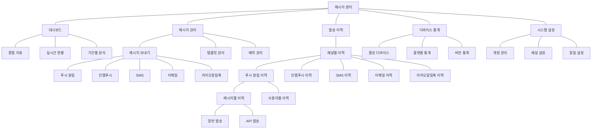

# [DESIGN-005] 어드민 유저 시나리오

## 요약

Automata-Signal은 다양한 메시징 채널을 통합 관리하는 플랫폼으로, 현재는 푸시 알림만 지원하나 향후 인앱푸시, SMS, 이메일, 카카오알림톡으로 확장 예정입니다. 통합 대시보드, 메시지 작성/발송, 이력 관리, 상세 분석 기능을 제공하며, 채널별 특화된 메시지 작성과 일관된 분석 경험을 제공합니다. 모든 채널은 동일한 워크플로우로 관리되어 확장성과 사용 편의성을 높였습니다.

## 핵심 기능 영역

1. **통합 대시보드** - 첫 화면으로 모든 채널의 주요 지표를 한눈에 확인
2. **메시지 보내기** - 여기서 채널 선택 후 채널별 특화된 메시지 작성
3. **발송이력** - 모든 채널의 발송 이력을 채널별 탭으로 관리
4. **디바이스 통계** - 사용자 환경 분석

### IA (구조 중심)

### 유저 플로우 (사용자 중심)

```mermaid
flowchart LR
    S[시작] --> L[로그인]
    L --> D[대시보드 확인]

    D --> CreateMsg[메시지 작성하기]
    CreateMsg --> SelectChannel[채널 선택]
    SelectChannel --> PushMsg[푸시 알림 선택]
    PushMsg --> InputTitle[제목 입력]
    InputTitle --> InputContent[내용 입력]
    InputContent --> UploadImage[이미지 업로드]
    UploadImage --> SetAction[클릭 동작 설정]
    SetAction --> SetTarget[발송 대상 설정]
    SetTarget --> Preview[미리보기]
    Preview --> TestSend[테스트 발송]
    TestSend --> Confirm[확인 및 수정]
    Confirm --> Send[발송하기]
    Send --> Success[발송 완료]

    D --> CheckHistory[발송 이력 확인하기]
    CheckHistory --> SelectChannel2[채널 선택]
    SelectChannel2 --> PushHistory[푸시 알림 이력]
    PushHistory --> FilterMessage[필터 적용]
    FilterMessage --> ViewList[이력 목록 확인]
    ViewList --> SelectMsg[특정 메시지 선택]
    SelectMsg --> ViewReport[상세 리포트 확인]
    ViewReport --> AnalyzeData[데이터 분석]

    D --> SearchUser[사용자별 이력 조회하기]
    SearchUser --> InputID[식별자 입력]
    InputID --> ViewUserHistory[사용자 이력 확인]
    ViewUserHistory --> FilterUserMsg[필터 적용]
    FilterUserMsg --> ViewUserReport[상세 이력 확인]
```

## 주요 기능 영역별 유저 시나리오

### 1. 통합 대시보드 (메시지 센터 > 대시보드)

| 기능                 | 유저 시나리오                                                                                                                                                                                                                                                                                                             |
| -------------------- | ------------------------------------------------------------------------------------------------------------------------------------------------------------------------------------------------------------------------------------------------------------------------------------------------------------------------- |
| 리프레시             | 원하는 시점에 대시보드 데이터를 확인할 수 있도록 리프레시 버튼을 클릭하여 데이터를 갱신할 수 있다.                                                                                                                                                                                                                        |
| 당월 메시지 현황     | 당월 메시지의 전체적인 현황을 간략히 확인하기 위해서 당월 발송완료된 메시지와 당일 앱 접속 수치를 확인할 수 있다. (현재는 푸시 채널만 표시)                                                                                                                                                                               |
| 실시간 앱 활성 수치  | 메시지 발송 시점의 앱 활성 상태를 파악하기 위해서 현재 시점으로부터 20분간의 분당 실시간 앱 접속 수치를 확인할 수 있다.                                                                                                                                                                                                   |
| 최근 발송이력        | 최근 발송한 메시지들의 성과를 분석하기 위해 최근 발송한 5개의 메시지의 성과내역을 확인할 수 있다. (현재는 푸시 채널만 표시) 개별 이력의 상세 분석을 위해 상세 리포트 확인 버튼을 클릭하여 리포트 페이지로 접근할 수 있다.                                                                                            |
| 앱 접속 요일 및 시간 | 적절한 메시지 발송 타이밍을 확인하기 위해서, 원하는 시점(월)을 필터링하여 요일 및 시간대별 접속량을 시각적으로 확인할 수 있다.                                                                                                                                                                                            |
| 디바이스 통계        | 기기별 메시지 발송 현황을 확인하기 위해서 전체 활성 디바이스와 Android, IOS 기기의 비율 및 수치를 시각적으로 확인할 수 있다.                                                                                                                                                                                              |
| 월간 지표 추이       | 메시지 발송 후 오픈률 추이를 분석하기 위해, 월별, 일자별 푸시 발송 수와 오픈 수의 변화를 시각적으로 확인할 수 있다. 메시지의 사용자 반응률을 분석하기 위해, 월별, 일자별 앱 접속 수 추이를 확인할 수 있다. 메시지가 앱 유지율에 미친 영향을 파악하기 위해, 월별, 일자별 앱 설치, 삭제 수 추이를 확인할 수 있다. |

### 2. 메시지 보내기 (메시지 센터 > 메시지 보내기)

| 기능      | 유저 시나리오                                                                                                 |
| --------- | ------------------------------------------------------------------------------------------------------------- |
| 채널 선택 | 메시지를 발송할 채널(푸시, 인앱푸시, SMS, 이메일, 카카오알림톡)을 선택할 수 있다. (현재는 푸시 채널만 활성화) |

#### 2.1 푸시 알림 채널 (현재 활성화)

| 기능                   | 유저 시나리오                                                                                                                                                                                                                                                                                                                     |
| ---------------------- | --------------------------------------------------------------------------------------------------------------------------------------------------------------------------------------------------------------------------------------------------------------------------------------------------------------------------------- |
| 발송 타입 설정         | 수신 동의 여부에 따라 자동으로 발송 대상이 분기되도록 발송 유형(광고/정보)을 선택할 수 있다.                                                                                                                                                                                                                                      |
| 푸시 제목 및 내용 설정 | 엔드유저가 푸시 메시지의 제목을 확인할 수 있도록 제목을 설정할 수 있다. 엔드유저가 푸시 메시지의 내용을 확인할 수 있도록 내용을 설정할 수 있다.                                                                                                                                                                              |
| 푸시 이미지 설정       | 푸시 메세지에 이미지가 함께 표시될 수 있도록 메시지에 사용할 이미지를 업로드하거나 외부 이미지 URL을 입력할 수 있다.                                                                                                                                                                                                              |
| 푸시 클릭 시 동작 설정 | 푸시 오픈 후 엔드유저의 행동 경로를 마케팅 목적에 맞게 유도하기 위해, 푸시 오픈 시, 알림 상세 화면 또는 지정한 URL 페이지로 이동하도록 설정할 수 있다. 푸시 오픈 후 엔드유저의 행동 경로를 효과적으로 유도하기 위해, 버튼명을 설정할 수 있다.                                                                                |
| 발송 일시              | 원하는 시간에 푸시 메세지를 발송하기 위해, 발송 시간(즉시,예약)을 설정할 수 있다.                                                                                                                                                                                                                                                 |
| 대상 고객 수           | 메시지 도달 범위를 사전에 파악하기 위해, 설정한 조건에 따라 변경되는 발송 대상 고객 수를 확인할 수 있다.                                                                                                                                                                                                                          |
| 발송 대상 & 발송 기기  | 마케팅 타겟에 맞는 대상에게 메세지를 보내기 위해, 전체 고객 또는 특정 고객을 발송 대상으로 설정할 수 있다. 특정 대상 고객을 타게팅하기 위해, 엑셀 업로드를 통해 특정 대상 고객군을 설정할 수 있다. 기기별로 메시지를 구분해서 보내기 위해, 대상기기를 전체 또는 특정 기기(IOS, Android)로 선택해 푸시를 발송할 수 있다. |
| 테스트 발송            | 실제 발송 전 메시지를 검토하기 위해 메시지를 사전에 테스트 발송할 수 있다.                                                                                                                                                                                                                                                        |
| 발송하기               | 엔드유저에게 실제로 메시지를 발송하기 위해 푸시 메세지를 즉시 또는 예약한 시간에 발송할 수 있다.                                                                                                                                                                                                                                  |
| 미리보기               | 푸시 메시지의 기기별 실제 노출 형태를 사전에 확인하기 위해, IOS 혹은 Android 환경에서의 푸시 메시지를 미리볼 수 있다.                                                                                                                                                                                                             |

### 3. 발송이력 관리 (메시지 센터 > 발송이력)

| 기능      | 유저 시나리오                                                                           |
| --------- | --------------------------------------------------------------------------------------- |
| 채널별 탭 | 각 메시징 채널별 발송 이력을 개별 탭으로 확인할 수 있다. (현재는 푸시 알림 탭만 활성화) |

#### 3.1 푸시 알림 채널 (현재 활성화)

| 기능               | 유저 시나리오                                                        |
| ------------------ | -------------------------------------------------------------------- |
| 메시지별 이력 조회 | 푸시 알림 채널에서 발송된 모든 메시지 이력을 조회할 수 있다.         |
| 사용자별 이력 조회 | 특정 사용자(식별자)에게 발송된 모든 푸시 알림 이력을 조회할 수 있다. |

##### 3.1.1 메시지별 이력 조회 - 일반 발송

| 기능            | 유저 시나리오                                                                                                                                                                                                                                                                                                                                                                                                                                          |
| --------------- | ------------------------------------------------------------------------------------------------------------------------------------------------------------------------------------------------------------------------------------------------------------------------------------------------------------------------------------------------------------------------------------------------------------------------------------------------------ |
| 검색            | 특정 기간동안 발송된 푸시 메시지 성과를 간략히 확인하기 위해서 기간 선택 필터를 활용하여 발송이력을 조회할 수 있다. 식별자별 이력을 확인하기 위해서, 식별자를 기준으로 발송이력을 검색할 수 있다. 발송 상태를 기준으로 푸시 메시지를 간략히 조회하기 위해, 발송 상태별 Chip filter를 사용하여 각 상태별 이력을 확인할 수 있다. 원하는 데이터를 빠르게 조회하기 위해서, 입력한 조건으로 검색하거나 검색조건을 간편하게 초기화할 수 있다. |
| 발송이력 테이블 | 발송이력의 건별 주요지표를 간단히 확인하기 위해 발송대상, 유형, 내용, 일시 등의 요소를 확인할 수 있다. 개별 발송건에 대한 상세한 분석을 위해서, '리포트 확인' 버튼을 클릭하여 상세 리포트 페이지로 이동할 수 있다. 원하는 시점에 최신 데이터를 확인하기 위해서, 리프레시 버튼을 클릭하여 개별 발송건의 데이터를 갱신할 수 있다.                                                                                                              |

##### 3.1.2 메시지별 이력 조회 - API 발송

| 기능            | 유저 시나리오                                                                                                                                                                                                                                                                                                                                                                                                                                                                              |
| --------------- | ------------------------------------------------------------------------------------------------------------------------------------------------------------------------------------------------------------------------------------------------------------------------------------------------------------------------------------------------------------------------------------------------------------------------------------------------------------------------------------------ |
| 검색            | 특정 기간동안 발송된 푸시 메시지 성과를 간략히 확인하기 위해서 기간 선택 필터를 활용하여 발송이력을 조회할 수 있다. 발송 상태를 기준으로 푸시 메시지를 간략히 조회하기 위해, 발송 상태별 Chip filter를 사용하여 각 상태별 이력을 확인할 수 있다. 원하는 데이터를 빠르게 조회하기 위해서, 입력한 조건으로 검색하거나 검색조건을 간편하게 초기화할 수 있다. 식별자별 발송된 메세지 이력을 확인하기 위해, 식별자를 기준으로 발송이력을 검색할 수 있다.                         |
| 발송이력 테이블 | 발송이력의 건별 주요지표를 간단히 확인하기 위해 발송대상, 유형, 내용, 일시 등의 요소를 확인할 수 있다. 개별 발송건에 대한 상세한 분석을 위해서, '리포트 확인' 버튼을 클릭하여 상세 리포트 페이지로 이동할 수 있다. 원하는 시점에 최신 데이터를 확인하기 위해서, 리프레시 버튼을 클릭하여 개별 발송건의 데이터를 갱신할 수 있다. 일시적 오류나 네트워크 문제 등으로 발송 실패한 건을 복구하기 위해, 발송 실패 건에 대해 재발송 버튼을 클릭하여 해당 푸시를 재발송할 수 있다. |

##### 3.1.3 사용자별 이력 조회

| 기능           | 유저 시나리오                                                                                                                 |
| -------------- | ----------------------------------------------------------------------------------------------------------------------------- |
| 식별자 검색    | 입력한 문자열을 포함하는 식별자를 검색하기 위해, like 검색 방식으로 식별자를 기준으로한 발송이력을 조회할 수 있다.            |
| 발송 이력 확인 | 특정 식별자의 상세한 발송 내역을 확인하기 위해, 발송 이력 확인 버튼을 클릭하여 해당 식별자의 푸시 발송 이력을 확인할 수 있다. |

### 4. 상세 리포트 (메시지 센터 > 발송이력 > 푸시 알림 > 메시지별 이력 조회 > 리포트 확인)

| 기능                               | 유저 시나리오                                                                                                                                                                                                                                                                                                                                                                                                                                                                                                                        |
| ---------------------------------- | ------------------------------------------------------------------------------------------------------------------------------------------------------------------------------------------------------------------------------------------------------------------------------------------------------------------------------------------------------------------------------------------------------------------------------------------------------------------------------------------------------------------------------------ |
| 발송 대상                          | 푸시 메시지가 총 몇 명의 대상에게 발송되었는지 확인하기 위해, 설정된 전체 발송 대상 수를 확인할 수 있다.                                                                                                                                                                                                                                                                                                                                                                                                                             |
| 주요 지표 요약                     | 메시지 성과를 빠르게 요약하여 파악하기 위해, 핵심지표인 발송완료, 실패, 오픈 앱 삭제 수치를 확인할 수 있다.                                                                                                                                                                                                                                                                                                                                                                                                                          |
| 푸시 발송 기기                     | 발송 대상 플랫폼별 성과를 빠르게 요약하기 위해서, 핵심지표를 기기별로 구분하여 확인할 수 있다. IOS와 Android 기기 비중을 한눈에 파악하기 위해서 디바이스별 발송 비율 및 수치를 시각적으로 확인할 수 있다.                                                                                                                                                                                                                                                                                                                       |
| 발송 상태                          | 해당 푸시가 정상적으로 발송이 완료되었는지를 한눈에 확인하기 위해 발송상태와 진행률을 시각적으로 확인할 수 있다. 발송의 정확한 실행 시간과 상태를 확인하기 위해서, 발송완료 수, 잔여 수, 발송 시작 및 완료 시간을 한눈에 확인할 수 있다. 잘못된 푸시발송으로 인해 마케팅 실패 방지를 위하여 발송 일시 중지 버튼을 클릭하여 푸시 발송을 중지시킬 수 있다.                                                                                                                                                                   |
| 메세지 상세                        | 푸시 발송 시 설정한 내용을 확인하기 위해, 푸시 상세보기 버튼을 클릭하여 read only 상태의 설정내역을 확인할 수 있다. 실제 발송된 푸시를 쉽게 인지하고 구별하기 위해서 IOS/Android 환경을 전환하며 푸시 메세지를 확인할 수 있다.                                                                                                                                                                                                                                                                                                  |
| 메세지 도달에 따른 앱 실행 수 변동 | 푸시 발송의 효과가 언제부터 어느정도 나타나는지를 확인하기 위해 메시지 도달 이후 사용자 실행 수의 추이를 시간대별로 확인할 수 있다. 푸시 발송이 활성 사용자 수 변화에 미친 영향을 분석하기 위해서, 메시지 발송 후 앱 사용자 수 변화의 추이를 확인할 수 있다. 푸시 발송에 따른 즉시 반응률과 지연 반응률을 확인하기 위해 푸시 메시지 오픈까지 걸린 시간을 일정 구간별로 확인하고 싶다. 해당 푸시를 특정 식별자가 정상적으로 받았고, 푸시에 대하여 반응했는지를 확인하기 위해 해당 푸시를 받은 식별자를 검색할 수 있다. |

### 5. 디바이스 통계 (메시지 센터 > 디바이스 통계)

| 기능                 | 유저 시나리오                                                                                                                                                                        |
| -------------------- | ------------------------------------------------------------------------------------------------------------------------------------------------------------------------------------ |
| 디바이스 트렌드 분석 | 시간 흐름에 따른 디바이스 트렌드를 분석하기 위해서, 선택한 디바이스 탭에 해당하는 데이터를 설정한 기간에 따라 일별 변화량을 시각적으로 확인할 수 있다.                               |
| 플랫폼별 분포        | 디바이스 트랜드의 플랫폼별 분포를 정량적으로 파악하기 위해, 선택한 디바이스 탭에 해당하는 데이터의 기간에 따른 Android, IOS, 합계수치를 일별 증감률 및 상세 데이터를 확인할 수 있다. |
| 장기 추이 파악       | 시즌성, 장기 추이를 파악하기 위해서, 선택한 디바이스 탭에 해당하는 데이터의 선택한 연도의 월별 수치를 시각적으로 확인할 수 있다.                                                     |
| 월별 상세 분석       | 월별 디바이스 수 변경 추이를 상세 분석하기 위해서, 각 월의 디바이스 수와 증감을 확인할 수 있다.                                                                                      |
