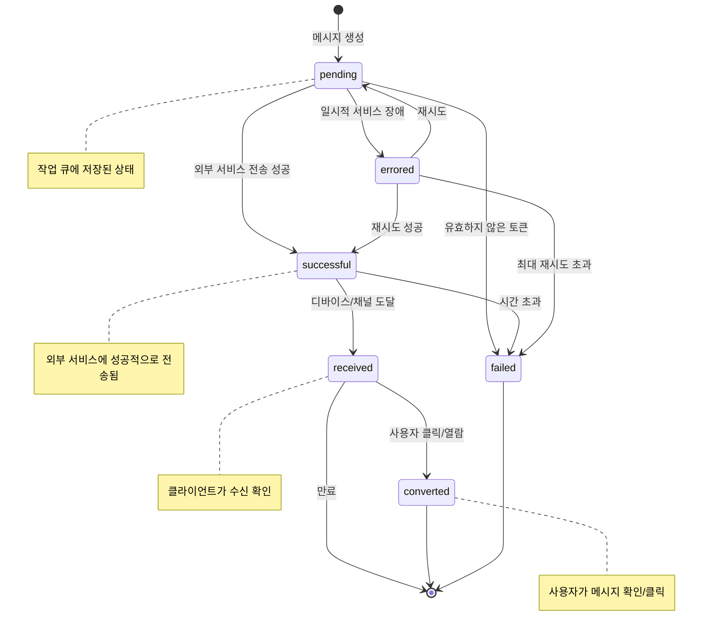

# [DICT-003] 메시지 상태 및 전이 규칙

| 버전 | 날짜       | 변경 내용      |
| ---- | ---------- | -------------- |
| 1.0  | 2025-04-02 | 최초 문서 작성 |

## 관련 문서

- [DICT-001] 구독 상태 코드 사전
- [FLOW-002] 메시지 처리 흐름
- [COMP-001] 템플릿 엔진 설계 및 구현
- [API-003] 메시지 API 명세

## 요약

본 문서는 Automata-Signal 시스템에서 메시지의 라이프사이클과 상태 전이 규칙을 정의합니다. 메시지 생성부터 최종 상태까지의 모든 상태와 전이 규칙을 설명합니다.

## 대상 독자

- 개발팀
- QA 팀
- 운영팀
- 분석팀

## 선행 지식

- 메시징 시스템의 기본 개념
- 상태 기계(State Machine) 개념 이해

## 1. 메시지 상태 다이어그램

다음 다이어그램은 메시지 상태와 가능한 전이를 보여줍니다:



## 2. 메시지 상태 정의

| 상태       | 상태명  | 정의                                    | 설명                                         |
| ---------- | ------- | --------------------------------------- | -------------------------------------------- |
| pending    | 대기 중 | 메시지가 생성되어 작업 큐에 저장된 상태 | 메시지가 생성되고 처리를 기다리는 초기 상태  |
| successful | 전송됨  | 외부 서비스에 성공적으로 전송된 상태    | APNS, FCM 등의 서비스에 메시지가 전달됨      |
| received   | 수신됨  | 디바이스/채널에 메시지가 도달한 상태    | 사용자 기기가 메시지를 받고 SDK가 수신 확인  |
| converted  | 열람됨  | 사용자가 메시지를 클릭/확인한 상태      | 사용자가 메시지를 열람하거나 액션을 취함     |
| failed     | 실패    | 메시지 전송이 실패한 상태               | 영구적인 오류(잘못된 토큰, 구독 취소 등)     |
| errored    | 오류    | 일시적인 서비스 장애로 인한 오류 상태   | 일시적인 오류(네트워크 문제, 서비스 장애 등) |

## 3. 상태 전이 정의

| 전이    | 시작 상태           | 종료 상태  | 트리거                                 | 설명                                           |
| ------- | ------------------- | ---------- | -------------------------------------- | ---------------------------------------------- |
| send    | pending             | successful | 메시지가 외부 서비스에 성공적으로 전송 | 메시지가 APNS, FCM 등의 서비스에 전달되면 발생 |
| fail    | pending, successful | failed     | 영구적인 전송 실패                     | 유효하지 않은 토큰, 구독 취소 등으로 인한 실패 |
| error   | pending             | errored    | 일시적인 서비스 장애                   | 네트워크 문제, 서비스 접근 불가 등 일시적 문제 |
| retry   | errored             | pending    | 재시도 스케줄링                        | 일정 시간 후 메시지 전송 재시도                |
| receive | successful          | received   | 기기/채널 도달 확인                    | 사용자 기기가 메시지를 수신했음을 확인         |
| convert | received            | converted  | 사용자 메시지 클릭/열람                | 사용자가 메시지와 상호작용함                   |
| timeout | successful          | failed     | 수신 확인 시간 초과                    | 일정 시간 내에 수신 확인이 없을 경우           |
| expire  | received            | 종료       | 만료 기간 경과                         | 클릭/열람 없이 만료 기간이 지난 경우           |

## 4. 상태별 타임스탬프

각 상태에는 해당 상태에 진입한 시점을 기록하는 타임스탬프가 있습니다:

| 상태       | 타임스탬프 필드  | 설명                           |
| ---------- | ---------------- | ------------------------------ |
| pending    | created_at       | 메시지 생성 시점               |
| successful | sent_at          | 외부 서비스에 전송된 시점      |
| received   | received_at      | 사용자 기기에 도달한 시점      |
| converted  | converted_at     | 사용자가 메시지를 열람한 시점  |
| failed     | failed_at        | 메시지 전송이 실패한 시점      |
| errored    | (별도 필드 없음) | error_details에 시간 정보 포함 |

## 5. 메시지 상태 추적 및 분석

### 5.1 핵심 지표 계산

| 지표        | 계산 방법                                    | 설명                                           |
| ----------- | -------------------------------------------- | ---------------------------------------------- |
| 전송률      | successful / (successful + failed + errored) | 성공적으로 전송된 메시지의 비율                |
| 도달률      | received / successful                        | 전송된 메시지 중 실제 기기에 도달한 비율       |
| 전환률      | converted / received                         | 수신된 메시지 중 사용자 상호작용이 발생한 비율 |
| 전체 전환률 | converted / (successful + failed + errored)  | 전체 메시지 중 사용자 상호작용이 발생한 비율   |

### 5.2 지연 시간 측정

| 지표           | 계산 방법                  | 설명                                     |
| -------------- | -------------------------- | ---------------------------------------- |
| 전송 지연      | sent_at - created_at       | 메시지 생성부터 전송까지 소요된 시간     |
| 도달 지연      | received_at - sent_at      | 전송부터 기기 도달까지 소요된 시간       |
| 상호작용 지연  | converted_at - received_at | 수신부터 사용자 상호작용까지 소요된 시간 |
| 전체 처리 시간 | converted_at - created_at  | 메시지 생성부터 상호작용까지 전체 시간   |

## 6. Ash State Machine 구현

메시지 상태 관리는 `ash_state_machine` 확장을 사용하여 구현됩니다:

```elixir
defmodule AutomataSignal.Resources.Message do
  use Ash.Resource,
    data_layer: Ash.DataLayer.Postgres,
    extensions: [AshStateMachine.Resource]

  attributes do
    uuid_primary_key :id
    attribute :title, :string
    attribute :body, :string
    attribute :data, :map, default: %{}
    attribute :user_id, :uuid
    attribute :subscription_id, :uuid
    attribute :application_id, :uuid
    attribute :campaign_id, :uuid, allow_nil?: true

    attribute :status, :atom do
      constraints [one_of: [:pending, :successful, :failed, :errored, :received, :converted]]
      default :pending
    end

    attribute :channel_type, :atom do
      constraints [one_of: [:push, :email, :sms, :kakao_talk, :in_app]]
    end

    timestamps()
    attribute :sent_at, :utc_datetime
    attribute :received_at, :utc_datetime
    attribute :converted_at, :utc_datetime
    attribute :failed_at, :utc_datetime

    attribute :error_reason, :string
    attribute :error_details, :map, default: %{}
    attribute :version_history, :map, default: %{}
  end

  state_machine do
    field :status

    initial_states [:pending]

    transitions do
      transition :send, from: [:pending], to: :successful
      transition :fail, from: [:pending, :successful], to: :failed
      transition :error, from: [:pending], to: :errored
      transition :retry, from: [:errored], to: :pending
      transition :receive, from: [:successful], to: :received
      transition :convert, from: [:received], to: :converted
    end

    on_transition :send do
      set_attribute :sent_at, &DateTime.utc_now/0
    end

    on_transition :fail do
      set_attribute :failed_at, &DateTime.utc_now/0
    end

    on_transition :receive do
      set_attribute :received_at, &DateTime.utc_now/0
    end

    on_transition :convert do
      set_attribute :converted_at, &DateTime.utc_now/0
    end
  end

  # ... 관계 및 기타 정의 ...
end
```

## 7. 메시지 이벤트 추적

상태 변경 시 `MessageEvent` 리소스를 통해 세부 이벤트를 기록합니다:

```elixir
defmodule AutomataSignal.Resources.MessageEvent do
  use Ash.Resource,
    data_layer: Ash.DataLayer.Postgres,
    extensions: [AshPaperTrail.Resource]

  attributes do
    uuid_primary_key :id
    attribute :message_id, :uuid
    attribute :event_type, :atom do
      constraints [one_of: [:created, :sent, :received, :converted, :failed, :errored, :retried]]
    end
    attribute :occurred_at, :utc_datetime
    attribute :metadata, :map, default: %{}
  end

  relationships do
    belongs_to :message, AutomataSignal.Resources.Message
  end

  paper_trail do
    track_attribute :event_type
    track_attribute :metadata
  end

  # ... 액션 및 기타 정의 ...
end
```

## 8. 채널별 특이사항

### 8.1 푸시 알림 채널

- Apple/Google 서비스는 전송 확인만 제공하고 기기 도달 확인은 SDK를 통해 수집
- 배지, 사운드, 알림음과 같은 추가 데이터는 `data` 맵에 저장

### 8.2 이메일 채널 (지원 예정)

- 전송 확인과 열람 추적을 위한 특수 픽셀 포함
- 바운스 및 스팸 신고 상태도 추적

### 8.3 SMS 채널 (지원 예정)

- 전송 확인은 가능하나 읽음 확인은 불가능
- 전환 확인을 위한 링크 클릭 추적 가능

### 8.4 카카오 알림톡 (지원 예정)

- 전송 및 읽음 확인 지원
- 버튼 액션 클릭 추적 가능

### 8.5 인앱 메시지 (지원 예정)

- 앱 내에서 모든 상태 추적 가능
- 가장 정확한 전환율 측정 가능

## 9. 재시도 전략

메시지 전송 실패 시 다음과 같은 재시도 전략을 사용합니다:

| 실패 유형                 | 재시도 여부 | 재시도 간격                        | 최대 시도 횟수    |
| ------------------------- | ----------- | ---------------------------------- | ----------------- |
| 일시적 네트워크 오류      | 예          | 지수 백오프 (30초, 2분, 5분, 15분) | 5회               |
| 서비스 장애               | 예          | 선형 간격 (15분)                   | 24회 (최대 6시간) |
| 영구적 오류 (잘못된 토큰) | 아니오      | -                                  | -                 |
| 서비스 비율 제한          | 예          | 서비스별 조정 (일반적으로 1~5분)   | 3회               |

재시도 로직은 Oban 작업 스케줄러를 통해 구현됩니다:

```elixir
defmodule AutomataSignal.Workers.MessageRetryWorker do
  use Oban.Worker, queue: :message_retry

  @impl Oban.Worker
  def perform(%Oban.Job{args: %{"message_id" => message_id}, attempt: attempt}) do
    message = AutomataSignal.Messages.get_message(message_id)

    case attempt do
      n when n <= 5 ->
        # 지수 백오프 전략 사용
        AutomataSignal.Messages.retry_message(message)
        :ok
      _ ->
        # 최대 재시도 횟수 초과
        AutomataSignal.Messages.mark_as_failed(message, "최대 재시도 횟수 초과")
        :ok
    end
  end
end
```

## 10. 만료 정책

메시지 상태별 만료 정책은 다음과 같습니다:

| 상태       | 만료 시간 | 만료 후 액션                   |
| ---------- | --------- | ------------------------------ |
| pending    | 24시간    | 실패로 표시 (시간 초과)        |
| successful | 72시간    | 수신 확인이 없으면 실패로 표시 |
| received   | 30일      | 통계로만 유지 (분석용)         |
| converted  | 무기한    | 통계로만 유지 (분석용)         |
| failed     | 90일      | 보관 처리 (장기 보관)          |
| errored    | 24시간    | 재시도 또는 실패로 전환        |

## 11. 분석 및 보고

메시지 상태 데이터를 기반으로 다음과 같은 분석이 가능합니다:

1. **채널별 성과 비교**: 푸시 알림, 이메일, SMS 등 채널별 전환율 비교
2. **시간대별 참여율**: 메시지 발송 시간과 사용자 참여 간의 상관관계 분석
3. **메시지 유형별 성과**: 알림, 마케팅, 트랜잭션 메시지 등 유형별 성과 비교
4. **재시도 효과성**: 재시도 전략이 성공률에 미치는 영향 분석
5. **사용자 세그먼트 분석**: 사용자 특성에 따른 참여율 차이 분석
