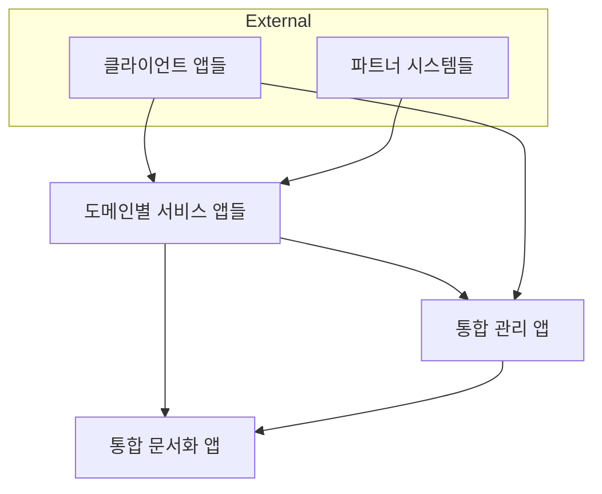
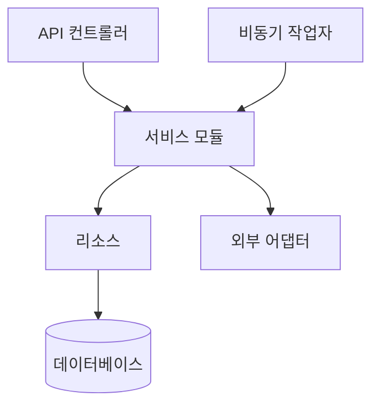

# [GUIDE-002] Automata 시스템 구조

| 버전 | 날짜       | 변경 내용      |
| ---- | ---------- | -------------- |
| 1.0  | 2025-04-02 | 최초 문서 작성 |

## 개요

본 문서는 Elixir Umbrella 구조를 활용한 Automata 시스템의 전체 구조와 아키텍처를 설명합니다. 이 가이드는 개발자와 시스템 설계자가 Automata 시스템의 구성 요소, 내부 구조, 그리고 각 애플리케이션의 역할과 상호작용을 이해하는 데 필요한 정보를 제공합니다.

## 1. 시스템 개요

Automata는 Elixir Umbrella 구조를 기반으로 한 확장성 높은 시스템입니다. 문서 중심의 접근 방식과 AI 주도 개발을 통해 지속적으로 진화하며, Umbrella 아키텍처의 장점을 살려 다양한 기능의 앱들이 독립적으로 개발되면서도 통합적인 관리가 가능한 환경을 제공합니다.

### 1.1 핵심 원칙

- **AI 주도 개발**: 문서와 코드 생성에 AI를 적극 활용하여 개발 효율성 극대화
- **문서 중심 설계**: 모든 개발은 명확한 문서를 기반으로 진행
- **모듈성**: 각 기능을 독립적인 애플리케이션으로 분리
- **확장성**: 새로운 앱을 쉽게 추가할 수 있는 구조
- **통합 관리**: 중앙화된 관리 시스템을 통한 효율적인 운영
- **재사용성**: 공통 기능의 효율적 공유와 활용

## 2. 전체 시스템 구조

Automata 시스템의 최상위 디렉토리 구조는 다음과 같습니다:

```text
automata/                             # Elixir Umbrella 프로젝트 루트
├── .cursor/                          # Cursor 에디터 설정
│   └── rules                         # Cursor 규칙 정의
├── .github/                          # GitHub Actions 워크플로우
├── apps/                             # Umbrella 하위 애플리케이션
│   ├── automata_signal/              # 멀티채널 메시징 서비스 앱
│   ├── automata_admin/               # 통합 관리 앱
│   └── automata_docs/                # 통합 문서화 앱 (Docusaurus 기반)
├── config/                           # Umbrella 공통 설정
└── mix.exs                           # Umbrella 프로젝트 설정 파일
```

### 2.1 애플리케이션 구조

Automata 시스템은 다음과 같은 애플리케이션 구조를 가지고 있습니다:

- **도메인별 서비스 앱**: 각 도메인별로 독립적인 서비스 기능을 제공하는 앱들입니다. 현재는 메시징 서비스 앱이 구현되어 있으며, 향후 다양한 도메인별 앱이 추가될 수 있습니다.

- **통합 관리 앱**: 시스템 내 모든 앱의 기능을 중앙에서 관리하는 컴포넌트입니다. 각 앱의 설정, 모니터링, 사용자 관리 등을 통합 제어하는 인터페이스를 제공합니다.

- **통합 문서화 앱**: 프로젝트의 모든 문서를 관리하는 시스템으로, AI 주도 개발의 핵심 기반이 됩니다. 이 문서는 코드 생성 및 개발 의사결정의 근거가 됩니다.

## 3. Umbrella vs 일반적인 모노리포

**일반적인 모노리포(다른 언어):**

- 여러 프로젝트의 코드를 한 저장소에서 관리하는 접근 방식
- 코드 관리와 의존성 공유가 주요 목적
- 각 앱은 독립적으로 컴파일되고 다른 서버에 배포하는 것이 일반적
- 앱 간 통신은 API 호출 등 네트워크 통신을 통해 이루어짐

**Elixir Umbrella 프로젝트:**

- 단순한 코드 관리를 넘어 실행 시에도 함께 작동하도록 설계
- 모든 앱이 동일한 BEAM VM 인스턴스에서 실행됨이 표준 패턴
- 앱 간 효율적인 직접 함수 호출이 핵심 이점
- 여러 앱이 함께 단일 유닛으로 배포됨
- 각 앱의 모듈성과 관심사 분리를 유지하면서도 실행 시 통합된 시스템으로 작동

자세한 배포 및 운영 관련 내용은 [[DESIGN-004] 운영 아키텍처](../designs/DESIGN-004-operational-architecture) 문서를 참조하세요.

## 4. 애플리케이션 간 상호작용

Automata 시스템 내 애플리케이션들은 독립적으로 동작하면서도 서로 상호작용하여 통합된 시스템을 구성합니다.



### 4.1 주요 상호작용 패턴

- **직접 모듈 호출**: Umbrella 앱들은 동일한 BEAM VM에서 실행되므로 `in_umbrella: true` 의존성을 통해 다른 앱의 모듈을 직접 호출할 수 있습니다. 이는 네트워크 오버헤드 없이 효율적인 통신을 가능하게 합니다.

  ```elixir
  # automata_admin 앱에서 automata_signal 앱의 모듈 직접 호출
  AutomataSignal.NotificationService.send_notification(user_id, message)
  ```

- **이벤트 기반 통신**: 느슨한 결합이 필요한 경우 Phoenix PubSub을 활용한 비동기 이벤트 처리 방식을 사용합니다. 이는 앱 간의 의존성을 줄이고 시스템 확장성을 높입니다.

  ```elixir
  # 이벤트 발행
  Phoenix.PubSub.broadcast(Automata.PubSub, "user:notifications", {:new_message, payload})

  # 이벤트 구독 (수신 앱에서)
  Phoenix.PubSub.subscribe(Automata.PubSub, "user:notifications")
  ```

- **RESTful API**: 외부 시스템이나 클라이언트와의 통신을 위해 RESTful API를 제공합니다. 이를 통해 다른 시스템과 표준화된 방식으로 통신할 수 있습니다.

- **중앙 관리 인터페이스**: 모든 도메인 앱의 설정, 모니터링, 상태 확인은 통합 관리 앱을 통해 중앙에서 수행합니다. 이를 통해 시스템 컴포넌트들을 일관되게 관리할 수 있습니다.

- **문서 중심 개발**: 문서화 앱은 모든 앱 개발의 기초가 되는 문서를 제공하며, 이를 통해 일관된 설계와 구현을 보장합니다.

### 4.2 내부 모듈 구성

각 애플리케이션 내부는 다음과 같은 핵심 모듈 구조를 따릅니다:



- **컨트롤러**: 외부 요청을 처리하고 적절한 서비스를 호출합니다.
- **서비스**: 핵심 비즈니스 로직을 구현합니다.
- **리소스**: 데이터 모델과 영속성 계층을 담당합니다.
- **어댑터**: 외부 시스템과의 연동을 담당합니다.
- **워커**: 비동기 작업 처리를 담당합니다.

## 5. 개발 및 확장 가이드

### 5.1 애플리케이션 간 의존성 관리

애플리케이션 간 의존성은 각 앱의 `mix.exs` 파일에서 다음과 같이 관리합니다:

```elixir
def deps do
  [
    {:other_app_name, in_umbrella: true},
    # 기타 의존성
  ]
end
```

이 설정을 통해 한 앱에서 다른 앱의 코드를 직접 참조할 수 있게 됩니다:

```elixir
defmodule MyApp.SomeModule do
  # 다른 앱의 모듈 직접 호출
  def process do
    OtherApp.Module.some_function()
  end
end
```

이 방식으로 코드 중복 없이 앱 간에 기능을 공유할 수 있습니다.

### 5.2 문서 기반 개발

Automata 시스템은 문서 기반 개발을 채택하고 있으며, AI 주도 개발 워크플로우를 따릅니다. 자세한 내용은 [[GUIDE-003] AI 주도 개발 워크플로우](GUIDE-003-ai-driven-development-workflow) 문서를 참조하세요.

주요 특징:

- 모든 개발은 문서 작성으로 시작합니다
- 명확한 문서를 기반으로 AI가 코드 생성을 지원합니다
- 문서와 코드의 동기화가 지속적으로 유지됩니다
