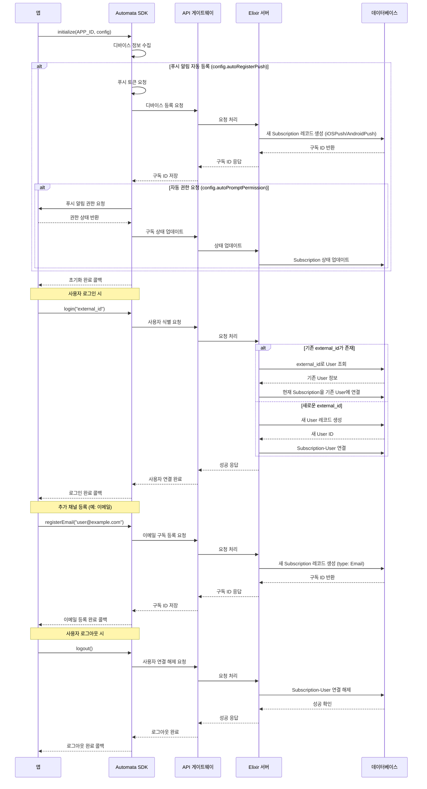

# [SEQ-001] 초기화 시퀀스

| 버전 | 날짜       | 변경 내용      |
| ---- | ---------- | -------------- |
| 1.0  | 2025-04-02 | 최초 문서 작성 |

## 요약

본 문서는 Automata-Signal SDK의 초기화 과정, 사용자 식별(로그인/로그아웃), 그리고 다양한 메시징 채널 구독 관리에 대한 흐름을 설명합니다. SDK와 서버 간의 상호작용을 포함한 전체 프로세스를 상세히 다룹니다.

## 1. SDK 초기화 및 사용자 식별 흐름 다이어그램



## 2. SDK 초기화 프로세스

### 2.1 초기화 파라미터

SDK 초기화는 앱 시작 시 최대한 빨리 수행되어야 합니다:

```dart
// Flutter SDK 초기화 예시
void main() async {
  WidgetsFlutterBinding.ensureInitialized();

  // SDK 초기화
  await AutomataSignal().initialize(
    'YOUR_APP_ID',
    AutomataSignalConfig(
      autoRegisterPush: true,
      autoPromptPermission: true,
      foregroundNotificationsEnabled: true,
      enableInAppMessages: true, // 인앱 메시지 활성화 (지원 예정)
      defaultLanguage: 'ko',
      trackMessageEvents: true
    )
  );

  runApp(MyApp());
}
```

`AutomataSignalConfig` 옵션:

| 옵션                           | 타입   | 기본값 | 설명                                 |
| ------------------------------ | ------ | ------ | ------------------------------------ |
| autoRegisterPush               | bool   | true   | 자동으로 푸시 알림 토큰 등록         |
| autoPromptPermission           | bool   | true   | 자동으로 푸시 알림 권한 요청         |
| foregroundNotificationsEnabled | bool   | true   | 앱 포그라운드 상태에서도 알림 표시   |
| enableInAppMessages            | bool   | true   | 인앱 메시지 활성화 (지원 예정)       |
| defaultLanguage                | String | null   | 기본 언어 설정                       |
| trackMessageEvents             | bool   | true   | 메시지 수신/열람 등 이벤트 자동 추적 |

### 2.2 내부 초기화 단계

SDK의 내부 초기화 과정은 다음 순서로 진행됩니다:

1. 앱 ID 및 설정 저장
2. 필요한 매니저 클래스 초기화:
   - SubscriptionManager: 구독 관리
   - UserManager: 사용자 식별 관리
   - MessageManager: 메시지 처리 및 추적
   - InAppMessageManager: 인앱 메시지 관리 (지원 예정)
3. 디바이스 정보 수집:
   - 디바이스 모델
   - OS 버전
   - 앱 버전
   - SDK 버전
   - 언어 설정
   - 국가 코드
   - 타임존

```dart
// 내부 초기화 로직 예시
Future<void> _initialize(String appId, AutomataSignalConfig config) async {
  _appId = appId;
  _config = config;

  // 디바이스 정보 수집
  _deviceInfo = await _collectDeviceInfo();

  // 구독 관리자 초기화
  _subscriptionManager = SubscriptionManager(
    appId: appId,
    deviceInfo: _deviceInfo
  );

  // 사용자 관리자 초기화
  _userManager = UserManager(appId: appId);

  // 메시지 관리자 초기화
  _messageManager = MessageManager(
    appId: appId,
    trackEvents: config.trackMessageEvents
  );

  // 저장된 사용자 ID가 있는 경우 자동 복원
  await _restoreUserIfAvailable();

  // 자동 푸시 알림 등록
  if (config.autoRegisterPush) {
    await _registerPushNotifications(
      promptPermission: config.autoPromptPermission
    );
  }
}
```

### 2.3 푸시 알림 등록 프로세스

자동 등록이 활성화된 경우 푸시 알림 등록 과정:

1. 플랫폼별 푸시 서비스 초기화:
   - iOS: APNS(Apple Push Notification Service)
   - Android: FCM(Firebase Cloud Messaging)
2. 디바이스 토큰 요청
3. 토큰을 서버에 등록하여 새로운 구독 생성
4. (옵션) 사용자에게 알림 권한 요청

```dart
// 푸시 알림 등록 로직 예시
Future<void> _registerPushNotifications({bool promptPermission = true}) async {
  // 플랫폼별 초기화
  if (Platform.isIOS) {
    await _initializeAPNS();
  } else if (Platform.isAndroid) {
    await _initializeFCM();
  }

  // 토큰 요청
  String? token = await _getPushToken();
  if (token != null) {
    // 토큰을 서버에 등록
    await _subscriptionManager.registerPushSubscription(token);
  }

  // 권한 요청
  if (promptPermission) {
    bool granted = await _requestNotificationPermission();
    // 권한 상태 서버에 업데이트
    if (token != null) {
      await _subscriptionManager.updateSubscriptionStatus(
        token,
        granted ? 1 : -22  // -22: 수동 구독 취소
      );
    }
  }
}
```

### 2.4 서버 API 요청

SDK 초기화 중 서버로 보내는 API 요청 예시:

**푸시 알림 구독 등록 요청 (POST /api/v1/subscriptions)**

```json
{
  "application_id": "YOUR_APP_ID",
  "type": "iOSPush", // 또는 "AndroidPush"
  "token": "device_push_token_here",
  "device_info": {
    "device_model": "iPhone 13",
    "device_os": "iOS 15.4",
    "device_language": "ko",
    "app_version": "1.0.0",
    "sdk_version": "1.0.0",
    "country_code": "KR",
    "test_type": 0
  }
}
```

**응답:**

```json
{
  "subscription_id": "a1b2c3d4-e5f6-7890-abcd-ef1234567890",
  "status": "success"
}
```

## 3. 사용자 식별 프로세스

### 3.1 로그인 프로세스

사용자가 앱에 로그인할 때 SDK를 통해 사용자를 식별합니다:

```dart
// 사용자 로그인 예시
Future<void> onUserLogin(String userId) async {
  try {
    await AutomataSignal().login(userId);
    print('User identified successfully');

    // 로그인 후 인앱 메시지 확인 (지원 예정)
    await AutomataSignal().fetchInAppMessages();
  } catch (error) {
    print('Failed to identify user: $error');
  }
}
```

내부적으로 다음 단계가 수행됩니다:

1. 사용자 ID를 검증하고 저장
2. 서버에 사용자 식별 요청 전송
3. 서버가 User 레코드를 찾거나 생성
4. 현재 구독과 사용자를 연결
5. 성공 시 로컬에 사용자 ID 캐싱 (앱 재시작 시 자동 복원용)

```dart
// 내부 사용자 식별 로직 예시
Future<void> identifyUser(String externalId) async {
  if (externalId.isEmpty) {
    throw Exception('User ID cannot be empty');
  }

  try {
    // 서버에 사용자 식별 요청
    final response = await _apiClient.post(
      '/api/v1/users/identify',
      body: {
        'application_id': _appId,
        'external_id': externalId,
        'subscriptions': await _subscriptionManager.getSubscriptionIds()
      }
    );

    if (response['status'] == 'success') {
      // 로컬에 사용자 ID 저장
      _externalId = externalId;
      _automataId = response['user_id'];
      await _storage.setString('user_external_id', externalId);

      _isIdentified = true;
      return;
    }

    throw Exception('Failed to identify user: ${response['error']}');
  } catch (error) {
    _isIdentified = false;
    rethrow;
  }
}
```

### 3.2 서버 측 식별 처리

서버에서는 사용자 식별 요청을 다음과 같이 처리합니다:

1. `application_id`와 `external_id`를 기반으로 기존 사용자 검색
2. 사용자가 없는 경우 새 User 레코드 생성
3. 요청에 포함된 구독 ID를 사용자와 연결
4. 관련 메타데이터 업데이트 (마지막 활성 시간 등)

```elixir
# 서버 측 사용자 식별 처리 로직 예시
def identify_user(params) do
  Ash.transaction(fn ->
    # 사용자 찾기 또는 생성
    user =
      case find_user_by_external_id(params.application_id, params.external_id) do
        nil ->
          # 새 사용자 생성
          User.create_changeset(%{
            external_id: params.external_id,
            application_id: params.application_id,
            last_active_at: DateTime.utc_now()
          })
          |> Ash.create!()

        existing_user ->
          # 기존 사용자 업데이트
          existing_user
          |> User.update_changeset(%{last_active_at: DateTime.utc_now()})
          |> Ash.update!()
      end

    # 구독과 사용자 연결
    link_subscriptions_to_user(user.id, params.subscriptions)

    # 성공 응답 반환
    %{
      status: "success",
      user_id: user.id
    }
  end)
end
```

### 3.3 로그아웃 프로세스

사용자가 앱에서 로그아웃할 때:

```dart
// 사용자 로그아웃 예시
Future<void> onUserLogout() async {
  try {
    await AutomataSignal().logout();
    print('User logged out successfully');
  } catch (error) {
    print('Failed to logout user: $error');
  }
}
```

내부적으로 다음 단계가 수행됩니다:

1. 서버에 로그아웃 요청 전송
2. 현재 구독과 사용자 연결 해제
3. 로컬에 저장된 사용자 ID 삭제
4. 인앱 메시지 캐시 제거 (지원 예정)

```dart
// 내부 로그아웃 로직 예시
Future<void> logoutUser() async {
  if (!_isIdentified) {
    return; // 이미 로그아웃 상태
  }

  try {
    // 서버에 로그아웃 요청
    await _apiClient.post(
      '/api/v1/users/logout',
      body: {
        'application_id': _appId,
        'subscriptions': await _subscriptionManager.getSubscriptionIds()
      }
    );

    // 로컬 사용자 정보 제거
    _externalId = null;
    _automataId = null;
    await _storage.remove('user_external_id');

    // 인앱 메시지 캐시 제거 (지원 예정)
    await _inAppMessageManager?.clearCache();

    _isIdentified = false;
  } catch (error) {
    // 오류는 기록하되, 로컬 로그아웃은 진행
    print('Error during logout: $error');
    _externalId = null;
    _automataId = null;
    await _storage.remove('user_external_id');
    _isIdentified = false;

    rethrow;
  }
}
```

### 3.4 서버 측 로그아웃 처리

서버에서는 로그아웃 요청을 다음과 같이 처리합니다:

1. 요청에 포함된 구독 ID를 사용자와 연결 해제
2. 구독 상태는 유지하되 User ID 참조만 제거
3. 익명 사용자 상태로 되돌림

```elixir
# 서버 측 로그아웃 처리 로직 예시
def logout_user(params) do
  Ash.transaction(fn ->
    # 구독과 사용자 연결 해제
    unlink_subscriptions_from_user(params.subscriptions)

    # 성공 응답 반환
    %{status: "success"}
  end)
end

defp unlink_subscriptions_from_user(subscription_ids) do
  Enum.each(subscription_ids, fn subscription_id ->
    subscription = Subscription.get!(subscription_id)

    subscription
    |> Subscription.update_changeset(%{user_id: nil})
    |> Ash.update!()

    # 구독 상태 변경 이벤트 기록
    SubscriptionEvent.create_changeset(%{
      subscription_id: subscription.id,
      application_id: subscription.application_id,
      event_type: :user_unlinked,
      reason: "user_logout",
      occurred_at: DateTime.utc_now()
    })
    |> Ash.create!()
  end)
end
```

## 4. 채널 구독 관리

SDK는 다양한 메시징 채널의 구독을 관리하는 기능을 제공합니다.

### 4.1 푸시 알림 구독 관리

SDK 초기화 시 자동으로 등록되는 푸시 알림 구독을 관리하는 메서드:

```dart
// 푸시 알림 비활성화
await AutomataSignal().disablePush();

// 푸시 알림 활성화
await AutomataSignal().enablePush();

// 푸시 토큰 수동 업데이트
await AutomataSignal().updatePushToken("new_token_here");
```

내부적으로 구독 상태가 업데이트됩니다:

- 활성화: `subscription_status` 값을 1로 설정
- 비활성화: `subscription_status` 값을 -2로 설정 (사용자에 의한 구독 취소)

### 4.2 이메일 구독 관리 (지원 예정)

이메일 채널 구독 등록 및 관리:

```dart
// 이메일 구독 등록
String? subscriptionId = await AutomataSignal().registerEmail("user@example.com");

// 이메일 구독 비활성화
await AutomataSignal().disableChannel(SubscriptionType.Email);

// 이메일 구독 활성화
await AutomataSignal().enableChannel(SubscriptionType.Email);
```

이메일 구독 등록 API 요청:

```json
POST /api/v1/subscriptions
{
  "application_id": "YOUR_APP_ID",
  "type": "Email",
  "token": "user@example.com",
  "user_id": "optional_user_id_if_logged_in"
}
```

### 4.3 SMS 구독 관리 (지원 예정)

SMS 채널 구독 등록 및 관리:

```dart
// SMS 구독 등록
String? subscriptionId = await AutomataSignal().registerSMS("+821012345678");

// SMS 구독 비활성화
await AutomataSignal().disableChannel(SubscriptionType.SMS);

// SMS 구독 활성화
await AutomataSignal().enableChannel(SubscriptionType.SMS);
```

### 4.4 카카오 알림톡 구독 관리 (지원 예정)

카카오 알림톡 채널 구독 등록 및 관리:

```dart
// 카카오 알림톡 구독 등록
String? subscriptionId = await AutomataSignal().registerKakaoTalk("+821012345678");

// 카카오 알림톡 구독 비활성화
await AutomataSignal().disableChannel(SubscriptionType.KakaoTalk);

// 카카오 알림톡 구독 활성화
await AutomataSignal().enableChannel(SubscriptionType.KakaoTalk);
```

### 4.5 인앱 메시지 구독 관리 (지원 예정)

인앱 메시지 채널 구독 관리:

```dart
// 인앱 메시지 비활성화
await AutomataSignal().disableChannel(SubscriptionType.InAppMessage);

// 인앱 메시지 활성화
await AutomataSignal().enableChannel(SubscriptionType.InAppMessage);
```

## 5. 태그 관리

사용자의 구독에 태그를 추가하여 세그먼트 기반 메시징을 지원합니다:

```dart
// 태그 추가
await AutomataSignal().addTags({
  "premium_user": "true",
  "user_level": "silver",
  "favorite_category": "electronics"
});

// 태그 제거
await AutomataSignal().removeTags(["user_level"]);

// 태그 조회
Map<String, String> tags = await AutomataSignal().getTags();
```

태그 추가 API 요청:

```json
POST /api/v1/subscriptions/tags
{
  "application_id": "YOUR_APP_ID",
  "subscription_ids": ["subscription_id1", "subscription_id2"],
  "tags": {
    "premium_user": "true",
    "user_level": "silver",
    "favorite_category": "electronics"
  }
}
```

## 6. 데이터 지속성

SDK는 다음 데이터를 로컬에 저장합니다:

1. **구독 정보**:

   - 구독 ID
   - 채널 유형
   - 토큰 값
   - 구독 상태

2. **사용자 정보**:

   - 외부 사용자 ID (앱 재시작 시 자동 복원용)
   - Automata 사용자 ID

3. **메시지 추적 데이터**:

   - 처리 중인 메시지 ID
   - 수신 확인 대기 중인 메시지 큐
   - 네트워크 연결 없을 때 캐시된 이벤트

4. **인앱 메시지 데이터** (지원 예정):
   - 캐싱된 인앱 메시지
   - 표시 규칙 및 트리거

데이터 지속성 구현:

```dart
// 구독 정보 저장 예시
Future<void> _saveSubscriptionInfo(SubscriptionInfo subscription) async {
  final subscriptions = await _getStoredSubscriptions();
  subscriptions[subscription.id] = subscription.toJson();
  await _storage.setString('subscriptions', jsonEncode(subscriptions));
}

// 구독 정보 복원 예시
Future<Map<String, SubscriptionInfo>> _getStoredSubscriptions() async {
  final data = await _storage.getString('subscriptions');
  if (data == null || data.isEmpty) {
    return {};
  }

  try {
    final Map<String, dynamic> jsonData = jsonDecode(data);
    return jsonData.map((key, value) =>
      MapEntry(key, SubscriptionInfo.fromJson(value))
    );
  } catch (e) {
    print('Error restoring subscriptions: $e');
    return {};
  }
}
```

## 7. 오류 처리 및 재시도

SDK는 네트워크 오류나 서버 문제 시 다음과 같은 전략을 사용합니다:

1. **지수 백오프 재시도**:

   - 초기 재시도 간격: 1초
   - 최대 재시도 간격: 60초
   - 최대 재시도 횟수: 5회

2. **오프라인 작업 큐**:

   - 네트워크 연결이 없을 때 작업 큐에 저장
   - 연결 복원 시 큐의 작업 처리

3. **오류 분류**:
   - 네트워크 오류: 재시도 가능
   - 인증 오류: 재인증 필요
   - 서버 오류: 상황에 따라 재시도
   - 클라이언트 오류: 재시도 불가

```dart
// 오류 처리 및 재시도 예시
Future<T> _retryableRequest<T>(Future<T> Function() request) async {
  int attempt = 0;
  Duration delay = Duration(seconds: 1);

  while (true) {
    try {
      return await request();
    } catch (e) {
      attempt++;

      if (!_shouldRetry(e) || attempt >= 5) {
        rethrow;
      }

      // 지수 백오프 대기
      await Future.delayed(delay);
      delay = Duration(seconds: min(60, delay.inSeconds * 2));
    }
  }
}

bool _shouldRetry(dynamic error) {
  if (error is NetworkError) {
    return true;
  }

  if (error is ServerError && error.statusCode >= 500) {
    return true;
  }

  return false;
}
```

## 8. 보안 고려사항

SDK 구현 시 다음과 같은 보안 사항을 고려합니다:

1. **인증 토큰 보안**:

   - 토큰은 앱의 안전한 저장소에 암호화하여 저장
   - 메모리에서 필요한 시간만 유지

2. **API 통신 보안**:

   - 모든 API 통신은 HTTPS/TLS 사용
   - 인증 헤더 및 토큰을 통한 API 요청 인증

3. **개인정보 보호**:
   - 필요한 최소한의 개인 정보만 수집 및 전송
   - 민감한 정보는 서버에 직접 저장하지 않음

## 9. 디버깅 및 로깅

SDK는 다음과 같은 디버깅 지원을 제공합니다:

1. **로그 레벨 설정**:

   - VERBOSE: 상세한 디버깅 정보
   - DEBUG: 디버깅 정보
   - INFO: 일반 정보 (기본값)
   - WARNING: 경고
   - ERROR: 오류
   - NONE: 로깅 비활성화

2. **SDK 상태 확인**:
   - 구독 상태 및 ID 조회
   - 사용자 식별 상태 확인
   - 푸시 토큰 정보

```dart
// 로그 레벨 설정 예시
AutomataSignal().setLogLevel(LogLevel.DEBUG);

// SDK 상태 확인 예시
bool isIdentified = await AutomataSignal().isUserIdentified();
List<SubscriptionInfo> subscriptions = await AutomataSignal().getSubscriptions();
String? pushToken = await AutomataSignal().getPushToken();
```
