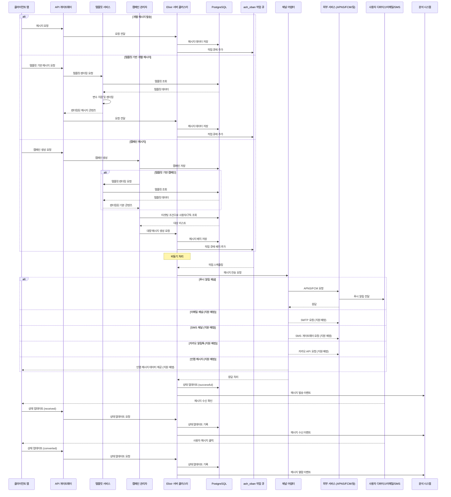

# [SEQ-002] 메시지 처리 시퀀스

| 버전 | 날짜       | 변경 내용      |
| ---- | ---------- | -------------- |
| 1.0  | 2025-04-02 | 최초 문서 작성 |

## 관련 문서

- [SEQ-003] 라이프사이클 시퀀스
- [SEQ-004] 캠페인 관리 시퀀스
- [COMP-002] 어댑터 시스템
- [DESIGN-002] 시스템 아키텍처

## 요약

본 문서는 Automata-Signal 시스템에서 메시지가 생성되고 처리되는 전체 흐름을 설명합니다. 개별 메시지 발송, 템플릿 기반 메시지, 대량 캠페인 등 다양한 메시지 처리 경로와 각 단계별 상호작용을 포함합니다.

## 대상 독자

- 개발팀
- 시스템 엔지니어
- QA 팀
- 운영팀

## 1. 메시지 처리 흐름 다이어그램



## 2. 메시지 생성 경로

Automata-Signal 시스템에서 메시지는 세 가지 주요 경로를 통해 생성됩니다:

### 2.1 개별 메시지 발송

이 경로는 가장 단순한 메시지 생성 방식으로, 특정 사용자/구독에 직접 메시지를 전송합니다:

1. 클라이언트 앱이 API 엔드포인트를 통해 메시지 전송 요청
2. API 게이트웨이가 요청을 검증하고 Elixir 서버에 전달
3. Elixir 서버가 메시지 데이터를 저장하고 작업 큐에 추가
4. 비동기 작업자가 메시지 전송 처리

**API 요청 예시:**

```json
POST /api/v1/messages
{
  "subscription_id": "a1b2c3d4-e5f6-7890-abcd-ef1234567890",
  "title": "알림 제목",
  "body": "알림 내용 메시지",
  "data": {
    "action": "open_screen",
    "screen": "order_details",
    "order_id": "ORD-12345"
  }
}
```

### 2.2 템플릿 기반 개별 메시지

템플릿을 사용하여 일관된 형식의 개인화된 메시지를 생성합니다:

1. 클라이언트가 템플릿 ID와 변수를 포함한 메시지 요청
2. API 게이트웨이가 템플릿 서비스에 렌더링 요청
3. 템플릿 서비스가 데이터베이스에서 템플릿을 조회
4. 제공된 변수로 템플릿 렌더링 (변수 치환)
5. 렌더링된 콘텐츠로 메시지 생성 및 처리

**API 요청 예시:**

```json
POST /api/v1/messages/template
{
  "subscription_id": "a1b2c3d4-e5f6-7890-abcd-ef1234567890",
  "template_id": "order_confirmation",
  "variables": {
    "customer_name": "홍길동",
    "order_id": "ORD-12345",
    "order_amount": "35,000원",
    "estimated_delivery": "4월 5일"
  }
}
```

### 2.3 캠페인 메시지

대량의 타겟팅된 사용자에게 메시지를 전송하는 캠페인 방식:

1. 클라이언트가 캠페인 생성 요청 (대상 조건, 콘텐츠 포함)
2. API가 캠페인 관리자에 요청 전달
3. 캠페인 관리자가 캠페인 정보 저장
4. 템플릿 기반 캠페인인 경우 템플릿 렌더링
5. 타겟팅 조건에 맞는 사용자/구독 조회
6. 대상자별 개별 메시지 생성 및 배치로 작업 큐에 추가

**API 요청 예시:**

```json
POST /api/v1/campaigns
{
  "name": "4월 프로모션 캠페인",
  "template_id": "monthly_promotion",
  "targeting_criteria": {
    "tags": ["active_user", "has_purchased"],
    "last_active_after": "2025-03-01T00:00:00Z",
    "countries": ["KR"]
  },
  "variables": {
    "promotion_name": "봄맞이 할인 행사",
    "discount_percent": "20%",
    "promotion_end_date": "4월 15일"
  },
  "scheduled_at": "2025-04-03T09:00:00Z"
}
```

## 3. 메시지 처리 단계

메시지가 생성된 후 처리되는 주요 단계를 설명합니다:

### 3.1 메시지 저장 및 큐 등록

1. Elixir 서버는 메시지 데이터를 데이터베이스에 저장 (상태: `pending`)
2. 메시지 처리 작업이 Oban 작업 큐에 등록됨
3. 메시지 생성 이벤트가 기록됨

**메시지 저장 로직 예시:**

```elixir
def create_message(attrs) do
  Message.create_changeset(attrs)
  |> Ash.create!()
  |> schedule_delivery()
end

def schedule_delivery(message) do
  %{id: message.id}
  |> MessageWorker.new()
  |> Oban.insert!()

  message
end
```

### 3.2 비동기 메시지 처리

1. Oban 워커가 작업 큐에서 메시지 처리 작업을 가져옴
2. 메시지 데이터를 로드하고 적절한 채널 어댑터를 선택
3. 채널 어댑터에 메시지 전송 요청

**작업자 로직 예시:**

```elixir
defmodule AutomataSignal.Workers.MessageWorker do
  use Oban.Worker, queue: :messages

  @impl Oban.Worker
  def perform(%Oban.Job{args: %{"id" => message_id}}) do
    message = AutomataSignal.Messages.get_message!(message_id)

    # 구독 타입에 따라 적절한 어댑터 선택
    adapter = get_adapter_for_channel(message.subscription.type)

    # 어댑터를 통해 메시지 전송
    case adapter.send_message(message) do
      {:ok, response} ->
        # 성공 처리
        AutomataSignal.Messages.mark_as_sent(message, response)
        :ok

      {:error, reason} ->
        # 오류 처리 (일시적/영구적 오류 구분)
        handle_send_error(message, reason)
    end
  end

  defp get_adapter_for_channel(:iOSPush), do: AutomataSignal.Adapters.PushAdapter
  defp get_adapter_for_channel(:AndroidPush), do: AutomataSignal.Adapters.PushAdapter
  # ... 다른 채널 어댑터 ...
end
```

### 3.3 외부 서비스 통합

채널 어댑터는 해당 메시징 채널의 외부 서비스와 통합됩니다:

1. 채널별 메시지 형식으로 변환
2. 외부 서비스 API 호출 (APNS, FCM 등)
3. 응답 처리 및 결과 반환

**푸시 어댑터 예시:**

```elixir
defmodule AutomataSignal.Adapters.PushAdapter do
  alias AutomataSignal.Adapters.Base

  def send_message(%{subscription: subscription} = message) do
    case subscription.type do
      :iOSPush -> send_ios_message(message)
      :AndroidPush -> send_android_message(message)
      _ -> {:error, :invalid_subscription_type}
    end
  end

  defp send_ios_message(message) do
    # APNS 통합 로직
    notification = %{
      token: message.subscription.token,
      topic: get_bundle_id(message.application),
      notification: %{
        title: message.title,
        body: message.body
      },
      custom: message.data
    }

    case Pigeon.APNS.push(notification, get_apns_config(message.subscription)) do
      {:ok, data} ->
        {:ok, %{provider_message_id: data.id}}
      {:error, reason} ->
        mapped_error = map_apns_error(reason)
        {:error, mapped_error}
    end
  end

  defp send_android_message(message) do
    # FCM 통합 로직
    notification = %{
      to: message.subscription.token,
      notification: %{
        title: message.title,
        body: message.body
      },
      data: message.data
    }

    case Pigeon.FCM.push(notification) do
      {:ok, data} ->
        {:ok, %{provider_message_id: data.id}}
      {:error, reason} ->
        mapped_error = map_fcm_error(reason)
        {:error, mapped_error}
    end
  end

  # ... 기타 헬퍼 함수 ...
end
```

### 3.4 응답 처리 및 상태 업데이트

외부 서비스 응답에 따라 메시지 상태가 업데이트됩니다:

1. 성공적인 전송: 상태를 `successful`로 변경, `sent_at` 타임스탬프 기록
2. 영구적 오류: 상태를 `failed`로 변경, 오류 정보 기록
3. 일시적 오류: 상태를 `errored`로 변경, 재시도 스케줄링

**상태 업데이트 로직 예시:**

```elixir
def mark_as_sent(message, response) do
  # 상태 전이 트리거
  message
  |> Message.send_changeset(response)
  |> Ash.update!()
  |> create_message_event(:sent, response)
end

def mark_as_failed(message, reason) do
  message
  |> Message.fail_changeset(reason)
  |> Ash.update!()
  |> create_message_event(:failed, %{reason: reason})
end

defp create_message_event(message, event_type, metadata) do
  MessageEvent.create_changeset(%{
    message_id: message.id,
    event_type: event_type,
    occurred_at: DateTime.utc_now(),
    metadata: metadata
  })
  |> Ash.create!()

  message
end
```

### 3.5 메시지 수신 확인

사용자 기기가 메시지를 수신하면 SDK를 통해 수신 확인이 서버로 전송됩니다:

1. 사용자 기기의 SDK가 메시지 수신 감지
2. SDK가 API 서버로 수신 확인 전송
3. 서버가 메시지 상태를 `received`로 업데이트
4. 수신 이벤트 기록 및 분석 데이터 수집

**SDK 메시지 수신 처리 예시 (Flutter):**

```dart
void _handlePushReceived(Map<String, dynamic> message) {
  final String messageId = message['automata_message_id'];
  if (messageId != null) {
    // 서버에 수신 확인 전송
    _apiClient.confirmMessageReceived(messageId).then((_) {
      print('Message receipt confirmation sent');
    }).catchError((error) {
      print('Failed to confirm message receipt: $error');
    });
  }
}
```

### 3.6 사용자 상호작용 추적

사용자가 메시지와 상호작용하면 해당 정보가 서버로 전송됩니다:

1. 사용자가 메시지를 클릭/열람
2. SDK가 상호작용 이벤트를 감지하고 API 서버로 전송
3. 서버가 메시지 상태를 `converted`로 업데이트
4. 전환 이벤트 기록 및 분석 데이터 수집

**SDK 메시지 클릭 처리 예시 (Flutter):**

```dart
void _handlePushClicked(Map<String, dynamic> message) {
  final String messageId = message['automata_message_id'];
  if (messageId != null) {
    // 서버에 클릭 이벤트 전송
    _apiClient.trackMessageConverted(messageId).then((_) {
      print('Message conversion tracked');
    }).catchError((error) {
      print('Failed to track message conversion: $error');
    });

    // 메시지 액션 처리
    _handleMessageAction(message['data']);
  }
}
```

## 4. 배치 처리 최적화

대량 메시지 처리를 위해 다음과 같은 최적화가 적용됩니다:

### 4.1 메시지 배치 생성

캠페인에서 대량 메시지 생성 시 배치 처리를 사용합니다:

```elixir
def create_campaign_messages(campaign, subscriptions) do
  # 구독 목록을 적절한 크기의 배치로 분할
  subscriptions
  |> Enum.chunk_every(500)
  |> Enum.each(fn batch ->
    # 배치 트랜잭션으로 메시지 레코드 생성
    Ash.transaction(fn ->
      Enum.map(batch, fn subscription ->
        create_message_for_subscription(campaign, subscription)
      end)
    end)
  end)
end
```

### 4.2 작업 큐 최적화

Oban 작업 큐를 사용하여 처리량과 안정성을 최적화합니다:

1. 우선순위 큐: 중요한 트랜잭션 메시지는 높은 우선순위로 처리
2. 병렬 워커: 다수의 워커를 통한 동시 처리
3. 비율 제한: 외부 서비스 제한을 고려한 처리 비율 제한
4. 재시도 전략: 실패한 작업에 대한 지수 백오프 재시도

**작업 큐 설정 예시:**

```elixir
config :automata_signal, Oban,
  repo: AutomataSignal.Repo,
  plugins: [
    {Oban.Plugins.Pruner, max_age: 60 * 60 * 24 * 7},
    {Oban.Plugins.Cron, crontab: [
      {"0 0 * * *", AutomataSignal.Workers.DailyQuotaResetWorker}
    ]}
  ],
  queues: [
    messages: 50,        # 일반 메시지 큐
    campaigns: 10,       # 캠페인 처리 큐
    high_priority: 20,   # 중요 메시지 큐
    message_retry: 5     # 재시도 큐
  ]
```

### 4.3 데이터베이스 최적화

데이터베이스 작업 최적화:

1. 일괄 삽입: `INSERT INTO ... VALUES (...), (...), ...` 구문 활용
2. 인덱스 최적화: 자주 쿼리되는 필드에 인덱스 적용
3. 읽기/쓰기 분리: 분석 쿼리와 작업 큐를 별도 연결로 분리
4. 트랜잭션 관리: 일관성을 위한 트랜잭션 사용

## 5. 채널별 처리 특성

각 채널의 특성에 맞게 메시지 처리 방식이 조정됩니다:

### 5.1 푸시 알림 채널

- 현재 지원됨
- APNS(iOS)와 FCM(Android) 서비스 통합
- 토큰 기반 타겟팅
- 비동기 응답 처리

### 5.2 이메일 채널 (지원 예정)

- AWS SES 또는 SMTP 서버 통합 예정
- 이메일 템플릿 렌더링 (HTML/텍스트)
- 열람 추적 픽셀 및 링크 추적
- 바운스 및 스팸 신고 처리

### 5.3 SMS 채널 (지원 예정)

- 다양한 SMS 게이트웨이 통합 예정
- 국가별 포맷팅 규칙 적용
- 메시지 길이 제한 및 분할 처리
- 수신 확인 처리

### 5.4 카카오 알림톡 (지원 예정)

- 카카오 비즈니스 API 통합 예정
- 승인된 템플릿 기반 메시지 발송
- 버튼 액션 추적
- 대체 발송(SMS) 자동 처리

### 5.5 인앱 메시지 (지원 예정)

- 앱 내 직접 메시지 표시
- 다양한 레이아웃 템플릿 지원
- 메시지 트리거 조건 설정
- 오프라인 메시지 저장 및 표시

## 6. 오류 처리 및 재시도

### 6.1 오류 분류

메시지 처리 중 발생하는 오류는 다음과 같이 분류됩니다:

1. **영구적 오류**: 다시 시도해도 해결되지 않는 오류

   - 유효하지 않은 토큰/주소
   - 차단된 사용자
   - 구독 취소된 사용자
   - 서비스 인증 실패

2. **일시적 오류**: 재시도를 통해 해결될 수 있는 오류
   - 네트워크 연결 문제
   - 서비스 일시적 장애
   - 비율 제한 초과
   - 서버 과부하

### 6.2 재시도 전략

일시적 오류에 대한 재시도 전략:

```elixir
defmodule AutomataSignal.ErrorHandler do
  def handle_send_error(message, reason) do
    case classify_error(reason) do
      :permanent ->
        # 영구적 오류 처리
        AutomataSignal.Messages.mark_as_failed(message, reason)
        {:error, reason}

      :temporary ->
        # 일시적 오류 처리 및 재시도 스케줄링
        message = AutomataSignal.Messages.mark_as_errored(message, reason)
        schedule_retry(message)
        {:error, :retry_scheduled}
    end
  end

  defp classify_error(reason) do
    cond do
      reason in [:invalid_token, :unregistered, :not_registered] -> :permanent
      reason in [:service_unavailable, :internal_server_error, :timeout] -> :temporary
      # ... 기타 오류 분류 ...
      true -> :permanent  # 기본적으로 안전하게 영구적 오류로 처리
    end
  end

  defp schedule_retry(message) do
    # Oban 작업으로 재시도 스케줄링 (지수 백오프 적용)
    backoff = get_backoff_for_attempt(message.retry_count || 0)

    %{message_id: message.id}
    |> AutomataSignal.Workers.MessageRetryWorker.new(
      queue: :message_retry,
      scheduled_in: backoff
    )
    |> Oban.insert!()
  end

  defp get_backoff_for_attempt(attempt) do
    base = 30
    max_backoff = 60 * 60  # 최대 1시간

    backoff = base * :math.pow(2, attempt)
    min(backoff, max_backoff)
  end
end
```

## 7. 모니터링 및 알림

메시지 처리 흐름의 모니터링 포인트:

1. **처리량 지표**:

   - 초당 생성된 메시지 수
   - 초당 처리된 메시지 수
   - 작업 큐 길이
   - 처리 지연 시간

2. **상태 비율 지표**:

   - 성공/실패/오류 메시지 비율
   - 채널별 전송 성공률
   - 도달률 및 전환율

3. **이상 알림**:
   - 비정상적인 높은 실패율
   - 특정 채널 오류 증가
   - 작업 큐 백로그 증가
   - 외부 서비스 연결 문제

## 8. 성능 고려사항

### 8.1 처리량 목표

- 초당 10만 건(10초당 100만 건)의 메시지 처리
- 단일 노드에서 초당 5,000-10,000건 처리
- 메시지 전송 지연 시간 500ms 이하

### 8.2 리소스 사용

- 노드당 30-50개의 데이터베이스 연결
- 적절한 워커 수 설정 (CPU 코어 수 × 2 권장)
- 메모리 사용량 모니터링 및 제한 설정

### 8.3 스케일링 전략

- 메시지 볼륨 증가 시 노드 수 증가
- 리전별 트래픽에 따른 노드 분배
- 작업 큐를 통한 부하 분산
