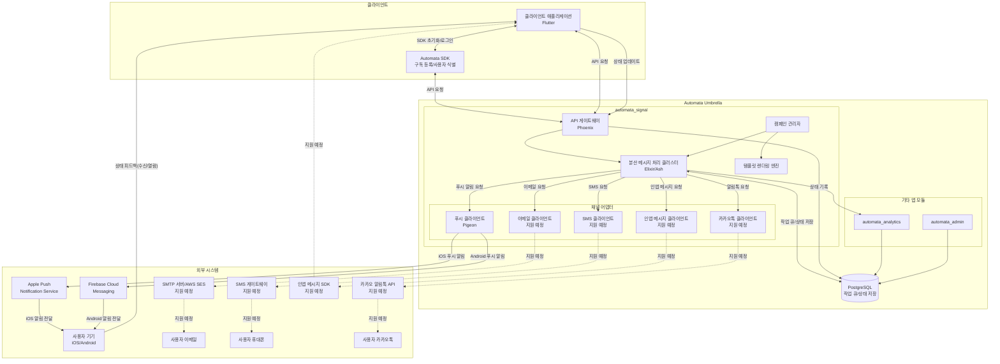
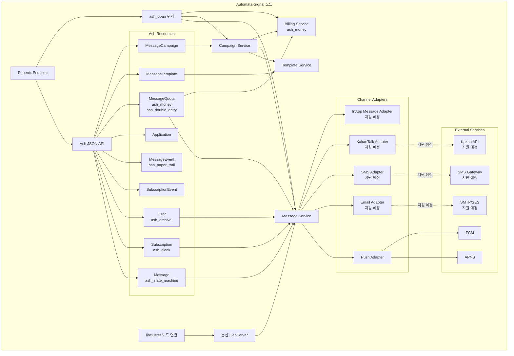
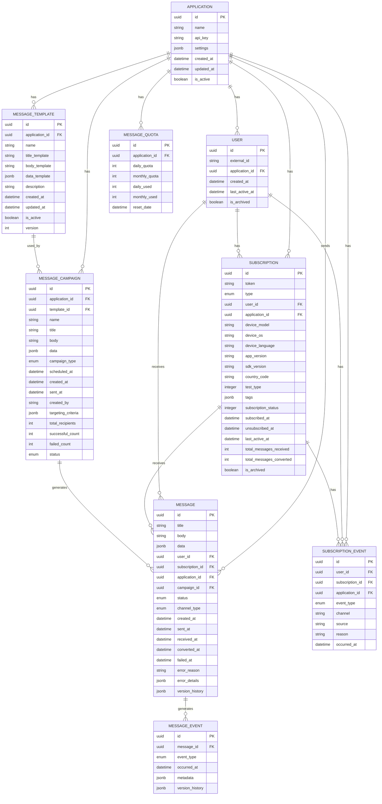
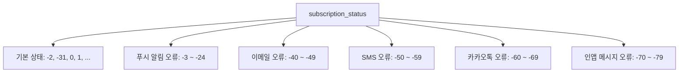
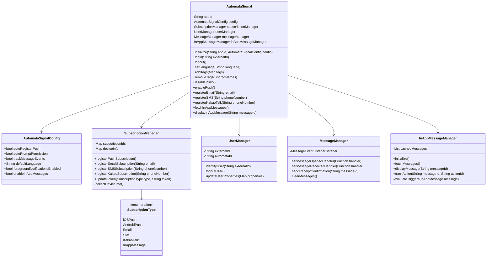
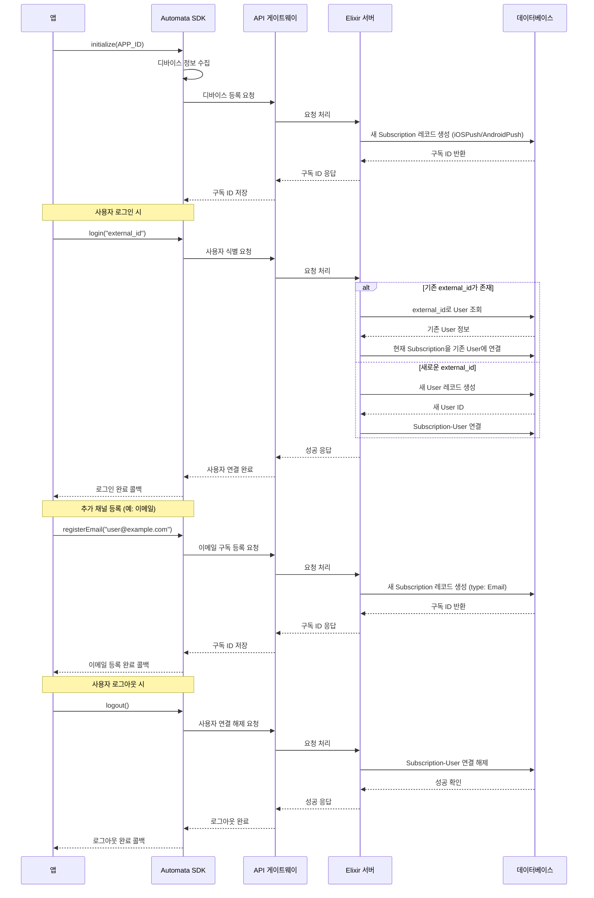
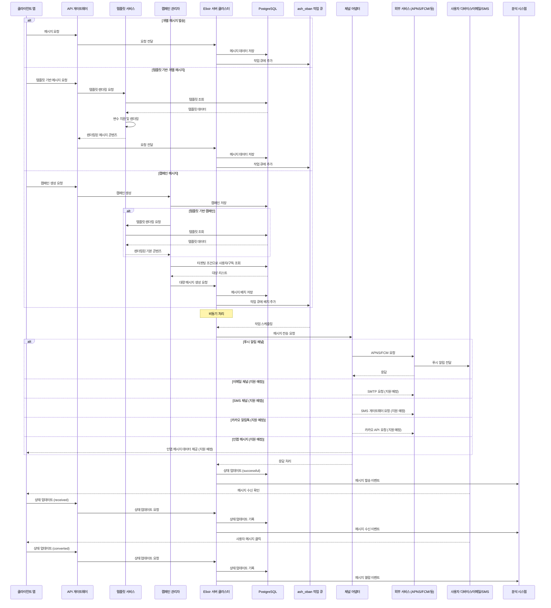
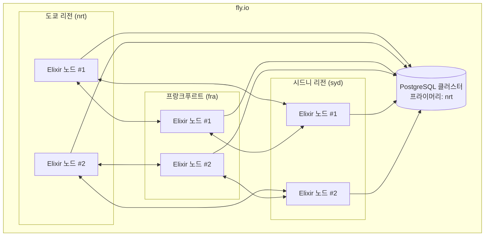
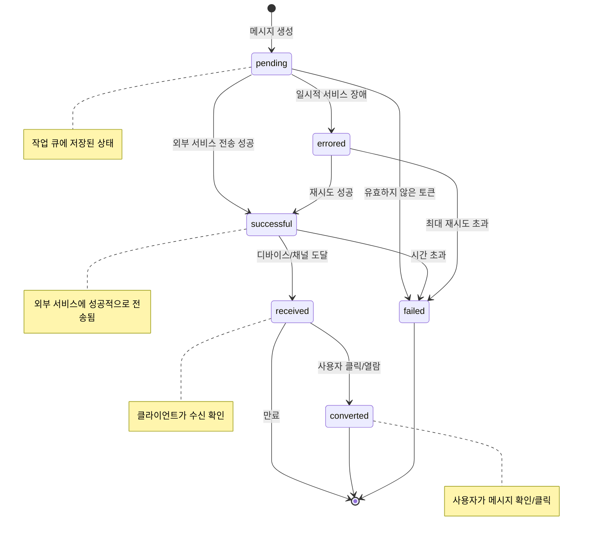
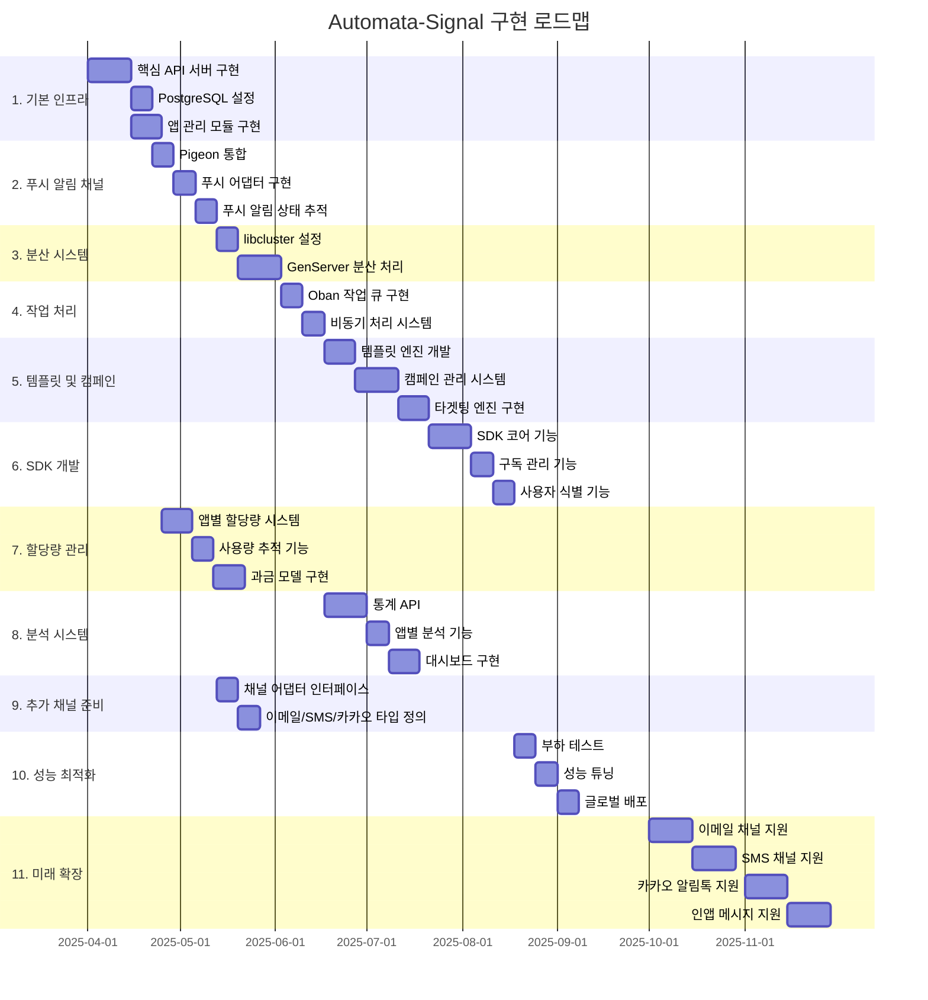

# Automata-Signal: 기술 명세서

## 1. 서론

### 목적

본 문서는 Automata-Signal 시스템의 기술적 설계와 구현 계획을 상세히 기술하며, 개발팀, 이해관계자 및 시스템 운영자에게 필요한 기술적 정보를 제공합니다.

### 배경

모바일 애플리케이션과 웹 서비스의 성장으로 사용자 참여를 유도하는 효과적인 메시징 시스템의 필요성이 증가하고 있습니다. 기존 메시징 서비스들은 확장성, 안정성, 그리고 다양한 플랫폼 및 채널 지원에 제한이 있어, 글로벌 규모의 고성능 통합 메시징 시스템 개발이 요구되었습니다.

## 2. 제품 개요

### 기능적 요구사항

- **멀티채널 메시징 지원**:
  - 푸시 알림 (iOS, Android)
  - 이메일 (지원 예정)
  - SMS (지원 예정)
  - 카카오 알림톡 (지원 예정)
  - 인앱 메시지 (지원 예정)
- 메시지 상태 관리 및 추적 (발송→도달→오픈)
- 대량 메시지 배치 처리 및 스케줄링
- 사용자 및 채널별 구독 관리
- 메시지 템플릿 관리와 개인화 (채널별 최적화)
- 메시지 캠페인 관리 및 타겟팅
- 통합 SDK 제공 (구독 관리, 사용자 식별, 메시지 처리)
- 멀티채널 통합 분석 및 보고서 생성

### 비기능적 요구사항

- **성능**: 초당 10만 건(10초당 100만 건)의 메시지 처리 능력
- **확장성**: 사용자, 채널 및 메시지 볼륨 증가에 유연한 대응
- **안정성**: fly.io 기반 글로벌 분산 배포로 99.95% 이상의 가용성
- **보안**: 민감한 사용자 데이터 및 인증 토큰 암호화
- **유지보수성**: Umbrella 구조와 어댑터 패턴을 통한 모듈성 및 확장성 보장
- **감사 추적**: 모든 메시지 상태 변경 기록 및 추적
- **채널 독립성**: 새로운 메시징 채널을 쉽게 추가할 수 있는 확장 가능한 구조

## 3. 시스템 아키텍처

### 3.1 전체 아키텍처 개요



Automata-Signal은 Elixir Umbrella 프로젝트 구조를 기반으로 구축된 분산 시스템으로, 다음과 같은 주요 구성 요소로 이루어져 있습니다:

1. **API 게이트웨이**: Phoenix Framework 기반으로 REST API를 제공합니다.
2. **분산 메시지 처리 클러스터**: Elixir/OTP, libcluster, GenServer를 활용한 고성능 메시지 처리 시스템입니다.
3. **채널 어댑터**:
   - 푸시 클라이언트: Pigeon 라이브러리를 통해 iOS(APNS)와 Android(FCM) 플랫폼에 알림 전송
   - 이메일 클라이언트: 향후 구현 예정
   - SMS 클라이언트: 향후 구현 예정
   - 카카오 알림톡 클라이언트: 향후 구현 예정
   - 인앱 메시지 클라이언트: 향후 구현 예정
4. **템플릿 렌더링 엔진**: 메시지 템플릿 및 변수를 처리하여 개인화된 메시지를 생성합니다.
5. **캠페인 관리자**: 대규모 메시지 캠페인 생성, 스케줄링 및 타겟팅을 처리합니다.
6. **작업 큐 및 상태 저장소**: PostgreSQL, ash_oban, ash_state_machine을 활용한 작업 관리 및 상태 추적 시스템입니다.
7. **SDK**: 구독 등록, 토큰 관리, 사용자 식별 등의 기능을 제공하는 클라이언트 라이브러리입니다.
8. **분석 모듈**: 메시지 상태 및 사용자 참여 데이터 분석을 위한 컴포넌트입니다.
9. **관리자 모듈**: 시스템 관리 및 모니터링을 위한 인터페이스입니다.

### 3.2 Elixir 노드 내부 아키텍처



Elixir 노드 내부에서는 다양한 컴포넌트들이 유기적으로 상호작용하여 메시징 기능을 제공합니다:

1. **Phoenix Endpoint**: 클라이언트 요청을 받아 처리하는 웹 서버 엔드포인트입니다.
2. **Ash JSON API**: Ash Framework 기반의 RESTful API를 제공하며, 리소스에 대한 CRUD 작업을 처리합니다.
3. **Ash Resources**:
   - **Application**: 메시징 서비스를 사용하는 애플리케이션 정보 관리
   - **User**: 사용자 정보 및 외부 ID 매핑 관리 (ash_archival 확장으로 논리적 삭제 지원)
   - **Subscription**: 사용자의 구독 정보 관리 (ash_cloak 확장으로 토큰 암호화)
   - **Message**: 메시지 내용 및 상태 관리 (ash_state_machine 확장으로 상태 전이 관리)
   - **MessageEvent**: 메시지 이벤트 추적 (ash_paper_trail 확장으로 변경 이력 관리)
   - **SubscriptionEvent**: 구독 상태 변경 추적
   - **MessageQuota**: 앱별 할당량 관리 (ash_money 확장으로 과금 관리, ash_double_entry 확장으로 정확한 사용량 추적)
   - **MessageTemplate**: 재사용 가능한 메시지 템플릿 관리
   - **MessageCampaign**: 대량 메시지 발송 캠페인 관리
4. **서비스 컴포넌트**:
   - **Message Service**: 메시지 생성 및 전송 로직 구현
   - **Template Service**: 템플릿 렌더링 및 변수 치환 처리
   - **Campaign Service**: 캠페인 처리 및 대상자 필터링
   - **Billing Service**: 과금 및 할당량 관리 (ash_money 활용)
5. **작업 처리 컴포넌트**:
   - **ash_oban 워커**: 비동기 작업 처리 및 스케줄링
   - **분산 GenServer**: 노드 간 상태 공유 및 작업 분배
6. **채널 어댑터**:
   - **Push Adapter**: iOS/Android 푸시 알림 처리
   - **Email Adapter**: 이메일 메시지 처리 (지원 예정)
   - **SMS Adapter**: SMS 메시지 처리 (지원 예정)
   - **KakaoTalk Adapter**: 카카오 알림톡 처리 (지원 예정)
   - **InApp Message Adapter**: 인앱 메시지 처리 (지원 예정)
7. **노드 연결**:
   - **libcluster**: 자동 노드 발견 및 연결로 분산 클러스터 구성

### 3.3 데이터 모델 아키텍처



### 주요 엔티티

1. **Application**: 메시징 서비스를 이용하는 앱 정보 (API 키, 설정 등)
2. **User**: 각 앱의 사용자 정보. `external_id`를 통해 앱 내에서 사용자 식별 (이메일, 이름 등 저장하지 않음)
3. **Subscription**: 사용자의 구독 정보 (푸시 알림, 이메일, SMS, 카카오톡 등)
4. **MessageTemplate**: 재사용 가능한 메시지 형식 템플릿 정의
5. **MessageCampaign**: 대량 메시지 발송을 위한 캠페인 정의
6. **Message**: 개별 사용자의 구독 채널에 전송된 메시지와 상태 정보
7. **MessageEvent**: 메시지 상태 변경 이벤트 기록
8. **SubscriptionEvent**: 구독/구독취소 이벤트 기록
9. **MessageQuota**: 앱별 메시지 할당량 및 사용량 관리

### 주요 데이터 모델 특징

1. **복합 유니크 제약조건**: User 테이블에서 `(external_id, application_id)` 조합은 유니크해야 합니다. 이를 통해 한 앱 내에서 사용자 식별자의 유일성을 보장합니다.
2. **Subscription 메타데이터**: 구독 채널에 대한 상세 정보 저장
   - `type`: 구독 채널 유형 (예: `iOSPush`, `AndroidPush`, `Email`, `SMS`, `KakaoTalk`, `InAppMessage`)
   - `token`: 채널별 식별자 (푸시 토큰, 이메일 주소, 전화번호 등)
   - 디바이스 관련 정보 (푸시 알림 채널인 경우):
     - `device_model`, `device_os`: 디바이스 하드웨어 및 OS 정보
     - `device_language`: 디바이스 설정 언어
     - `app_version`, `sdk_version`: 앱 및 SDK 버전 관리
   - `country_code`: 지역별 분석 및 규제 준수
   - `test_type`: 테스트 환경 설정 (0: Production, 1: Development, 2: Ad-Hoc)
   - `tags`: 유연한 태그 데이터 저장(JSON)
3. **구독 상태 코드 체계**:



### 기본 구독 상태

| 코드   | 정의                  | 설명                                                                               |
| ------ | --------------------- | ---------------------------------------------------------------------------------- |
| 1 이상 | 구독됨                | 해당 채널에서 메시지를 수신할 수 있는 상태. 푸시 알림의 경우 유효한 토큰이 필요함. |
| 0, -99 | 구독된 적 없음        | 초기 상태. 해당 채널에 아직 구독되지 않음.                                         |
| -2     | 구독 취소됨           | 사용자가 직접 구독을 취소한 상태. enabled 속성을 false로 설정할 때 권장되는 값.    |
| -31    | API를 통해 비활성화됨 | REST API를 통해 관리자나 시스템에 의해 비활성화된 경우.                            |
| -98    | 이중 확인 대기 중     | SMS/이메일에서 더블 옵트인을 기다리는 상태.                                        |

### 푸시 알림 관련 오류 코드

| 코드             | 정의                              | 설명                                                   |
| ---------------- | --------------------------------- | ------------------------------------------------------ |
| -3, -5           | Android 지원 라이브러리 오류      | 앱의 Android 지원 라이브러리 추가 또는 업데이트 필요   |
| -4, -8, -11, -12 | Android Google Play 서비스 오류   | Google Play 서비스 라이브러리 업그레이드 필요          |
| -6               | Android 잘못된 프로젝트 번호      | FCMv1 Sender ID가 토큰 원본과 일치하지 않음            |
| -7, -9           | Android 구버전 Google Play 서비스 | 기기의 Google Play 서비스 앱 업데이트 필요             |
| -10              | 구독되지 않음                     | 앱 제거 또는 기기 설정에서 구독 취소됨, 웹 푸시 차단됨 |
| -13              | iOS 푸시 기능 누락                | 필요한 SDK 설정 단계가 누락됨                          |
| -14, -16, -17    | iOS APNS 오류                     | 기기가 APNS 연결에 문제 있음                           |
| -15              | iOS 시뮬레이터 오류               | iOS 16.4+ 시뮬레이터 필요                              |
| -18              | 권한 요청 안됨                    | 구독 권한 요청이 표시된 적 없음                        |
| -19              | 권한 요청 무응답                  | 구독 권한 요청이 표시되었으나 응답하지 않음            |
| -20, -21         | 웹 레코드 임시 상태               | 웹 푸시 권한 철회됨                                    |
| -22              | 수동 구독 취소                    | 사용자가 권한을 철회함                                 |
| -23, -24         | 웹 서비스 워커 오류               | 웹 푸시 관련 오류                                      |

### 이메일 관련 오류 코드 (지원 예정)

| 코드 | 정의                 | 설명                                       |
| ---- | -------------------- | ------------------------------------------ |
| -40  | 유효하지 않은 이메일 | 이메일 형식이 올바르지 않음                |
| -41  | 이메일 전송 실패     | 일반적인 이메일 전송 오류                  |
| -42  | 하드 바운스          | 영구적인 전송 실패 (존재하지 않는 주소 등) |
| -43  | 소프트 바운스        | 일시적인 전송 실패 (사서함 용량 초과 등)   |
| -44  | 스팸으로 신고됨      | 사용자가 스팸으로 신고함                   |
| -45  | 수신 거부            | 이메일 내 수신 거부 링크를 통해 구독 취소  |

### SMS 관련 오류 코드 (지원 예정)

| 코드 | 정의                   | 설명                          |
| ---- | ---------------------- | ----------------------------- |
| -50  | 유효하지 않은 전화번호 | 전화번호 형식이 올바르지 않음 |
| -51  | SMS 전송 실패          | 일반적인 SMS 전송 오류        |
| -52  | 번호 없음              | 존재하지 않는 전화번호        |
| -53  | 네트워크 오류          | 통신사 네트워크 오류          |
| -54  | 차단됨                 | 사용자가 수신을 차단함        |
| -55  | 발신 번호 제한         | 발신 번호에 대한 제한         |

### 카카오 알림톡 관련 오류 코드 (지원 예정)

| 코드 | 정의              | 설명                                |
| ---- | ----------------- | ----------------------------------- |
| -60  | 카카오톡 미사용자 | 카카오톡을 사용하지 않는 사용자     |
| -61  | 알림톡 차단       | 사용자가 알림톡 수신을 차단함       |
| -62  | 친구 추가 안됨    | 비즈니스 계정 친구 추가가 안된 상태 |
| -63  | 템플릿 미승인     | 알림톡 템플릿이 승인되지 않음       |
| -64  | 발송 한도 초과    | 일일 발송 한도 초과                 |
| -65  | 채널 오류         | 카카오 비즈니스 채널 오류           |

### 인앱 메시지 관련 오류 코드 (지원 예정)

| 코드 | 정의                        | 설명                                          |
| ---- | --------------------------- | --------------------------------------------- |
| -70  | 앱 버전 불일치              | 지원되지 않는 앱 버전                         |
| -71  | 사용자 설정에 의한 비활성화 | 사용자가 앱 설정에서 인앱 메시지를 비활성화함 |
| -72  | 표시 조건 불일치            | 표시 조건(트리거)에 부합하지 않음             |
| -73  | 기기 저장공간 부족          | 인앱 메시지 에셋을 저장할 공간 부족           |
| -74  | SDK 초기화 실패             | 인앱 메시지 SDK 초기화 오류                   |

1. **채널별 메시지 형식**: 각 채널 유형에 따라 메시지 형식과 내용이 달라질 수 있음
   - 푸시 알림: 제목, 본문, 액션 데이터
   - 이메일: 제목, HTML 본문, 첨부파일
   - SMS: 단문 메시지
   - 카카오톡: 알림톡 템플릿 ID 및 변수
   - 인앱 메시지: 제목, 본문, 레이아웃 타입, 액션, 표시 규칙
2. **템플릿 기반 메시지**: 템플릿은 고정된 구조에 변수 플레이스홀더를 포함
   - `title_template`, `body_template`: 제목 및 본문에 `{{variable}}` 형태의 변수 포함
   - 예: "안녕하세요 `{{user_name}}`님, `{{event_name}}` 이벤트가 시작됩니다"
   - 채널별 템플릿 지원: 이메일용 HTML 템플릿, 카카오톡용 알림톡 템플릿 등
3. **캠페인-메시지 관계**: 모든 메시지는 개별 발송이거나 캠페인의 일부로 생성됨
   - 개별 메시지: `campaign_id`가 null
   - 캠페인 메시지: 동일한 `campaign_id`를 공유하는 다수의 메시지 인스턴스
4. **메시지 테이블 공유**: 모든 채널(푸시, 이메일, SMS, 카카오 알림톡, 인앱 메시지)의 메시지는 동일한 `MESSAGE` 테이블을 사용하며, `channel_type` 필드로 구분

### Subscription 리소스 예시

```elixir
defmodule AutomataSignal.Resources.Subscription do
  use Ash.Resource,
    data_layer: Ash.DataLayer.Postgres,
    extensions: [
      AshArchival.Resource,
      AshCloak.Resource
    ]

  attributes do
    uuid_primary_key :id
    attribute :token, :string, sensitive?: true
    attribute :type, :atom do
      constraints [one_of: [:iOSPush, :AndroidPush, :Email, :SMS, :KakaoTalk, :InAppMessage]]
    end
    attribute :user_id, :uuid
    attribute :application_id, :uuid

    # 디바이스 메타데이터 (푸시 알림 구독인 경우)
    attribute :device_model, :string
    attribute :device_os, :string
    attribute :device_language, :string
    attribute :app_version, :string
    attribute :sdk_version, :string
    attribute :country_code, :string
    attribute :test_type, :integer, default: 0
    attribute :tags, :map, default: %{}

    # 구독 상태
    attribute :subscription_status, :integer, default: 0
    attribute :subscribed_at, :utc_datetime
    attribute :unsubscribed_at, :utc_datetime

    # 통계 지표
    attribute :last_active_at, :utc_datetime
    attribute :total_messages_received, :integer, default: 0
    attribute :total_messages_converted, :integer, default: 0
  end

  encrypted_attributes do
    attribute :token
  end

  archival do
    archive_attribute :is_archived
    archive_timestamp_attribute :archived_at
  end

  # 구독 상태 코드 관련 함수
  calculations do
    calculate :is_push_channel, :boolean, expr: expr(type in [:iOSPush, :AndroidPush])
    calculate :is_messaging_channel, :boolean, expr: expr(type in [:Email, :SMS, :KakaoTalk])
    calculate :is_in_app_channel, :boolean, expr: expr(type == :InAppMessage)

    calculate :is_subscribed, :boolean, expr: expr(subscription_status > 0)
    calculate :is_unsubscribed, :boolean, expr: expr(subscription_status == -2 or subscription_status == -31)
    calculate :has_error, :boolean, expr: expr(subscription_status < -2 and subscription_status != -31 and subscription_status != -99)
    calculate :error_code_range, :string, expr: expr(
      cond do
        subscription_status >= -24 and subscription_status <= -3 -> "push_error"
        subscription_status >= -49 and subscription_status <= -40 -> "email_error"
        subscription_status >= -59 and subscription_status <= -50 -> "sms_error"
        subscription_status >= -69 and subscription_status <= -60 -> "kakao_error"
        subscription_status >= -79 and subscription_status <= -70 -> "in_app_error"
        true -> "other"
      end
    )
  end

  relationships do
    belongs_to :user, AutomataSignal.Resources.User
    belongs_to :application, AutomataSignal.Resources.Application
    has_many :messages, AutomataSignal.Resources.Message,
      destination_field: :subscription_id
    has_many :subscription_events, AutomataSignal.Resources.SubscriptionEvent,
      destination_field: :subscription_id
  end

  # ... 추가 액션 및 기타 설정 ...
end

```

### Message 리소스 예시

```elixir
defmodule AutomataSignal.Resources.Message do
  use Ash.Resource,
    data_layer: Ash.DataLayer.Postgres,
    extensions: [AshStateMachine.Resource]

  attributes do
    uuid_primary_key :id
    attribute :title, :string
    attribute :body, :string
    attribute :data, :map, default: %{}
    attribute :user_id, :uuid
    attribute :subscription_id, :uuid
    attribute :application_id, :uuid
    attribute :campaign_id, :uuid, allow_nil?: true

    attribute :status, :atom do
      constraints [one_of: [:pending, :successful, :failed, :errored, :received, :converted]]
      default :pending
    end

    attribute :channel_type, :atom do
      constraints [one_of: [:push, :email, :sms, :kakao_talk, :in_app]]
    end

    timestamps()
    attribute :sent_at, :utc_datetime
    attribute :received_at, :utc_datetime
    attribute :converted_at, :utc_datetime
    attribute :failed_at, :utc_datetime

    attribute :error_reason, :string
    attribute :error_details, :map, default: %{}
    attribute :version_history, :map, default: %{}
  end

  state_machine do
    field :status

    initial_states [:pending]

    transitions do
      transition :send, from: [:pending], to: :successful
      transition :fail, from: [:pending, :successful], to: :failed
      transition :error, from: [:pending], to: :errored
      transition :retry, from: [:errored], to: :pending
      transition :receive, from: [:successful], to: :received
      transition :convert, from: [:received], to: :converted
    end

    on_transition :send do
      set_attribute :sent_at, &DateTime.utc_now/0
    end

    on_transition :fail do
      set_attribute :failed_at, &DateTime.utc_now/0
    end

    on_transition :receive do
      set_attribute :received_at, &DateTime.utc_now/0
    end

    on_transition :convert do
      set_attribute :converted_at, &DateTime.utc_now/0
    end
  end

  relationships do
    belongs_to :user, AutomataSignal.Resources.User
    belongs_to :subscription, AutomataSignal.Resources.Subscription
    belongs_to :application, AutomataSignal.Resources.Application
    belongs_to :campaign, AutomataSignal.Resources.MessageCampaign, allow_nil?: true
    has_many :events, AutomataSignal.Resources.MessageEvent,
      destination_field: :message_id
  end

  # ... 액션 및 기타 설정 ...
end

```

### MessageQuota 리소스 예시

```elixir
defmodule AutomataSignal.Resources.MessageQuota do
  use Ash.Resource,
    data_layer: Ash.DataLayer.Postgres,
    extensions: [
      AshMoney.Resource,
      AshDoubleEntry.Resource
    ]

  attributes do
    uuid_primary_key :id
    attribute :application_id, :uuid
    attribute :daily_quota, :integer
    attribute :monthly_quota, :integer
    attribute :daily_used, :integer, default: 0
    attribute :monthly_used, :integer, default: 0
    attribute :reset_date, :utc_datetime

    # 과금 관련 필드 (ash_money 사용)
    attribute :unit_price, :money  # 메시지당 단가
    attribute :credit_balance, :money, default: 0  # 남은 크레딧
    attribute :billing_currency, :string, default: "KRW"
  end

  relationships do
    belongs_to :application, AutomataSignal.Resources.Application
  end

  # ash_double_entry 설정
  double_entry do
    # 사용량 계정 정의
    account :daily_usage do
      # 일일 사용량 증가 및 감소
      change_attribute :daily_used
      credit_type :increase  # 사용량 증가는 credit 작업
      debit_type :decrease   # 사용량 감소는 debit 작업
    end

    account :monthly_usage do
      # 월간 사용량 증가 및 감소
      change_attribute :monthly_used
      credit_type :increase
      debit_type :decrease
    end

    # 크레딧 계정 정의 (ash_money와 통합)
    account :credit_balance do
      change_attribute :credit_balance
      credit_type :increase  # 크레딧 증가
      debit_type :decrease   # 크레딧 감소 (사용)
    end
  end

  # ... 액션 및 기타 설정 ...
end

```

### 3.4 SDK 아키텍처



### SDK 구현 예시 (Flutter)

```dart
// 메인 SDK 클래스
class AutomataSignal {
  static final AutomataSignal _instance = AutomataSignal._internal();
  factory AutomataSignal() => _instance;
  AutomataSignal._internal();

  String? _appId;
  late AutomataSignalConfig config;
  late SubscriptionManager _subscriptionManager;
  late UserManager _userManager;
  late MessageManager _messageManager;
  late InAppMessageManager _inAppMessageManager; // 인앱 메시지 매니저 (지원 예정)

  Future<void> initialize(String appId, [AutomataSignalConfig? config]) async {
    _appId = appId;
    this.config = config ?? AutomataSignalConfig();

    _subscriptionManager = SubscriptionManager(appId);
    _userManager = UserManager(appId);
    _messageManager = MessageManager(appId);
    _inAppMessageManager = InAppMessageManager(appId); // 인앱 메시지 매니저 초기화 (지원 예정)

    // 푸시 알림 구독 등록 (기본)
    if (this.config.autoRegisterPush) {
      await _subscriptionManager.registerPushSubscription();

      // 권한 요청 (설정에 따라)
      if (this.config.autoPromptPermission) {
        await requestNotificationPermission();
      }
    }

    // 인앱 메시지 초기화 (지원 예정)
    if (this.config.enableInAppMessages) {
      await _inAppMessageManager.initialize();
    }
  }

  // 사용자 식별
  Future<void> login(String externalId) async {
    await _userManager.identifyUser(externalId);
  }

  Future<void> logout() async {
    await _userManager.logoutUser();
  }

  // 채널별 구독 등록
  Future<String?> registerEmail(String email) async {
    return await _subscriptionManager.registerEmailSubscription(email);
  }

  Future<String?> registerSMS(String phoneNumber) async {
    return await _subscriptionManager.registerSMSSubscription(phoneNumber);
  }

  Future<String?> registerKakaoTalk(String phoneNumber) async {
    return await _subscriptionManager.registerKakaoSubscription(phoneNumber);
  }

  // 인앱 메시지 관련 메서드 (지원 예정)
  Future<void> fetchInAppMessages() async {
    // 지원 예정
    return await _inAppMessageManager.fetchMessages();
  }

  Future<void> displayInAppMessage(String messageId) async {
    // 지원 예정
    return await _inAppMessageManager.displayMessage(messageId);
  }

  Future<void> trackInAppMessageAction(String messageId, String actionId) async {
    // 지원 예정
    return await _inAppMessageManager.trackAction(messageId, actionId);
  }

  // 구독 관련 메서드
  Future<void> disableChannel(SubscriptionType type) async {
    await _subscriptionManager.disableSubscription(type);
  }

  Future<void> enableChannel(SubscriptionType type) async {
    await _subscriptionManager.enableSubscription(type);
  }

  // 기타 API 메서드들...
}

// 설정 클래스
class AutomataSignalConfig {
  final bool autoRegisterPush;
  final bool autoPromptPermission;
  final bool trackMessageEvents;
  final String? defaultLanguage;
  final bool foregroundNotificationsEnabled;
  final bool enableInAppMessages; // 인앱 메시지 활성화 옵션 (지원 예정)

  AutomataSignalConfig({
    this.autoRegisterPush = true,
    this.autoPromptPermission = true,
    this.trackMessageEvents = true,
    this.defaultLanguage,
    this.foregroundNotificationsEnabled = true,
    this.enableInAppMessages = true, // 기본적으로 활성화
  });
}

// 구독 유형 열거형
enum SubscriptionType {
  iOSPush,
  AndroidPush,
  Email,
  SMS,
  KakaoTalk,
  InAppMessage, // 인앱 메시지 타입 추가 (지원 예정)
}

```

```dart
// 앱에서의 사용 예시
void main() async {
  WidgetsFlutterBinding.ensureInitialized();

  // SDK 초기화
  await AutomataSignal().initialize('YOUR_APP_ID',
    AutomataSignalConfig(
      autoRegisterPush: true,
      autoPromptPermission: true,
      foregroundNotificationsEnabled: true,
      enableInAppMessages: true, // 인앱 메시지 활성화
    )
  );

  runApp(MyApp());
}

// 사용자 로그인 시
Future<void> onUserLogin(String userId) async {
  await AutomataSignal().login(userId);

  // 로그인 후 인앱 메시지 확인 (지원 예정)
  await AutomataSignal().fetchInAppMessages();
}

// 사용자 로그아웃 시
Future<void> onUserLogout() async {
  await AutomataSignal().logout();
}

// 다양한 채널 등록 예시
Future<void> registerUserChannels(User user) async {
  // 이메일 채널 등록
  if (user.email != null) {
    String? emailSubscriptionId = await AutomataSignal().registerEmail(user.email!);
    print('Email subscription registered: $emailSubscriptionId');
  }

  // SMS 채널 등록
  if (user.phoneNumber != null) {
    String? smsSubscriptionId = await AutomataSignal().registerSMS(user.phoneNumber!);
    print('SMS subscription registered: $smsSubscriptionId');
  }

  // 카카오톡 채널 등록
  if (user.phoneNumber != null) {
    String? kakaoSubscriptionId = await AutomataSignal().registerKakaoTalk(user.phoneNumber!);
    print('KakaoTalk subscription registered: $kakaoSubscriptionId');
  }
}

// 인앱 메시지 처리 예시 (지원 예정)
class MyHomePage extends StatefulWidget {
  @override
  _MyHomePageState createState() => _MyHomePageState();
}

class _MyHomePageState extends State<MyHomePage> with WidgetsBindingObserver {
  @override
  void initState() {
    super.initState();
    WidgetsBinding.instance.addObserver(this);

    // 인앱 메시지 리스너 설정
    AutomataSignal().setInAppMessageClickHandler((messageId, actionId) {
      // 메시지 클릭 처리
      print('In-app message clicked: $messageId, action: $actionId');
    });
  }

  @override
  void didChangeAppLifecycleState(AppLifecycleState state) {
    if (state == AppLifecycleState.resumed) {
      // 앱이 포그라운드로 돌아올 때 인앱 메시지 확인
      AutomataSignal().fetchInAppMessages();
    }
  }

  @override
  void dispose() {
    WidgetsBinding.instance.removeObserver(this);
    super.dispose();
  }
}

```

### 3.5 메시지 처리 흐름

### 3.5.1 SDK 초기화 및 사용자 식별 흐름



모바일 SDK 초기화 및 사용자 식별 과정을 상세하게 설명합니다:

1. **SDK 초기화**:
   - 앱은 `initialize(APP_ID)`를 호출하여 Automata SDK를 초기화합니다.
   - SDK는 디바이스 정보(모델, OS, 언어 등)를 수집하고 API를 통해 서버에 푸시 알림 구독을 등록합니다.
   - 서버는 새로운 Subscription 레코드를 생성하고 구독 ID를 반환합니다.
   - 이 시점에서 구독은 익명 상태로 등록됩니다(특정 사용자와 연결되지 않음).
2. **사용자 로그인**:
   - 앱에서 사용자 인증 후, `login("external_id")`를 호출하여 사용자 식별 정보를 제공합니다.
   - `external_id`는 앱의 고유 사용자 식별자로, 이메일이나 사용자 ID 등이 될 수 있습니다.
   - 서버는 `external_id`로 기존 User를 검색하거나 새로운 User를 생성합니다.
   - 현재 등록된 구독들이 해당 User와 연결되어 개인화된 메시지를 받을 수 있게 됩니다.
   - 같은 `external_id`로 여러 구독이 로그인하면, 모든 구독이 동일한 User에 연결됩니다.
3. **추가 채널 등록**:
   - 앱에서 `registerEmail()`, `registerSMS()`, `registerKakaoTalk()` 등을 호출하여 추가 채널을 등록합니다.
   - 서버는 해당 채널에 대한 새로운 Subscription 레코드를 생성하고 현재 로그인된 사용자와 연결합니다.
   - 이렇게 하나의 사용자는 여러 채널(푸시, 이메일, SMS, 카카오톡 등)을 통해 메시지를 받을 수 있게 됩니다.
4. **사용자 로그아웃**:
   - 앱에서 `logout()`을 호출하면 구독과 사용자 간의 연결이 해제됩니다.
   - 구독은 익명 상태로 돌아가고, 개인화된 메시지는 중단됩니다.
   - 구독 토큰은 여전히 유효하므로 일반 메시지는 계속 받을 수 있습니다.

이 흐름은 OneSignal과 유사한 방식으로 구독 등록 및 사용자 식별을 처리하며, 한 사용자가 여러 채널과 디바이스를 사용하는 시나리오와 여러 사용자가 한 디바이스를 공유하는 시나리오 모두를 지원합니다.

### 3.5.2 메시지 처리 흐름



메시지 처리 흐름은 개별 메시지, 템플릿 기반 메시지, 대량 캠페인의 세 가지 주요 경로를 포함합니다. 현재 푸시 알림 채널만 구현되어 있으며 나머지 채널(이메일, SMS, 카카오 알림톡, 인앱 메시지)은 향후 구현될 예정입니다:

1. **개별 메시지 발송**:
   - 클라이언트 앱이 특정 사용자/구독에 메시지 전송을 요청합니다.
   - 서버는 메시지 데이터를 저장하고 작업 큐에 추가합니다.
2. **템플릿 기반 개별 메시지**:
   - 클라이언트가 템플릿 ID와 변수를 제공하여 메시지를 요청합니다.
   - 템플릿 서비스가 템플릿을 조회하고 변수를 치환하여 최종 콘텐츠를 생성합니다.
   - 렌더링된 콘텐츠로 메시지를 생성하고 작업 큐에 추가합니다.
3. **캠페인 메시지**:
   - 클라이언트가 대량 발송을 위한 캠페인을 생성합니다.
   - 캠페인 관리자는 캠페인 정보를 저장하고, 템플릿 기반 캠페인인 경우 템플릿 서비스에 렌더링을 요청합니다.
   - 타겟팅 조건에 맞는 사용자/구독을 조회하여 대량의 메시지를 생성합니다.
   - 생성된 메시지를 배치로 작업 큐에 추가합니다.
4. **비동기 처리 및 전송**:
   - 작업 큐는 서버 부하에 따라 메시지 전송 작업을 스케줄링합니다.
   - 채널 어댑터가 메시지 유형에 따라 적절한 외부 서비스로 전송 요청을 처리합니다.
     - 푸시 알림: 즉시 APNS 또는 FCM으로 전송
     - 이메일/SMS/카카오 알림톡/인앱 메시지: 지원 예정
   - 전송 결과에 따라 메시지 상태가 업데이트되고 이벤트가 기록됩니다.
5. **상태 추적**:
   - 클라이언트 SDK는 메시지 수신 및 사용자 상호작용을 서버에 보고합니다.
   - 서버는 메시지 상태를 업데이트하고 분석 데이터를 수집합니다.

이 흐름은 개별 메시지부터 대량 캠페인까지 다양한 시나리오를 효율적으로 처리하며, 템플릿을 활용한 개인화와 상태 추적을 통한 상세한 분석을 제공합니다. 향후 이메일, SMS, 카카오 알림톡, 인앱 메시지 채널이 구현되면 이 흐름이 확장될 예정입니다.

### 3.6 채널 어댑터 시스템

Automata-Signal은 다양한 메시징 채널을 지원하기 위해 모듈화된 어댑터 시스템을 구현합니다. 각 채널 어댑터는 특정 메시징 서비스와의 통합을 담당합니다:

### 푸시 알림 어댑터 (지원)

```elixir
defmodule AutomataSignal.Adapters.PushAdapter do
  use GenServer
  alias AutomataSignal.Adapters.Base

  # APNS 설정
  @apns_config %{
    cert: {:file, "path/to/cert.pem"},
    key: {:file, "path/to/key.pem"},
    mode: :prod  # :dev 또는 :prod
  }

  # FCM 설정
  @fcm_config %{
    key: "your_server_key"
  }

  # 구독 유형에 따라 적절한 어댑터 선택
  def send_message(%{subscription: subscription} = message) do
    case subscription.type do
      :iOSPush -> send_ios_message(message)
      :AndroidPush -> send_android_message(message)
      _ -> {:error, :invalid_subscription_type}
    end
  end

  # ... 디바이스 타입별 전송 로직 ...

  # 디바이스의 test_type에 따라 APNS 환경 결정
  defp get_apns_config(%{test_type: 1}), do: %{@apns_config | mode: :dev}
  defp get_apns_config(%{test_type: 2}), do: %{@apns_config | mode: :dev}
  defp get_apns_config(_), do: @apns_config

  # 오류 코드 매핑
  defp map_error_to_subscription_code(:unregistered), do: -10
  # ... 기타 오류 코드 매핑 ...
end

```

### 이메일 어댑터 (지원 예정)

```elixir
defmodule AutomataSignal.Adapters.EmailAdapter do
  use GenServer
  alias AutomataSignal.Adapters.Base

  def send_message(%{subscription: %{type: :Email, token: email}} = message) do
    # 지원 예정:
    # Swoosh를 사용한 이메일 전송
    {:error, :not_implemented_yet}
  end

  # ... 지원 예정 응답 처리 로직 ...
end

```

### SMS 어댑터 (지원 예정)

```elixir
defmodule AutomataSignal.Adapters.SMSAdapter do
  use GenServer
  alias AutomataSignal.Adapters.Base

  def send_message(%{subscription: %{type: :SMS, token: phone_number}} = message) do
    # 지원 예정:
    # SMS 게이트웨이를 통한 전송
    {:error, :not_implemented_yet}
  end

  # ... 지원 예정 응답 처리 로직 ...
end

```

### 카카오톡 어댑터 (지원 예정)

```elixir
defmodule AutomataSignal.Adapters.KakaoAdapter do
  use GenServer
  alias AutomataSignal.Adapters.Base

  def send_message(%{subscription: %{type: :KakaoTalk, token: phone_number}} = message) do
    # 지원 예정:
    # 카카오 알림톡 API를 통한 전송
    {:error, :not_implemented_yet}
  end

  # ... 지원 예정 응답 처리 로직 ...
end

```

### 인앱 메시지 어댑터 (지원 예정)

```elixir
defmodule AutomataSignal.Adapters.InAppAdapter do
  use GenServer
  alias AutomataSignal.Adapters.Base

  def send_message(%{subscription: %{type: :InAppMessage}} = message) do
    # 지원 예정:
    # SDK를 통한 인앱 메시지 전달 로직
    {:error, :not_implemented_yet}
  end

  # ... 지원 예정 응답 처리 로직 ...
end

```

이 어댑터 시스템의 주요 이점:

- **일관된 인터페이스**: 모든 채널에 동일한 `send_message/1` 인터페이스 제공
- **모듈성**: 새로운 채널 추가가 기존 코드에 영향을 주지 않음
- **단계적 구현**: 푸시 알림부터 시작하여 다른 채널은 향후 단계적으로 구현 가능
- **채널별 최적화**: 각 채널의 고유한 특성과 기능을 최대한 활용
- **오류 처리 통합**: 채널별 오류 코드를 표준화된 내부 코드로 변환
- **채널별 지표 수집**: 각 채널의 성능 및 효율성을 독립적으로 모니터링

### 3.7 멀티채널 메시징 시스템

Automata-Signal은 다양한 채널을 통해 메시지를 전송할 수 있는 통합 메시징 플랫폼으로 설계되었습니다:

| 채널          | 기술                  | 지원      | 장점                                 |
| ------------- | --------------------- | --------- | ------------------------------------ |
| iOS 푸시      | Pigeon/APNS           | 지원      | 즉각적인 모바일 알림, 유저 참여 증대 |
| Android 푸시  | Pigeon/FCM            | 지원      | 크로스 플랫폼 모바일 알림 지원       |
| 이메일        | Swoosh/SMTP/SES       | 지원 예정 | 풍부한 콘텐츠 전달, 마케팅 캠페인    |
| SMS           | 다양한 SMS 게이트웨이 | 지원 예정 | 높은 도달률, 중요 알림에 적합        |
| 카카오 알림톡 | 카카오 비즈니스 API   | 지원 예정 | 한국 시장 타겟팅, 공식 채널 식별     |
| 인앱 메시지   | SDK 내장 컴포넌트     | 지원 예정 | 앱 내 직접 전달, 높은 참여율         |

각 채널에 대한 전용 어댑터는 메시지 형식, 전송 프로토콜, 오류 처리 등을 처리하여 일관된 인터페이스를 제공합니다.

### 3.8 배포 아키텍처



Automata-Signal은 fly.io 플랫폼을 활용한 글로벌 분산 배포를 구현합니다:

- **다중 리전 배포**: 지역적으로 분산된 여러 데이터 센터에 배포하여 지연 시간 최소화 및 중복성 제공
- **노드 간 통신**: libcluster를 활용하여 Elixir 노드 간 자동 연결 및 통신 구현
- **데이터베이스 복제**: 프라이머리 리전에 메인 데이터베이스를 두고 다른 리전에 복제본 유지
- **근접성 기반 라우팅**: 사용자에게 가장 가까운 리전으로 요청 라우팅

## 4. 핵심 기술 사항

### 사용된 기술 스택

**백엔드**:

- **프로그래밍 언어**: Elixir - 동시성 처리와 분산 시스템 구축에 최적화된 언어
- **웹 프레임워크**: Phoenix - 고성능 웹 API 개발용 프레임워크
- **데이터 모델링**: Ash Framework - 풍부한 도메인 모델링 및 확장 기능 제공
- **데이터베이스**: PostgreSQL - 트랜잭션 안정성과 확장성이 뛰어난 관계형 DB
- **작업 큐**: Oban(ash_oban) - 백그라운드 작업 처리 및 스케줄링
- **푸시 서비스**: Pigeon - iOS와 Android 푸시 통합 라이브러리
- **분산 시스템**: libcluster와 Erlang/OTP - 노드 발견 및 분산 처리
- **템플릿 엔진**: EEx 기반 커스텀 템플릿 엔진 - 변수 치환 및 조건부 콘텐츠 지원

**클라이언트**:

- **모바일 프레임워크**: Flutter - 크로스 플랫폼 모바일 개발
- **푸시 통합**: firebase_messaging, flutter_local_notifications
- **SDK 구조**: 모듈화된 SDK - 구독 등록, 사용자 식별, 메시지 처리

**인프라**:

- **클라우드 플랫폼**: fly.io - 글로벌 엣지 배포 지원
- **모니터링**: 내장 모니터링 및 로깅 시스템

### 기술적 특징 및 이점

### Ash Framework 확장 모듈 활용

| 모듈              | 용도             | 설명                                                          |
| ----------------- | ---------------- | ------------------------------------------------------------- |
| ash_state_machine | 메시지 상태 관리 | 메시지 라이프사이클을 상태 머신으로 관리                      |
| ash_oban          | 비동기 작업 처리 | 메시지 전송 작업 큐 관리 및 스케줄링                          |
| ash_paper_trail   | 변경 내역 추적   | 메시지 상태 변경 기록 및 감사 추적                            |
| ash_archival      | 논리적 삭제      | 사용자 및 구독 데이터의 소프트 삭제 처리                      |
| ash_cloak         | 데이터 암호화    | 민감한 사용자 데이터 및 토큰 암호화                           |
| ash_money         | 과금 처리        | 정확한 통화 변환 및 요금 계산 (향후 유료 과금제 도입 시 활용) |
| ash_double_entry  | 사용량 추적      | 앱별 메시지 할당량 및 사용량 정확한 추적                      |
| ash_csv           | 데이터 내보내기  | 통계 데이터 및 보고서 CSV 내보내기                            |

### 템플릿 엔진 구현

템플릿 엔진은 다음과 같은 기능을 제공합니다:

```elixir
defmodule AutomataSignal.TemplateEngine do
  @doc """
  템플릿에 변수를 적용하여 최종 텍스트를 생성합니다.

  ## 예시
    template = "안녕하세요 {{user_name}}님, {{event_name}} 이벤트가 시작됩니다"
    variables = %{"user_name" => "홍길동", "event_name" => "여름 세일"}

    render_template(template, variables)
    # => "안녕하세요 홍길동님, 여름 세일 이벤트가 시작됩니다"
  """
  def render_template(template, variables) when is_binary(template) and is_map(variables) do
    Regex.replace(~r/\{\{([^}]+)\}\}/, template, fn _, var_name ->
      Map.get(variables, var_name, "")
    end)
  end

  @doc """
  템플릿 객체(title_template, body_template, data_template)에
  변수를 적용하여 최종 메시지 콘텐츠를 생성합니다.
  """
  def render_message_content(template, variables) do
    %{
      title: render_template(template.title_template, variables),
      body: render_template(template.body_template, variables),
      data: render_data_template(template.data_template, variables)
    }
  end

  # 중첩된 데이터 구조에 변수 적용
  defp render_data_template(data_template, variables) when is_map(data_template) do
    data_template
    |> Enum.map(fn {k, v} -> {k, render_data_value(v, variables)} end)
    |> Enum.into(%{})
  end

  defp render_data_value(value, variables) when is_binary(value) do
    render_template(value, variables)
  end

  defp render_data_value(value, variables) when is_map(value) do
    render_data_template(value, variables)
  end

  defp render_data_value(value, variables) when is_list(value) do
    Enum.map(value, &render_data_value(&1, variables))
  end

  defp render_data_value(value, _variables), do: value
end

```

### 메시지 상태 추적 시스템



메시지의 전체 라이프사이클을 추적하여 상세한 상태 정보와 분석 데이터를 제공합니다:

| 상태              | 정의                          | 측정 방식                  |
| ----------------- | ----------------------------- | -------------------------- |
| successful (발송) | 외부 서비스에 성공적으로 전달 | 서비스 응답 확인           |
| failed (실패)     | 유효하지 않은 토큰/구독 취소  | 오류 코드 분석             |
| errored (오류)    | 일시적 서비스 장애            | 서비스 불가 응답           |
| received (도달)   | 사용자 기기/채널에 도달       | 클라이언트 SDK 확인 신호   |
| converted (열람)  | 사용자가 메시지 클릭/확인     | 클라이언트 SDK 열람 이벤트 |

## 5. 성능 및 부하 요구사항

### 5.1 성능 지표

| 항목                   | 사양                     | 비고                    |
| ---------------------- | ------------------------ | ----------------------- |
| 최대 처리량            | 초당 10만 건             | 분산 노드 구성 시       |
| 버스트 처리            | 10초당 100만 건          | 큐 기반 버퍼링으로 처리 |
| 평균 E2E 지연          | 500ms 이하               | 네트워크 상태 양호 시   |
| 데이터베이스 동시 접속 | 최대 50 connections/노드 | 커넥션 풀링 적용        |
| 단일 노드 처리량       | 초당 5,000-10,000건      | HW 사양에 따라 변동     |

### 5.2 부하 테스트 계획

1. **단일 노드 부하 테스트**:
   - 목표: 단일 노드의 최대 처리량 측정
   - 방법: 점진적으로 요청 수를 증가시키며 응답 시간 및 오류율 모니터링
   - 지표: 초당 처리량, 응답 지연 시간, CPU/메모리 사용량
2. **분산 클러스터 부하 테스트**:
   - 목표: 전체 시스템의 확장성 검증
   - 방법: 다중 노드 환경에서 대량 메시지 요청 시뮬레이션
   - 지표: 전체 처리량, 노드 간 부하 분산, 데이터베이스 병목 현상
3. **장애 복구 테스트**:
   - 목표: 노드 장애 시 복구 능력 검증
   - 방법: 임의 노드 중단 및 복구 시 시스템 동작 테스트
   - 지표: 복구 시간, 메시지 손실률, 서비스 연속성
4. **지속 부하 테스트**:
   - 목표: 장시간 운영 시 안정성 검증
   - 방법: 72시간 지속적인 중간 부하 유지
   - 지표: 메모리 누수, 성능 저하, 오류 발생 패턴
5. **앱별 할당량 테스트**:
   - 목표: 할당량 제한 및 과금 메커니즘 검증
   - 방법: 여러 앱의 할당량 초과 시나리오 시뮬레이션
   - 지표: 할당량 추적 정확도, 제한 적용 정확성
6. **SDK 성능 테스트**:
   - 목표: SDK의 성능 및 안정성 검증
   - 방법: 다양한 디바이스 환경에서 초기화, 로그인, 채널 등록 성능 측정
   - 지표: 배터리 소모, 메모리 사용량, 응답 시간
7. **멀티채널 부하 테스트** (향후):
   - 목표: 다양한 채널의 동시 처리 능력 검증
   - 방법: 여러 채널에 대한 혼합 부하 생성
   - 지표: 채널별 처리 속도, 시스템 전체 처리량

### 5.3 시스템 요구사항

| 구성 요소   | 최소 사양                                      | 권장 사양                                          |
| ----------- | ---------------------------------------------- | -------------------------------------------------- |
| Elixir 노드 | CPU: 2 vCPU<br />RAM: 2GB<br />DISK: 20GB      | CPU: 4+ vCPU<br />RAM: 4GB+<br />DISK: 40GB+       |
| PostgreSQL  | CPU: 4 vCPU<br />RAM: 8GB<br />DISK: 100GB SSD | CPU: 8+ vCPU<br />RAM: 16GB+<br />DISK: 500GB+ SSD |
| 네트워크    | 1Gbps                                          | 10Gbps                                             |

## 6. 모니터링 및 운영

### 모니터링 전략

1. **시스템 모니터링**:
   - CPU, 메모리, 디스크 I/O, 네트워크 트래픽 등 기본 시스템 지표
   - 노드 상태 및 클러스터 연결 상태
   - 데이터베이스 성능 및 연결 풀 상태
2. **애플리케이션 모니터링**:
   - 요청 처리량, 응답 시간, 오류율
   - 채널별 전송 상태 및 성능
   - 작업 큐 길이 및 작업 처리 시간
   - 템플릿 렌더링 성능
   - 캠페인 처리 진행 상황
3. **비즈니스 지표 모니터링**:
   - 메시지 상태별 분포 및 변화율
   - 앱별 할당량 사용 현황
   - 구독/구독취소 추이
   - 템플릿 및 캠페인 사용 통계
   - 채널별 성과 분석 및 비교
   - 메시지 전환율(수신→열람) 분석
4. **SDK 성능 모니터링**:
   - 초기화 시간
   - 구독 등록 성공률
   - 사용자 식별 성공률
   - 클라이언트 오류 발생률
5. **알림 설정**:
   - 시스템 성능 저하 시 알림
   - 오류율 임계값 초과 시 알림
   - 앱별 할당량 소진 임계값 도달 시 알림
   - 캠페인 진행 상황 알림

### 운영 계획

1. **장애 대응 절차**:
   - 단계별 에스컬레이션 프로세스
   - 자동화된 복구 절차
   - 백업 및 복원 계획
2. **성능 최적화**:
   - 정기적인 성능 검토 및 병목 지점 식별
   - 데이터베이스 쿼리 최적화
   - 템플릿 렌더링 캐싱 전략
   - 주기적인 리소스 확장 계획 검토
3. **유지보수 계획**:
   - 무중단 업데이트 전략
   - 정기적인 데이터베이스 유지보수
   - 보안 패치 및 의존성 업데이트 일정
   - SDK 버전 관리 및 호환성 전략
4. **백업 전략**:
   - 일일 데이터베이스 전체 백업
   - 시간별 증분 백업
   - 다중 리전 백업 저장
5. **채널 관리 전략** (향후):
   - 채널별 성능 및 안정성 모니터링
   - 채널 추가 및 삭제 프로세스
   - 채널별 할당량 및 비용 관리

## 7. 구현 로드맵



### 개발 일정

| 단계                   | 주요 목표                   | 소요 시간 | 내용                                                                                                          |
| ---------------------- | --------------------------- | --------- | ------------------------------------------------------------------------------------------------------------- |
| 1. 기본 인프라 구축    | 핵심 API 서버, 리소스 설계  | 4주       | - Umbrella 프로젝트 구조 설정<br />- Ash 리소스 정의<br />- 데이터베이스 스키마 설계<br />- 앱 관리 모듈 구현 |
| 2. 푸시 알림 채널 구현 | 푸시 알림 발송 및 상태 관리 | 3주       | - Pigeon 푸시 서비스 통합<br />- 푸시 어댑터 구현<br />- 상태 머신 구현                                       |
| 3. 분산 처리 시스템    | 분산 노드 구성              | 3주       | - libcluster 설정<br />- 분산 GenServer 구현<br />- 노드 간 작업 분배                                         |
| 4. 비동기 작업 처리    | 작업 큐 구현                | 2주       | - ash_oban 워커 구현<br />- 재시도 전략 설정<br />- 배치 처리 최적화                                          |
| 5. 템플릿 및 캠페인    | 템플릿 기반 메시지 기능     | 4주       | - 템플릿 엔진 개발<br />- 변수 처리 로직<br />- 캠페인 관리 시스템<br />- 타겟팅 기능                         |
| 6. SDK 개발            | SDK 구현                    | 4주       | - Flutter SDK 핵심 기능<br />- 구독 등록 기능<br />- 사용자 식별 및 로그인<br />- 메시지 추적 콜백            |
| 7. 할당량 관리         | 앱별 사용량 제한 및 과금    | 4주       | - 앱별 할당량 모델 구현<br />- 사용량 추적 시스템<br />- 과금 모델 및 보고서                                  |
| 8. 통계 및 분석 시스템 | 데이터 분석 기능            | 4주       | - 통계 API 구현<br />- 앱별, 채널별 분석 기능<br />- 대시보드 데이터 제공                                     |
| 9. 추가 채널 준비      | 미래 채널 확장 준비         | 2주       | - 채널 어댑터 인터페이스 정의<br />- 이메일/SMS/카카오/인앱 타입 정의                                         |
| 10. 성능 최적화        | 성능 향상                   | 3주       | - 성능 테스트<br />- 병목 지점 분석<br />- 시스템 튜닝<br />- 글로벌 배포                                     |
| 11. 미래 확장          | 추가 채널 지원              | 향후 계획 | - 이메일 채널 지원<br />- SMS 채널 지원<br />- 카카오 알림톡 지원<br />- 인앱 메시지 지원                     |

### 자원 할당

1. **개발 팀 구성**:
   - 백엔드 개발자 (Elixir) - 3명
   - 프론트엔드 개발자 (Flutter) - 2명
   - DevOps 엔지니어 - 1명
   - QA 엔지니어 - 1명
2. **하드웨어 요구사항**:
   - 개발 환경: 각 개발자 워크스테이션
   - 테스트 환경: 6-8 노드 클러스터
   - 운영 환경: 최소 12 노드 분산 클러스터 (리전당 4노드)
3. **외부 서비스 및 도구**:
   - fly.io 계정 및 리소스
   - APNS 및 FCM 개발자 계정
   - 모니터링 및 로깅 도구
   - CI/CD 파이프라인

## 8. 결론

Automata-Signal은 Elixir의 분산 처리 능력과 Ash Framework의 강력한 도메인 모델링 기능을 활용하여 구축된 통합 멀티채널 메시징 플랫폼입니다. 초기에는 푸시 알림에 집중하되, 향후 이메일, SMS, 카카오 알림톡, 인앱 메시지 등의 채널을 쉽게 추가할 수 있는 확장 가능한 아키텍처로 설계되었습니다. 초당 10만 건의 메시지를 처리할 수 있는 확장성과 글로벌 분산 배포를 통한 높은 가용성을 제공합니다.

핵심 차별점:

- **멀티채널 통합 아키텍처**: 다양한 채널을 단일 플랫폼에서 통합 관리할 수 있는 확장 가능한 구조
- **고성능 분산 처리**: Elixir/OTP 기반 경량 프로세스 모델을 통한 높은 동시성 처리
- **확장 가능한 어댑터 시스템**: 새로운 채널을 쉽게 추가할 수 있는 모듈화된 어댑터 아키텍처
- **통합 SDK**: OneSignal과 유사한 사용자 경험의 크로스 플랫폼 SDK, 다양한 채널 구독 관리 지원
- **사용자 식별 시스템**: external_id 기반의 사용자 식별 및 멀티 채널/디바이스 지원
- **단계적 구현 접근법**: 처음에는 푸시 알림에 집중하고, 향후 단계적으로 추가 채널 지원
- **강력한 템플릿 기능**: 재사용 가능한 템플릿과 변수 치환을 통한 개인화, 채널별 최적화
- **대량 캠페인 관리**: 타겟팅 조건 기반의 대규모 메시지 캠페인 관리
- **정교한 상태 추적**: 메시지의 전체 라이프사이클 추적을 통한 상세한 참여 분석
- **앱별 사용량 관리**: 앱 단위의 할당량 관리 및 사용량 기반 과금 모델 지원
- **글로벌 확장성**: fly.io를 활용한 지역 분산 배포로 전 세계 어디서나 낮은 지연 시간 보장
- **모듈화된 설계**: Umbrella 구조를 통한 명확한 관심사 분리 및 유지보수성 향상
- **표준화된 구독 상태 코드**: 멀티채널 환경에 최적화된 구독 상태 관리 시스템

이 시스템은 엄격한 코드 품질 원칙, TDD 방식, SOLID 원칙을 적용하여 개발되며, 모든 구성 요소는 철저한 테스트 및 문서화를 통해 장기적인 유지보수를 지원합니다. 초기에는 푸시 알림 기능에 집중하되, 미래에 다양한 메시징 채널을 쉽게 추가할 수 있는 유연한 기반을 제공합니다.
